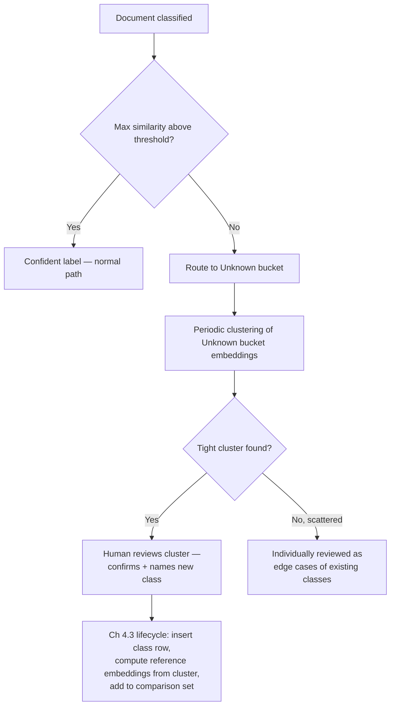

# 9.4 Human-in-the-Loop and Active Learning for Onboarding New Classes

## Problem

Chapter 4.3 established the mechanical lifecycle for adding a class (insert a row, compute
reference embeddings, add to the comparison set — no retraining, no downtime). But it assumed
labeled reference examples for the new class already exist. Two real questions remain unsolved:
**where do those labeled examples come from**, and — more fundamentally — **how does the system
even know a new class is needed**, rather than just forcing every document into the nearest
existing class, silently, with no visibility into the fact that a whole new category of
document is arriving?

## Solution / Concept: An Open-Set "Unknown" Bucket, Feeding a Review and Discovery Loop

### Detecting candidates for a new class

Rather than always forcing a document into whichever existing class has the highest similarity
score, the classification pipeline (Chapter 2.3, Chapter 8.2's Classification Service) checks
that top similarity score against a threshold. If **no class's reference set is similar enough**
(max similarity below the threshold), the document is routed to an **"unknown" bucket** — flagged
for human review rather than force-labeled into a poor-fitting existing class. This directly
extends the aggregation confidence logic already built (Chapter 2.4) with one more explicit
outcome: not just "confident in class X" or "needs more pages," but "not confidently any known
class at all."

### Prioritizing review effort — active learning over random sampling

The review queue (Chapter 10.3, Chapter 8.2's Review Service) should not be worked through
randomly. Two prioritization signals matter, for two different purposes:

- **Lowest-confidence predictions among known classes** — the standard active-learning signal:
  documents the model is least sure about are the most informative to have a human confirm or
  correct, since they're the most likely to reveal a systematic weakness in an existing class's
  reference set.
- **Clustering within the "unknown" bucket** — since every unknown document already has a
  computed embedding (it went through Classification Service before failing the threshold
  check), the unknown bucket's embeddings can be clustered (e.g., a simple density-based
  clustering method). **A tight cluster of similar unknown documents is a strong signal of a
  real, emerging document type worth formalizing as a new class; scattered singleton unknowns
  are more likely noise or edge cases of existing classes**, and don't justify the overhead of
  onboarding a whole new class for a handful of one-off documents.

### Closing the loop

Once a human reviewer confirms a cluster represents a genuine new class, the existing Chapter
4.3 lifecycle runs exactly as designed: insert the new class row, curate/confirm a reference set
from the cluster's documents, compute their embeddings with the same unchanged backbone, and add
them to the comparison set — no retraining required, consistent with the extensibility
architecture chosen all the way back in Chapter 2.3. This is the point where "the system doesn't
know this document type" becomes "the system now handles this document type," entirely through
data operations.

## Trade-offs

| Choice | Gain | Cost |
|---|---|---|
| Open-set "unknown" bucket (vs. always force-labeling into the nearest existing class) | Surfaces genuine taxonomy gaps instead of silently mislabeling novel document types — the entire mechanism by which class growth is *discovered*, not just *enabled* | Requires tuning the unknown-threshold correctly (see below); adds a review-queue operational burden that didn't exist with forced labeling |
| Clustering the unknown bucket to prioritize review, rather than reviewing every unknown document individually | Surfaces genuine emerging classes efficiently; avoids wasting review effort on scattered noise | Requires periodic clustering infrastructure and a human judgment step (is this cluster really a new class, or a variant of an existing one) that can't be fully automated |
| Active-learning prioritization (lowest-confidence known-class predictions) alongside unknown-cluster discovery | Improves existing classes' reference-set quality over time, not just discovers new classes | Competes for the same limited human review capacity as new-class discovery — a real prioritization trade-off, not a free addition |

## The Threshold-Tuning Trade-off

The unknown-bucket threshold has a real two-sided cost, and needs tuning against observed data
and review capacity, not a one-time guess:

- **Too loose** (threshold too low, rarely triggers "unknown") — genuinely novel document types
  get silently force-labeled into whichever existing class happens to be closest, delaying
  detection of a real taxonomy gap, potentially for a long time.
- **Too tight** (threshold too high, triggers "unknown" often) — floods the review queue with
  documents that are, in practice, perfectly well-classified but happen to score just under an
  overly conservative threshold — wasting scarce human review capacity on false alarms.

## When to Use / When Not To

- **The open-set unknown bucket and review loop should exist from the point the taxonomy is
  expected to grow at all** (which, per Chapter 1.1, is a stated near-term requirement, not a
  hypothetical) — without it, class growth relies entirely on someone externally deciding a new
  class is needed, with no systematic signal from the running system itself.
- **Clustering-based discovery** becomes worth the infrastructure once unknown-bucket volume is
  large enough that individual review of every unknown document is impractical — at low volume,
  a human reviewing each unknown document directly is simpler and sufficient.

## Summary

Adding a class mechanically (Chapter 4.3) only works once labeled examples exist — this lesson
closes that gap with an open-set "unknown" bucket that surfaces documents no existing class
confidently matches, clustering within that bucket to distinguish genuine emerging classes from
scattered noise, and a human review loop that confirms and curates new classes before they're
onboarded through the existing zero-downtime lifecycle. The one parameter this whole loop hinges
on — the unknown-bucket confidence threshold — is a real, ongoing tuning problem balanced
against human review capacity, not a value set once and forgotten.