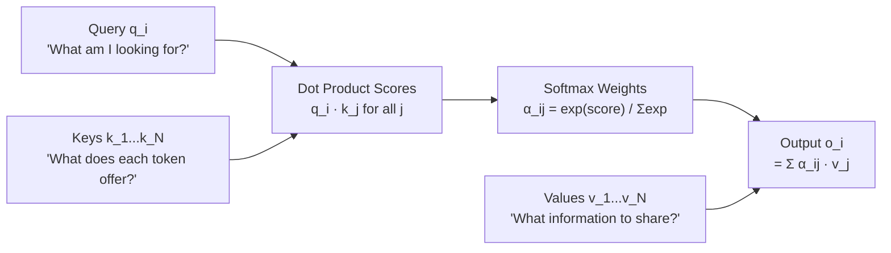

# Lesson 1.1 — Scaled Dot-Product Attention: The Foundation

> *Builds on: Token embeddings, basic matrix multiplication*
> *Paper: "Attention Is All You Need" — Vaswani et al. (2017)*

---

## The Problem: Static Embeddings Have No Context

Before attention, words were mapped to fixed vectors. "bank" always had the same embedding — whether it appeared next to "river" or "money". The model had no way to update a token's representation based on the words around it.

RNNs tried to solve this sequentially: each step reads one token and updates a hidden state. But this creates two hard problems:
- **Sequential bottleneck** — token 100 can't be processed until tokens 1–99 are done
- **Vanishing information** — context from early tokens fades over long sequences (the hidden state is a fixed-size vector that must carry everything)

Attention solves both at once: every token attends to every other token **in parallel**, and the signal doesn't fade because there's a direct path from any token to any other.

---

## The Core Intuition: A Soft, Differentiable Lookup

The best way to understand attention is as a **soft database lookup**.

In a hard lookup (like a Python dict), you give a query key, it either matches or it doesn't, and you get one value back.

In attention, everything is soft:
- Every token produces a **Query** — what it is looking for
- Every token produces a **Key** — what it has to offer for matching
- Every token produces a **Value** — the actual information it will share

The query is compared against every key via dot product. The result is a score, converted to weights via softmax. The output is a **weighted blend of all values** — every token contributes something, just with different weights.



This is why attention is powerful: the output for each token is a **context-aware** blending of information from the whole sequence, with the model learning which tokens are relevant to which.

---

## The Full Formula

Given an input sequence X of shape `(N, d)` where N = sequence length and d = embedding dimension:

```
Q = X · Wq        # shape: (N, d_k)
K = X · Wk        # shape: (N, d_k)
V = X · Wv        # shape: (N, d_v)

Attention(Q, K, V) = softmax( QKᵀ / √d_k ) · V
```

Step by step:
1. **QKᵀ** — dot product of every query with every key → shape `(N, N)` — the raw score matrix
2. **/ √d_k** — scale to control variance (see below)
3. **softmax(...)** — per-row normalization → each row sums to 1, giving attention weights
4. **· V** — weighted sum of value vectors → output shape `(N, d_v)`


*Each token produces a query (green), keys (brown) and values (purple). Note d_v = 128 is shown separately from d — it can differ from d_k.*

---

## What the Projection Matrices Actually Learn

`Wq`, `Wk`, `Wv` are not just reshaping matrices — they are **learned representations specialized for different roles**.

| Matrix | Shape | What It Learns |
|---|---|---|
| **Wq** | `d × d_k` | How to express "what I need" in a space optimized for matching |
| **Wk** | `d × d_k` | How to express "what I offer" for matching against queries |
| **Wv** | `d × d_v` | How to package information for sharing — a separate, richer representation |

**Key insight:** Wk and Wq must project into the **same space** (both produce vectors of size d_k) because they are compared via dot product. Wv projects into a potentially different space (d_v) because it is not used for matching — it's the payload delivered after matching is done.

> **Interview note:** "What does Wk learn?" — Wk learns a projection from the full token embedding into a d_k-dimensional matching space. Two tokens that should attract each other's attention will have high dot product in this projected space. The key projection learns what aspects of a token are useful for being "found" by other tokens' queries.

---

## Why We Divide by √d_k — The Full Derivation

This is one of the most common interview questions. Here is the complete derivation, not just the answer.

**Setup:** Assume q and k are vectors of dimension d_k, with entries drawn independently from a distribution with mean 0 and variance 1.

**Step 1: The dot product is a sum of d_k terms.**

```
q · k = Σᵢ qᵢ · kᵢ    (sum over i = 1 to d_k)
```

**Step 2: Compute the variance of the dot product.**

Each term `qᵢ · kᵢ` has:
- Mean: `E[qᵢ · kᵢ] = E[qᵢ] · E[kᵢ] = 0 · 0 = 0` (independent)
- Variance: `Var(qᵢ · kᵢ) = E[qᵢ²] · E[kᵢ²] - E[qᵢ]² · E[kᵢ]² = Var(qᵢ) · Var(kᵢ) - 0 · 0 = 1 · 1 = 1`
because `E[kᵢ]² = Var(qᵢ) = 1` and `E[qᵢ] = 0`

Since the d_k terms are independent:
```
Var(q · k) = Σᵢ Var(qᵢ · kᵢ) = d_k · 1 = d_k
```

So the **standard deviation of the dot product is √d_k**.

**Step 3: What happens in softmax when variance is large?**

Softmax computes `exp(xᵢ) / Σⱼ exp(xⱼ)`. When inputs have large magnitude (high variance), one value dominates the exponential and the softmax output approaches a one-hot vector.

Concretely: if scores are `[0.1, 0.2, 3.0]` → softmax gives roughly `[0.05, 0.06, 0.89]`. If they scale to `[1, 2, 30]` → softmax gives `[≈0, ≈0, ≈1]`. Gradients through softmax in the saturated region are ≈ 0. Training stops.

**Step 4: The fix.**

Dividing by √d_k rescales the dot products so their variance becomes 1:
```
Var(q · k / √d_k) = Var(q · k) / d_k = d_k / d_k = 1
```
property: `Var(aX) = a² · Var(X)` where `a` is constent

The softmax inputs now have unit variance regardless of d_k. Gradients stay healthy.

> **Interview note:** "Why divide by √d_k and not d_k itself?" — Dividing by the standard deviation (√d_k) normalizes variance to 1. Dividing by d_k would over-correct, making scores too small and softmax too uniform (also degrading gradients, just in the other direction — all tokens get equal weight).

> **Interview note:** "Why not subtract instead of divide?" — Subtraction (as done inside softmax for numerical stability) shifts values but doesn't change their spread. Dividing by √d_k physically shrinks the gap between scores, preventing saturation. These serve different purposes.

---

## V Can Have a Different Dimension from K and Q

This is a subtle point that the original paper specifies but most tutorials skip.

**Why Q and K must have the same dimension:**
- `QKᵀ` requires `(N, d_k) × (d_k, N)` — the inner dimension must match
- Q and K live in the same matching space by design

**Why V is free to have a different dimension d_v:**
- V is not involved in the matching step `QKᵀ`
- V enters only at the final weighted sum: `attention_weights · V` where weights are `(N, N)` and V is `(N, d_v)` → output is `(N, d_v)`
- The model can dedicate more or less representational capacity to "storing information" (d_v) vs "matching" (d_k)

**What changes downstream:**
- If d_v ≠ d_model, the output of attention `(N, d_v)` must be projected back to `(N, d_model)` before the residual connection
- This output projection `Wo` has shape `(d_v, d_model)`

In the original "Attention Is All You Need" paper:
```
d_model = 512
d_k = d_v = 64  (with h = 8 heads: 512 / 8 = 64)
```
d_k = d_v here is a design choice for simplicity, not a mathematical requirement.

---

## Attention as Three Types: Additive vs Multiplicative

The original paper compared scaled dot-product attention against additive attention (Bahdanau 2015):

| Type | Formula | Compute Cost | When Better |
|---|---|---|---|
| **Additive (Bahdanau)** | `v · tanh(Wq·q + Wk·k)` | O(N² · d) — feedforward over all pairs | d_k small; good for low-resource |
| **Multiplicative (Luong)** | `q · k` | O(N² · d_k) — just dot product | Fast; parallelizes well on hardware |
| **Scaled Dot-Product** | `q · k / √d_k` | Same as multiplicative + scaling | Large d_k — prevents softmax saturation |

The paper notes: *"For large values of d_k, the dot products grow large in magnitude, pushing the softmax function into regions where it has extremely small gradients. To counteract this, we scale the dot products by 1/√d_k."*

In practice, scaled dot-product attention won. It runs faster on hardware (matrix multiply is highly optimized), has no extra parameters (no W_a or v in the additive formula), and the scaling fixes the variance issue cleanly.

---

## Time Complexity — Full Derivation

```
Input: X ∈ R^(N × d)

Step 1: Compute Q, K, V
  Q = X · Wq  →  (N × d) × (d × d_k)  →  cost: N · d · d_k per matrix
  Cost for Q, K, V combined: O(3 · N · d · d_k) = O(N · d · d_k)

Step 2: Compute score matrix QKᵀ
  (N × d_k) × (d_k × N)  →  shape (N × N)
  Cost: O(N² · d_k)

Step 3: Softmax — O(N²) per row, N rows
  Cost: O(N²)

Step 4: Weighted sum (attention weights) · V
  (N × N) × (N × d_v)  →  shape (N × d_v)
  Cost: O(N² · d_v)

Total: O(N · d · d_k + N² · d_k + N² · d_v)
     = O(N · d² + N² · d)   (when d_k = d_v = d/h and h is constant)
```

**Which term dominates?**
- When N is small, d is large: **d² term dominates** (projection cost)
- When N is large (long context), N² grows faster: **N² term dominates**

This is why long contexts are expensive — the `N²` attention score matrix grows quadratically.

---

## Worked Example — 3-Token Sequence

Let's compute attention manually for: `["The", "cat", "sat"]` with d_k = 2 (tiny for illustration).

```python
import numpy as np

# Pretend Q, K, V are already projected (3 tokens, d_k=2, d_v=2)
Q = np.array([[1.0, 0.0],   # "The" query
              [0.8, 0.6],   # "cat" query
              [0.3, 0.9]])  # "sat" query

K = np.array([[1.0, 0.0],   # "The" key
              [0.9, 0.4],   # "cat" key
              [0.1, 1.0]])  # "sat" key

V = np.array([[0.5, 0.0],   # "The" value
              [0.0, 1.0],   # "cat" value
              [0.3, 0.7]])  # "sat" value

d_k = 2

# Step 1: Score matrix
scores = Q @ K.T            # shape (3, 3)
# scores[i, j] = how much token i attends to token j

# Step 2: Scale
scores = scores / np.sqrt(d_k)

# Step 3: Softmax (row-wise)
def softmax(x):
    x = x - x.max(axis=-1, keepdims=True)   # numerical stability
    e = np.exp(x)
    return e / e.sum(axis=-1, keepdims=True)

weights = softmax(scores)   # shape (3, 3), each row sums to 1

# Step 4: Weighted sum of values
output = weights @ V        # shape (3, 2)

print("Scores:\n", scores)
print("Attention weights:\n", weights.round(3))
print("Output:\n", output.round(3))
```

The output vector for "cat" is a blend of all three value vectors, weighted by how much "cat"'s query matched each token's key. If "cat"↔"cat" has the highest dot product, "cat"'s value dominates its own output — self-reinforcement.

---

## Summary

- Attention is a **soft, differentiable lookup**: Q searches, K offers, V delivers
- Projection matrices `Wq, Wk, Wv` are **learned** — they specialize for matching vs information storage
- **V can have a different dimension (d_v) from K and Q (d_k)** — no mathematical constraint ties them
- Dividing by **√d_k** normalizes dot product variance from d_k back to 1, preventing softmax saturation
- The **additive vs multiplicative** distinction matters historically; scaled dot-product won for speed + stability
- Complexity is **O(N·d² + N²·d)** — N² term dominates at long sequence lengths

---

## Interview Q&A

**Q: Why do we divide by √d_k?**
Dot product of two d_k-dimensional unit-variance vectors has variance d_k, so standard deviation √d_k. Without scaling, large d_k causes large score variance, saturating softmax and killing gradients. Dividing by √d_k normalizes variance back to 1.

**Q: Can d_v ≠ d_k?**
Yes. Q and K must share dimension d_k because they're dot-producted. V is only used in the final weighted sum and can have any dimension d_v. The output projection Wo then maps d_v back to d_model if needed.

**Q: What does Wk actually learn?**
Wk projects each token's embedding into a matching space — the subspace that captures what's useful about that token for being found by other tokens' queries. It learns which aspects of meaning make a good "key" for the attention lookup.

**Q: What happens if you remove the scaling (no √d_k)?**
At large d_k, raw dot products have high variance. Softmax saturates — one or two tokens get nearly all the weight, the rest get ≈0. Gradients through softmax in the saturated region ≈0. The model stops updating, especially early in training when projections are random.

**Q: What is the computational bottleneck of attention?**
The `QKᵀ` matrix of shape `(N, N)` — quadratic in sequence length. Both computing it (O(N²·d_k)) and storing it (O(N²) memory) are the bottleneck for long sequences. Flash Attention addresses the memory part.
