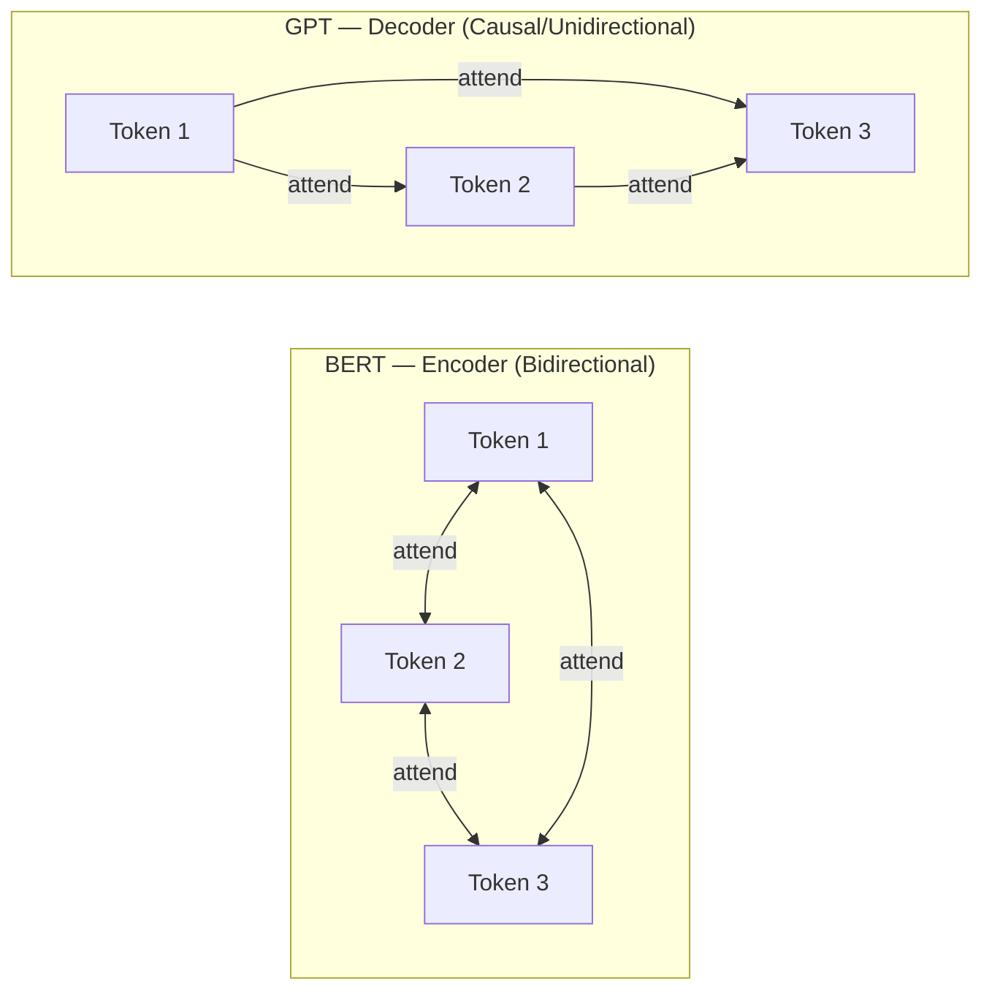
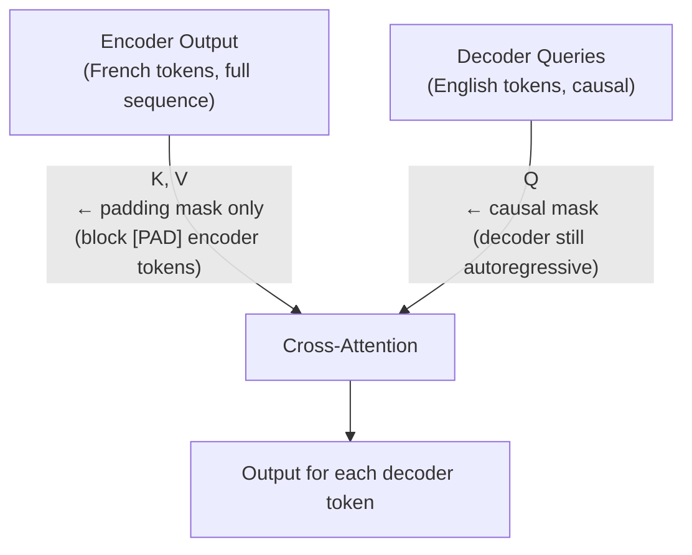

# Lesson 1.2 — Masking: Causal, Padding, and Combined

> *Builds on: Lesson 1.1 — Scaled Dot-Product Attention*
> *Papers: "Attention Is All You Need" (Vaswani 2017), BERT (Devlin 2018), GPT (Radford 2018)*

---

## The Problem: Attention Sees Everything

In standard self-attention, every token attends to every other token — both past and future:

```
Token 1 → attends to tokens 1, 2, 3, 4 ...
Token 2 → attends to tokens 1, 2, 3, 4 ...
Token 3 → attends to tokens 1, 2, 3, 4 ...
```

This full bidirectional access is **correct for some tasks and wrong for others.**

**When it's fine:** Classification, understanding tasks — you have the full sentence and want each token to build context from all sides. BERT's masked language modeling is an example.

**When it's wrong:** Language generation — when predicting token t, tokens t+1, t+2, ... don't exist yet at inference. If the model sees future tokens during training, it learns to use them, then fails at inference when they aren't available. This is the **train-test mismatch** problem.

Masking solves this by selectively blocking certain attention paths.

---

## Causal (Look-Ahead) Mask

### Construction

A causal mask M is a matrix the same shape as the score matrix (N × N):

```
M[i, j] = 0     if j ≤ i   (token j comes before or is token i itself → allowed)
M[i, j] = −∞   if j > i   (token j comes after token i → blocked)
```

For a 4-token sequence, M looks like:

```
        j=1   j=2   j=3   j=4
i=1  [   0    -∞    -∞    -∞  ]
i=2  [   0     0    -∞    -∞  ]
i=3  [   0     0     0    -∞  ]
i=4  [   0     0     0     0  ]
```

This is a **lower-triangular matrix of zeros** with −∞ above the diagonal.

### The −∞ Trick — Step by Step

The mask is **added to the raw score matrix** (before softmax, not after):

```
masked_scores = (QKᵀ / √d_k) + M
```

Then:
```
attention_weights = softmax(masked_scores)
```

**Numerical example** for token i=2 attending to 4 tokens:

```
Raw scores:    [1.2,  0.8,  0.5,  0.9]   # before mask
Mask row 2:    [0.0,  0.0,  -∞,   -∞]   # allow j≤2, block j>2
After adding:  [1.2,  0.8,  -∞,   -∞]

softmax:
  exp(1.2) = 3.32
  exp(0.8) = 2.23
  exp(-∞)  = 0
  exp(-∞)  = 0

  weights = [3.32/(3.32+2.23), 2.23/(3.32+2.23), 0, 0]
           = [0.598, 0.402, 0.0, 0.0]
```

Tokens 3 and 4 receive exactly zero attention weight — they are completely invisible.

### Why the Mask Goes Before Softmax

> **Interview note:** This is a common trap question. If you applied the mask *after* softmax (setting future weights to 0 and renormalizing), you could get the same final weights. But there's a subtle correctness issue: you'd need to renormalize the remaining weights manually. The −∞ trick leverages softmax's own normalization — `exp(−∞) = 0` and softmax already sums the remaining terms. It's cleaner, more numerically stable, and handles edge cases (e.g., all visible tokens get −∞ scores) correctly.

```python
import torch
import torch.nn.functional as F

def create_causal_mask(seq_len):
    # Upper triangle is -inf, diagonal and below are 0
    mask = torch.triu(torch.full((seq_len, seq_len), float('-inf')), diagonal=1)
    return mask

def masked_attention(Q, K, V, mask=None):
    d_k = Q.shape[-1]
    scores = (Q @ K.transpose(-2, -1)) / d_k**0.5   # (N, N)
    if mask is not None:
        scores = scores + mask                         # add mask (not multiply)
    weights = F.softmax(scores, dim=-1)
    return weights @ V

seq_len = 4
mask = create_causal_mask(seq_len)
print(mask)
# tensor([[0., -inf, -inf, -inf],
#         [0.,  0.,  -inf, -inf],
#         [0.,  0.,   0.,  -inf],
#         [0.,  0.,   0.,   0. ]])
```

---

## Padding Mask

### The Problem: Variable-Length Sequences in a Batch

Neural network operations require fixed-size tensors. When batching sequences of different lengths (e.g., one with 5 tokens and one with 12), shorter sequences are **padded** with a special `[PAD]` token to match the longest sequence.

```
Sequence 1: ["The", "cat", "sat", "[PAD]", "[PAD]"]
Sequence 2: ["A",   "big", "black", "dog",  "runs" ]
```

`[PAD]` tokens carry no meaningful information. If a real token attends to `[PAD]`, it picks up noise. If `[PAD]` tokens attend to real tokens, their output vectors are garbage but still participate in batch computations.

### Construction

A padding mask is a binary mask marking which positions are padding:

```python
# 1 = real token, 0 = padding
token_mask = torch.tensor([1, 1, 1, 0, 0])  # Sequence 1

# Convert to attention mask: padding positions get -inf
# Shape must broadcast to (N, N) — padding in KEY positions matters
padding_mask = (1 - token_mask).bool()       # True where padding
attn_mask = torch.zeros(seq_len, seq_len)
attn_mask[:, padding_mask] = float('-inf')   # block attending TO pad tokens
```

Key distinction: we block **keys** that are padding, not queries. A `[PAD]` query can still run (we just ignore its output), but no token should attend to `[PAD]` keys.

---

## Combined Mask: What Real Implementations Use

Decoder models like GPT need **both** masks simultaneously:
- Causal mask: don't see future tokens
- Padding mask: don't attend to `[PAD]` tokens

These are combined with addition (since both use the −∞ convention):

```python
def create_combined_mask(seq_len, padding_mask):
    """
    seq_len: int
    padding_mask: BoolTensor of shape (batch, seq_len), True where padding
    Returns: (batch, seq_len, seq_len) attention mask
    """
    # Causal mask — same for all sequences in batch
    causal = torch.triu(torch.full((seq_len, seq_len), float('-inf')), diagonal=1)

    # Padding mask — broadcast over query dimension
    # Shape: (batch, 1, seq_len) → blocks attention TO padding in key positions
    pad = padding_mask.float() * float('-inf')  # (batch, seq_len)
    pad = pad.unsqueeze(1)                       # (batch, 1, seq_len)

    # Combine: both become -inf where blocked
    combined = causal.unsqueeze(0) + pad         # (batch, seq_len, seq_len)
    return combined
```

---

## Bidirectional vs Unidirectional: BERT vs GPT

The mask determines the fundamental training objective of a model.



| Feature | BERT (Bidirectional) | GPT (Causal) |
|---|---|---|
| **Attention** | Every token sees all tokens | Every token sees only past tokens |
| **Mask** | Padding mask only | Causal + padding mask |
| **Training task** | Masked Language Modeling (predict [MASK] tokens) | Next-token prediction (predict token t from 1..t-1) |
| **Inference** | Full sequence must be available | Generates one token at a time |
| **Best for** | Understanding, classification, extraction | Generation, completion |

> **Interview note:** "Why doesn't BERT use a causal mask?" — BERT's training task (MLM) requires each token to use context from both sides to predict the masked word. A causal mask would cripple this. GPT is trained on next-token prediction, which requires only past context — so the causal mask is mandatory both for training correctness and inference consistency.

---

## Masking in Cross-Attention

When a decoder attends to an encoder (e.g., in translation), two different masks apply:



- **Encoder side (K, V):** Only a padding mask. The encoder has the full source sentence, so no causal masking is needed. Only PAD tokens in the source are blocked.
- **Decoder side (Q):** The decoder is still autoregressive — it generates one token at a time, so the queries still obey causal ordering (but this is handled by the decoder's self-attention layer, not cross-attention).

> **Interview note:** "Does cross-attention use a causal mask on the encoder output?" — No. The encoder has already processed the full source sentence bidirectionally. In cross-attention, Q comes from the decoder (limited by causal ordering in the decoder's own self-attention), but K and V come from the encoder and can all be attended to freely. Only PAD tokens in the encoder output are masked.

---

## Mask Implementation in Practice

Here's how masking is done in a real attention module:

```python
import torch
import math

def scaled_dot_product_attention(Q, K, V, attn_mask=None, dropout_p=0.0):
    """
    Q, K, V: (batch, heads, seq_len, d_k)
    attn_mask: (batch, 1, seq_len, seq_len) or (seq_len, seq_len) — additive mask
    """
    d_k = Q.size(-1)
    scores = torch.matmul(Q, K.transpose(-2, -1)) / math.sqrt(d_k)

    if attn_mask is not None:
        scores = scores + attn_mask     # NOT: scores * mask. Always additive.

    weights = torch.softmax(scores, dim=-1)

    if dropout_p > 0.0:
        weights = torch.dropout(weights, p=dropout_p, train=True)

    return torch.matmul(weights, V)
```

Note: **always additive**, not multiplicative. The `attn_mask` convention in PyTorch is that the mask is added (boolean masks are converted to float −∞ / 0 first).

---

## Limitations of Masking

**Causal masking limits parallelism at inference:**
- During training, the full sequence is processed in one forward pass (teacher forcing) — causal masking is applied to the whole matrix at once, fully parallel
- During inference, tokens must be generated one at a time — each step processes only the new token's query against all previous keys. You can't parallelize generation this way.

**KV cache** (Lesson 2.2) addresses the inference inefficiency.

**Bidirectional masking limits generation:**
- BERT-style models can't generate text autoregressively because they need the full sequence to compute attention. You can't predict the next token when you haven't written it yet.

---

## Summary

- The **causal mask** is a lower-triangular matrix of 0s and −∞s added to scores before softmax — blocks future tokens via `exp(−∞) = 0`
- The **padding mask** sets key positions of `[PAD]` tokens to −∞ — prevents attending to meaningless padding content
- Both masks are combined additively in practice
- **BERT** uses bidirectional attention (padding mask only) → suited for understanding
- **GPT** uses causal attention (causal + padding mask) → suited for generation
- In **cross-attention**: encoder K/V get only padding mask; decoder Q causality is enforced by the decoder's own self-attention, not cross-attention

---

## Interview Q&A

**Q: What happens if you apply the causal mask after softmax instead of before?**
You'd need to zero out the future weights and renormalize manually. This is mathematically equivalent but less clean. The pre-softmax −∞ trick leverages softmax's built-in normalization, handles numerical edge cases automatically, and is what all production implementations use.

**Q: Why does BERT not use a causal mask?**
BERT's MLM task requires each token to see its full surrounding context to predict the masked word. A causal mask would prevent tokens from attending to their right-context, destroying the bidirectional signal BERT was designed to capture.

**Q: In cross-attention, which side gets a causal mask?**
Neither, directly. The encoder output (K, V) only needs a padding mask. The decoder's Q vectors come from the decoder's self-attention layer, which is already causal. Cross-attention itself does not apply a causal mask.

**Q: What does "attention sinks" have to do with masking?**
Attention sinks (Lesson 3.3) are a related phenomenon: in causal models, the first token(s) always receive disproportionately high attention weight because every token can see them. With causal masking, early tokens accumulate weight from many attending positions, causing them to act as "sinks" for excess probability mass.
