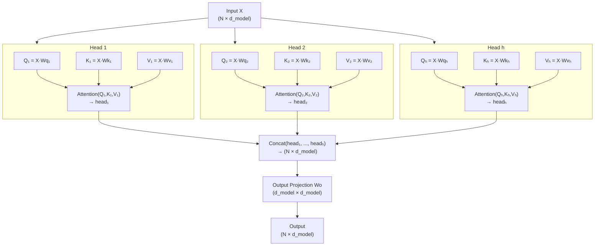

# Lesson 1.3 — Multi-Head Attention

> *Builds on: Lesson 1.1 (Scaled Dot-Product Attention), Lesson 1.2 (Masking)*
> *Paper: "Attention Is All You Need" — Vaswani et al. (2017)*

---

## The Problem: One Head, One Perspective

Single-head attention (Lesson 1.1) learns one set of Q/K/V projection matrices. This means the model looks at each token through **one learned lens** — one representation subspace for matching.

But natural language has multiple types of relationships between tokens that must be captured simultaneously:
- **Syntactic:** subject → verb agreement ("*The cats* that live next door *are* loud")
- **Semantic:** coreference ("*John* said *he* was tired" — "he" refers to John)
- **Positional:** adjacent tokens, sentence boundaries
- **Long-range:** a pronoun attending to its antecedent many tokens away

A single head cannot simultaneously optimize for all of these. The projection matrices Wq and Wk learn to serve one kind of relationship well, but in doing so, they compress or discard signals useful for other relationship types.

**Multi-Head Attention (MHA)** runs h independent attention heads in parallel, each free to specialize on different relationship types.

---

## The Architecture

Instead of one set of `(Wq, Wk, Wv)`, you have h independent sets — one per head:

```
For head i = 1 to h:
    Qi = X · Wq_i        # shape: (N, d_k)  where d_k = d_model / h
    Ki = X · Wk_i        # shape: (N, d_k)
    Vi = X · Wv_i        # shape: (N, d_v)  where d_v = d_model / h

    head_i = Attention(Qi, Ki, Vi)   # shape: (N, d_v)

O = Concat(head_1, ..., head_h)       # shape: (N, h·d_v) = (N, d_model)
Output = O · Wo                        # shape: (N, d_model)
```


*Each head has its own Q_i, K_i, V_i projection. All heads run in parallel. Outputs are concatenated and passed through a single output projection Wo.*



---

## Why d_k = d_model / h — The Computational Equivalence Argument

This is a key design decision from the original paper that most explanations gloss over.

**The goal:** h attention heads should cost approximately the same compute as one single-head attention with full d_model dimension.

**In single-head attention:**
- Q, K projections: `d_model × d_model` weight matrices
- QKᵀ: `(N × d_model) × (d_model × N)` = O(N² · d_model)

**In multi-head attention with d_k = d_model / h:**
- Each head: Q, K projections are `d_model × (d_model/h)` — smaller matrices
- Each head's QKᵀ: `(N × d_model/h) × (d_model/h × N)` = O(N² · d_model/h)
- h heads combined: h × O(N² · d_model/h) = O(N² · d_model) — **same as single head!**

The per-head projection matrices are h times smaller in one dimension, and there are h of them — they cancel out. Total compute stays the same but the model gets h different learned perspectives.

| | Single Head | Multi-Head (h heads) |
|---|---|---|
| Q projection cost | O(N · d_model²) | h × O(N · d_model · d_model/h) = O(N · d_model²) |
| KᵀQ cost | O(N² · d_model) | h × O(N² · d_model/h) = O(N² · d_model) |
| Total | O(N · d_model² + N² · d_model) | **Same** |

---

## The Output Projection Wo — Why Concatenation Alone Isn't Enough

After running h heads, we concatenate their outputs:
```
O = Concat(head_1, ..., head_h)   # shape: (N, h × d_v) = (N, d_model)
```

Why not just return O directly? **Two reasons:**

**1. Information mixing between heads:**
Each head has computed its own local output — a context-aware vector from that head's perspective. These h outputs sit side by side in the concatenated tensor, but they haven't interacted with each other. `Wo` (shape: `d_model × d_model`) mixes information across all h heads — it allows the model to learn weighted combinations of the different relationship types each head discovered.

**2. Dimension alignment for residual connection:**
The transformer uses residual connections: `output = LayerNorm(X + MHA(X))`. The MHA output must match X's shape `(N, d_model)`. Since `Concat(...)` is already `(N, d_model)` when d_v = d_model/h, the multiplication by Wo (d_model × d_model) preserves the shape while mixing.

> **Interview note:** "Can you skip Wo and just return the concatenation?" — Technically yes, you'd get the right shape. But you'd lose cross-head interaction. Each head's output would remain in its own silo — d_model/h dimensions. Wo is the layer that synthesizes the multi-head insights into a unified representation.

---

## Parameter Count — Worked Example

For **GPT-2 Small** style model: d_model = 768, h = 12, d_k = d_v = 64

```
Per head:
  Wq_i: 768 × 64 = 49,152
  Wk_i: 768 × 64 = 49,152
  Wv_i: 768 × 64 = 49,152

12 heads × 3 matrices × 49,152 = 1,769,472 parameters for Q, K, V

Output projection Wo:
  (12 × 64) × 768 = 768 × 768 = 589,824 parameters

Total for one MHA layer: 1,769,472 + 589,824 = 2,359,296 ≈ 2.36M

GPT-2 Small has 12 transformer layers:
  MHA: 12 × 2.36M = 28.3M parameters just for attention
```

In practice, the h separate Wq_i are often implemented as a single large matrix `Wq` of shape `(d_model, d_model)` that is split across heads — same math, better hardware utilization.

---

## What Each Head Actually Learns

Research analyzing trained transformers (Voita et al. 2019, Clark et al. 2019) found heads often specialize:

| Head Type | What It Attends To | Example |
|---|---|---|
| **Syntactic** | Subject-verb pairs, dependencies | "cats *are*" — verb attends to subject |
| **Coreference** | Pronoun → antecedent | "he" → "John" |
| **Positional** | Previous or next token | Attending to the immediately preceding token |
| **Sentence-boundary** | [SEP] or [CLS] tokens | Heads that always attend to special tokens |
| **Long-range** | Distant related tokens | Questions attending to their answers |

This specialization is **emergent** — not explicitly trained. The multi-head architecture creates the capacity for it, gradient descent discovers it.

> **Interview note:** "What happens if all heads learn the same thing?" — This is called "head collapse" and it does happen, especially with too many heads or insufficient regularization. Some papers find that the majority of heads in trained models are redundant and can be pruned with minimal quality loss. This suggests MHA is often overparameterized in practice.

---

## Attention Dropout

In the original paper, dropout is applied to the attention weights (after softmax, before the weighted sum):

```python
weights = F.softmax(scores, dim=-1)
weights = F.dropout(weights, p=dropout_p, training=self.training)
output = weights @ V
```

**Why dropout on weights specifically?**
The attention matrix is the mechanism by which tokens share information. Randomly zeroing out some attention weights forces the model to not over-rely on any single token's information pathway. It prevents co-adaptation between specific (query, key) pairs.

This is different from the MLP dropout in feedforward layers — it regularizes the information routing, not the feature transformation.

---

## Efficient Implementation: Batched Projection

In practice, the h separate projection matrices are merged into one large matrix and split:

```python
import torch
import torch.nn as nn
import math

class MultiHeadAttention(nn.Module):
    def __init__(self, d_model, num_heads, dropout=0.0):
        super().__init__()
        assert d_model % num_heads == 0
        self.d_model = d_model
        self.num_heads = num_heads
        self.d_k = d_model // num_heads

        # Single large projection instead of h separate ones
        self.W_qkv = nn.Linear(d_model, 3 * d_model, bias=False)
        self.W_o   = nn.Linear(d_model, d_model, bias=False)
        self.dropout = nn.Dropout(dropout)

    def forward(self, X, attn_mask=None):
        B, N, D = X.shape
        h = self.num_heads

        # Project and split into Q, K, V for all heads at once
        QKV = self.W_qkv(X)                        # (B, N, 3*D)
        Q, K, V = QKV.chunk(3, dim=-1)             # each (B, N, D)

        # Reshape to (B, h, N, d_k) for parallel head computation
        def split_heads(t):
            return t.view(B, N, h, self.d_k).transpose(1, 2)  # (B, h, N, d_k)

        Q, K, V = split_heads(Q), split_heads(K), split_heads(V)

        # Scaled dot-product attention for all heads in parallel
        scores = (Q @ K.transpose(-2, -1)) / math.sqrt(self.d_k)  # (B, h, N, N)
        if attn_mask is not None:
            scores = scores + attn_mask
        weights = torch.softmax(scores, dim=-1)
        weights = self.dropout(weights)
        attn_out = weights @ V                      # (B, h, N, d_k)

        # Concatenate heads and project
        attn_out = attn_out.transpose(1, 2).contiguous().view(B, N, D)  # (B, N, D)
        return self.W_o(attn_out)
```

The `.view()` and `.transpose()` calls reshape the tensor to simulate h separate heads without h separate matrix multiplications.

---

## Limitations of Multi-Head Attention

**1. Quadratic memory — the N² bottleneck:**
The attention score matrix is `(B, h, N, N)`. For N = 32,768 tokens with h = 32 heads in float16:
```
32 × 32 × 32768 × 32768 × 2 bytes ≈ 70 GB
```
This is why Flash Attention (Lesson 3.2) is essential for long contexts — it avoids materializing this matrix.

**2. Fixed context window:**
Standard MHA has no built-in sense of token position or distance — positional encodings must be added separately. Long sequences require either very large context windows or architectural changes.

**3. KV cache memory at inference:**
During generation, K and V for all past tokens must be stored (Lesson 2.2). With h heads, this is h times the storage of single-head attention.

**4. Head redundancy:**
Studies show 20–50% of heads can be pruned with minimal quality impact. This motivates MQA and GQA (Lesson 2.3) which directly reduce the number of K/V heads.

---

## Summary

- MHA runs **h independent attention heads in parallel**, each learning a different relationship type
- Setting **d_k = d_model / h** keeps total compute equal to single-head attention at full dimension
- The **output projection Wo** mixes information across heads — without it, heads stay siloed
- Parameter count: `4 × d_model²` per layer (Wq, Wk, Wv, Wo — all square at full model dimension)
- Heads **emergently specialize** (syntactic, semantic, positional) through training
- **Attention dropout** regularizes the information routing, not the features
- Key limitation: O(N²) memory for the score matrix makes long contexts expensive

---

## Interview Q&A

**Q: Why is d_k set to d_model / h?**
To maintain the same total compute as single-head full-dimension attention. Each head uses a d_model/h projection, and h heads multiply back to d_model. Total FLOPs are preserved while gaining h different perspectives.

**Q: What does the output projection Wo do?**
Wo mixes information across heads. After concatenation, each head's output sits in its own slice of the tensor — they haven't interacted. Wo is a learned mixing matrix that synthesizes all h perspectives into a unified output. It also ensures the output dimension matches d_model for the residual connection.

**Q: What if you use more heads but keep d_k constant (not reduce it)?**
Compute scales linearly with the number of heads (h × O(N² × d_k)). You get more perspectives at higher cost. This is sometimes done in large models but is unusual. Most models set d_k = d_model/h.

**Q: Can you prune attention heads?**
Yes. Multiple studies (Michel et al. 2019, Voita et al. 2019) show 20–50% of heads are functionally redundant in trained models. Pruning them with fine-tuning recovers most performance. This observation directly motivated MQA and GQA.

**Q: Why does MHA need a separate positional encoding?**
Attention is permutation-equivariant — if you shuffle the input tokens, the output shuffles identically. Positional information must be injected externally (via sinusoidal PE, RoPE, ALiBi, etc.) because MHA itself treats all token positions identically.
