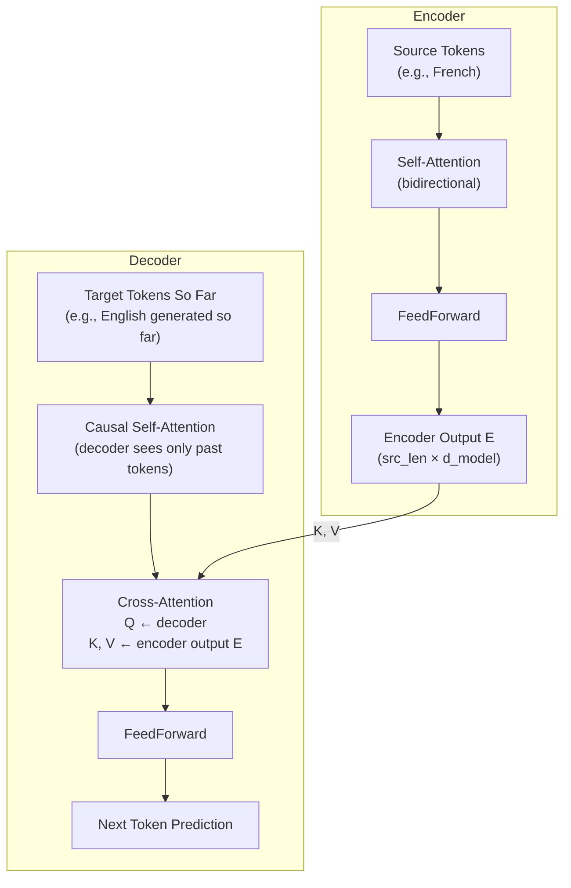

# Lesson 2.1 — Cross-Attention

> *Builds on: Lesson 1.2 (Masking), Lesson 1.3 (Multi-Head Attention)*
> *Paper: "Attention Is All You Need" — Vaswani et al. (2017), encoder-decoder section*

---

## The Problem: Self-Attention Can Only See One Sequence

Self-attention connects tokens within **the same sequence** — "bank" attends to "river" and "money" in the same sentence. But many tasks require connecting **two separate sequences**:

- **Machine translation:** generating English while reading French
- **Summarization:** generating a summary while referencing the full document
- **Speech recognition (Whisper):** generating transcription tokens while reading audio features
- **Image captioning:** generating text while attending to image patch embeddings

Self-attention gives Q, K, and V all from the same input X. There is no mechanism to route Q from one sequence and K/V from another.

**Cross-attention** is the structural change that connects two sequences: Q comes from the sequence being generated (decoder), K and V come from the source sequence (encoder).

---

## The Only Structural Change

Compare self-attention and cross-attention side by side:

```
Self-Attention:
  Q = X · Wq        ← same sequence X
  K = X · Wk        ← same sequence X
  V = X · Wv        ← same sequence X

Cross-Attention:
  Q = X_decoder · Wq      ← from the target (being generated)
  K = X_encoder · Wk      ← from the source (encoder output)
  V = X_encoder · Wv      ← from the source (encoder output)
```

That's the entire structural difference. The attention formula itself is unchanged:

```
CrossAttention(Q, K, V) = softmax( QKᵀ / √d_k ) · V
```

The decoder **asks questions** (Q). The encoder **holds the answers** (K and V).

---

## Where Cross-Attention Lives in the Architecture


*In the encoder-decoder Transformer, cross-attention appears in the decoder only. It sits between the decoder's causal self-attention and the feedforward layer. The encoder is run once; its output is reused by cross-attention at every decoder layer.*



**Key structural observations:**
- The encoder runs **once** over the full source sequence
- The encoder output E is a fixed tensor — it doesn't change between decoder steps
- Cross-attention in the decoder reuses E for every token it generates
- The decoder has **two** attention sub-layers per transformer block: causal self-attention (sees past generated tokens) + cross-attention (sees encoder output)

---

## Masking in Cross-Attention

Cross-attention uses **asymmetric masking** — different masks for the Q side and the K/V side:

| Side | Source | Mask Applied | Reason |
|---|---|---|---|
| **Q (decoder)** | Generated tokens | None in cross-attention* | Causality is enforced by preceding self-attention layer |
| **K, V (encoder)** | Source tokens | Padding mask only | Encoder has full bidirectional context; only PAD tokens are blocked |

*The decoder's causal constraint comes from its self-attention layer (which uses a causal mask). By the time the decoder's representations reach cross-attention, they already encode causal ordering. Cross-attention does not re-apply a causal mask.

```python
def cross_attention(Q_dec, K_enc, V_enc, encoder_padding_mask=None):
    """
    Q_dec: (batch, tgt_len, d_model) — decoder queries
    K_enc: (batch, src_len, d_model) — encoder keys
    V_enc: (batch, src_len, d_model) — encoder values
    encoder_padding_mask: (batch, 1, 1, src_len) — True where PAD in source
    """
    d_k = Q_dec.shape[-1]
    # Score matrix: (batch, tgt_len, src_len) — decoder queries vs encoder keys
    scores = (Q_dec @ K_enc.transpose(-2, -1)) / d_k**0.5

    if encoder_padding_mask is not None:
        # Block attending to [PAD] tokens in the source sequence
        scores = scores.masked_fill(encoder_padding_mask, float('-inf'))

    weights = torch.softmax(scores, dim=-1)   # (batch, tgt_len, src_len)
    return weights @ V_enc                     # (batch, tgt_len, d_model)
```

Note the score matrix shape: `(tgt_len, src_len)` — not square. Each decoder token can attend to any encoder token, but there's no causal constraint between them.

---

## Concrete Example: Machine Translation

Translating `"Le chat est assis"` → `"The cat is sitting"`

At the step where the decoder generates `"cat"`:

```
Decoder query (Q) for "cat" position
  → High similarity with encoder key for "chat"    (score ≈ 0.8)
  → Low similarity with "Le"                       (score ≈ 0.1)
  → Low similarity with "est"                      (score ≈ 0.05)
  → Low similarity with "assis"                    (score ≈ 0.05)

Attention weights:   [0.10,  0.80,  0.05,  0.05]
                      "Le"  "chat" "est" "assis"

Output = 0.10 × V("Le") + 0.80 × V("chat") + 0.05 × V("est") + 0.05 × V("assis")
       ≈ mostly V("chat") — the relevant source word flows into the decoder representation
```

When generating `"sitting"`:
```
High attention on "assis", low on everything else
→ V("assis") dominates the output
```

The model learns which source word to "look at" when generating each target word. This is the **alignment** mechanism that made attention so powerful — before it, sequence-to-sequence models had to compress the entire source into a fixed-size vector.

---

## Where Cross-Attention Does NOT Appear

Cross-attention is specific to **encoder-decoder** architectures. Decoder-only models (GPT, LLaMA, Mistral, Claude, GPT-4) do **not** use cross-attention.

| Architecture | Has Cross-Attention? | Example Models |
|---|---|---|
| Encoder-Decoder | ✅ Yes | T5, BART, Original Transformer, Whisper, mT5 |
| Encoder-only | ❌ No | BERT, RoBERTa, DeBERTa |
| Decoder-only | ❌ No | GPT family, LLaMA, Mistral, Falcon, Claude |

**Why decoder-only models skip it:**
- Decoder-only models are prompted with the context in the same sequence as the generation target
- The "source" (e.g., instruction) and the "target" (e.g., response) are concatenated into one sequence
- Causal self-attention naturally lets the model attend to all previous tokens, including the instruction
- This avoids the cost of running a separate encoder and maintaining cross-attention per layer

> **Interview note:** "Why doesn't GPT need cross-attention?" — GPT is decoder-only. It concatenates the input prompt and output response into one sequence and uses causal self-attention. There's no separate encoder; the "source" context is just earlier tokens in the same sequence. This is simpler, scales better, and achieves comparable or better results on most tasks compared to encoder-decoder designs.

---

## Limitations

**1. Encoder must be run first (latency):**
The encoder produces output E before any decoder token can be generated. For real-time applications (speech, streaming), this adds a full-sequence encoding step before generation starts.

**2. Encoder output must fit in memory:**
E has shape `(batch, src_len, d_model)`. For very long source documents, this becomes memory-intensive — and it's reused at every decoder layer (not cached the same way as KV cache).

**3. Decoding with cross-attention has cross-attention KV overhead:**
At each decoder layer, K and V are computed from the encoder output. Since E is fixed, these can be precomputed once (similar to KV caching) — most implementations do this.

**4. Encoder-decoder models are harder to prompt:**
Unlike decoder-only models where you just prepend instructions, encoder-decoder models require explicit separation of source and target — they're less flexible for general instruction following.

---

## Summary

- Cross-attention changes **only where Q, K, V come from**: Q from decoder, K/V from encoder
- The attention formula is **identical** to self-attention
- Masking: encoder K/V get **padding mask only** (no causal mask); causality is enforced by decoder's self-attention
- Score matrix is **non-square**: `(tgt_len × src_len)` — each decoder position vs each encoder position
- Cross-attention appears in **encoder-decoder models only** — decoder-only models concatenate source into the same sequence
- The encoder runs once; its output is reused by cross-attention at every decoder step

---

## Interview Q&A

**Q: What is the only difference between self-attention and cross-attention?**
The source of Q, K, V. In self-attention, all three come from the same sequence. In cross-attention, Q comes from the decoder (target sequence) and K, V come from the encoder (source sequence). The formula is identical.

**Q: Does cross-attention use a causal mask?**
No. The encoder output is fixed and fully available — there's no concept of "future" in the encoder's output for the decoder to cheat with. Only a padding mask is applied to block PAD tokens in the source. The decoder's causal constraint is enforced by its self-attention layer, not cross-attention.

**Q: Why is the cross-attention score matrix non-square?**
Because Q has length tgt_len (decoder steps so far) and K has length src_len (full source sequence). These are generally different, so the `QKᵀ` matrix is `(tgt_len × src_len)`.

**Q: Can you use cross-attention between two parts of the same sequence?**
Yes — this is done in some models. You can split a long sequence and have one part attend to another via cross-attention. It's also used in multi-modal models (text attending to image patches).

**Q: How does the decoder know how long the source sequence is?**
Through the padding mask in cross-attention. The encoder processes up to the actual source length; PAD tokens are masked out. The decoder's cross-attention softmax zeros out PAD key positions.
