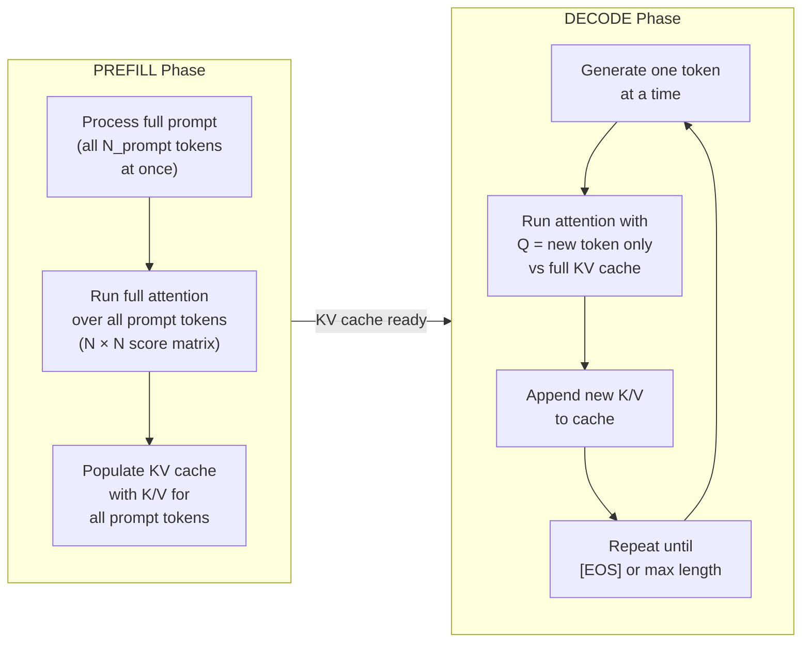

# Lesson 2.2 — KV Cache: Theory, Memory Math, and Optimization

> *Builds on: Lesson 1.3 (Multi-Head Attention)*
> *Context: Inference optimization. PagedAttention/vLLM mentioned briefly — covered in dedicated inference notes.*

---

## The Problem: Quadratic Redundancy at Generation Time

During token generation, a decoder-only model (like LLaMA) produces one token at a time. To generate token at position t, it runs attention over **all tokens from position 1 to t**.

Without caching, every generation step re-computes K and V for all past tokens:

```
Generating token 1:  attend to [x1]                    → compute K1, V1
Generating token 2:  attend to [x1, x2]                → compute K1, V1, K2, V2 (K1/V1 again!)
Generating token 3:  attend to [x1, x2, x3]            → compute K1, V1, K2, V2, K3, V3 (K1/V1, K2/V2 again!)
...
Generating token N:  attend to [x1...xN]               → compute K1...KN, V1...VN
```

Token 1's K and V are recomputed at every single step. For a sequence of length N, K1 is computed N times. Total redundant work: O(N²) — the same quadratic bottleneck as the score matrix, but for a different reason.

**KV cache** eliminates this by computing K and V for each token exactly once and storing them.

---

## What Gets Cached and Why

Recall the attention computation for a single token:

```
Q_t = x_t · Wq       ← depends on current token x_t only
K_t = x_t · Wk       ← depends on current token x_t only
V_t = x_t · Wv       ← depends on current token x_t only
```

**K_t and V_t depend only on token t's own embedding** — they are fixed the moment token t is processed. They don't change as future tokens are generated. → **Safe to cache.**

**Q_t depends on the current token being processed** — it changes at every step (a new token is always queried). → **Never cached.**

At step t, the attention computation with caching becomes:

```python
# At step t:
# Cache contains K1...K(t-1), V1...V(t-1) from previous steps
# Only new token's K and V need to be computed

new_K = x_t @ W_k               # compute K for new token only
new_V = x_t @ W_v               # compute V for new token only

# Append to cache
K_cache = concat([K_cache, new_K], dim=seq_dim)   # K1...Kt
V_cache = concat([V_cache, new_V], dim=seq_dim)   # V1...Vt

# Query is for current token only
Q_t = x_t @ W_q

# Attend over full history using cached K, V
scores = Q_t @ K_cache.T / sqrt(d_k)   # (1, t) — one query vs all past keys
weights = softmax(scores)
output_t = weights @ V_cache            # (1, d_v)
```

---

## Prefill vs Decode — Two Distinct Phases

A critical distinction that is often missing from basic explanations:



| | Prefill | Decode |
|---|---|---|
| **Tokens processed** | All prompt tokens at once | One new token at a time |
| **Score matrix size** | `N_prompt × N_prompt` — full quadratic | `1 × N_total` — one query vs all cache |
| **Compute characteristic** | **Compute-bound** (large matmuls, GPU utilization high) | **Memory-bandwidth-bound** (small matmul, KV cache must be loaded from HBM) |
| **GPU utilization** | High (matrix ops saturate CUDA cores) | Low (most time spent waiting for memory) |
| **Bottleneck** | FLOP throughput | HBM bandwidth — reading K and V for all past tokens |

> **Interview note:** "Why is decode memory-bandwidth-bound?" — During decode, the score computation is `(1 × d_k) × (d_k × N_past)` — one query against N_past keys. This is a matrix-vector product, not a large matmul. The GPU's thousands of CUDA cores are mostly idle while waiting for the KV tensors to stream from HBM. The bottleneck isn't arithmetic — it's moving KV tensors from slow memory to fast compute units. This is exactly why MQA and GQA (Lesson 2.3) exist: reducing KV size means less data to load per decode step.

---

## KV Cache Memory Formula

The exact memory required for the KV cache:

```
Memory = 2 × L × H_kv × d_head × S × B × bytes_per_element
```

Where:
- `2` — Key and Value (two tensors)
- `L` — number of transformer layers
- `H_kv` — number of KV heads (= H for MHA; < H for GQA/MQA)
- `d_head` — dimension per head = d_model / H_total
- `S` — sequence length (prompt + generated tokens)
- `B` — batch size
- `bytes_per_element` — 2 for FP16/BF16, 4 for FP32, 1 for INT8

### Worked Example: DeepSeek-R1/V3 (matching the image below)


*DeepSeek R1/V3: d_k = d_v = 128, 2 bytes/element (BF16), h = 128 heads, L = 61 layers, N = 32,768 tokens → 131 GB.*

```
d_head = 128
bytes  = 2   (BF16)
H_kv   = 128
L      = 61
S      = 32,768 tokens
B      = 1

Memory = 2 × 61 × 128 × 128 × 32768 × 1 × 2
       = 2 × 61 × 128 × 128 × 32768 × 2
       ≈ 131 GB
```

131 GB just for the KV cache, for a single sequence. This is why the entire KV cache reduction research direction (MQA → GQA → MLA) exists.

### LLaMA-3 8B (GQA, 8 KV heads):

```
d_model = 4096, H_total = 32, d_head = 128
H_kv    = 8    (GQA — 8 KV heads instead of 32)
L       = 32
S       = 8192 (8K context)
B       = 1
bytes   = 2

Memory = 2 × 32 × 8 × 128 × 8192 × 1 × 2
       ≈ 1.07 GB   (much more reasonable!)
```

---

## Visual: KV Caching in Action


*k1 through k6 were computed and cached in previous steps. When generating token 7, only q7 and k7 need to be computed. q7 attends to the full cache k1…k7. Past K and V vectors (purple V column) are reused.*

---

## KV Cache Optimization Strategies

### 1. KV Quantization (INT8 / FP8)

Store K and V tensors in lower precision:
```
FP16 → INT8: 2× memory reduction
FP16 → FP8:  2× memory reduction (with slightly different rounding)
FP16 → INT4: 4× memory reduction (higher accuracy degradation)
```

The key challenge: outlier values in K and V (a few very large values) cause significant quantization error. Solutions include per-channel quantization, smoothing (similar to SmoothQuant), and the **Hadamard rotation** technique covered in Lesson 3.3.

### 2. KV Eviction — H2O and StreamingLLM

At very long sequences, you can't keep all past K/V in memory. Solutions:
- **H2O (Heavy Hitter Oracle):** Keep only tokens with the highest accumulated attention scores ("heavy hitters") — these have been most attended to and are likely still important
- **StreamingLLM:** Keep the first few tokens (attention sinks — Lesson 3.3) and a recent sliding window; evict everything between

### 3. Sliding Window Attention (Mistral)

Don't attend to all past tokens — only the last W tokens:
- KV cache size is capped at `W × layers × H_kv × d_head × 2 × bytes`
- Fixed memory footprint regardless of sequence length
- Limitation: can't attend to tokens older than W — loses long-range context

### 4. PagedAttention (vLLM) — Brief

Standard KV cache allocates a contiguous block of memory for the maximum sequence length upfront. Most of this is wasted for shorter sequences (internal fragmentation) and you can't share KV blocks between concurrent requests.

PagedAttention stores KV cache in non-contiguous "pages" (like OS virtual memory paging), enabling:
- Near-zero memory fragmentation
- KV sharing between parallel decoding branches (beam search, speculative decoding)
- Significantly higher batch sizes at the same GPU memory budget

> This is covered in depth in the dedicated vLLM/inference serving notes.

---

## Limitations of KV Cache

**1. Memory grows linearly with sequence length and batch size:**
Even with GQA, the KV cache is the dominant memory consumer at long contexts and large batches.

**2. First token latency = prefill compute:**
For long prompts (RAG, long context), prefill is the bottleneck — O(N²) compute for the score matrix. KV cache doesn't help prefill — only decode.

**3. Throughput vs latency trade-off:**
Larger batch size = more requests served simultaneously = higher throughput. But each request adds to total KV memory needed. GPU memory limits batch size, which limits throughput.

**4. Cache invalidation:**
If the same prompt is seen twice (e.g., a system prompt used across many requests), should you cache its KV? Yes — this is **prefix caching**, implemented in production systems (vLLM, TGI). But it requires careful cache management.

---

## Summary

- KV cache eliminates recomputation of K and V for past tokens — from O(N²) redundant work to O(1) reuse per step
- **Only K and V are cached** — Q is always recomputed for the current token
- **Prefill** (processing the prompt) is compute-bound; **Decode** (generating tokens) is memory-bandwidth-bound
- Memory formula: `2 × L × H_kv × d_head × S × B × bytes` — DeepSeek at 32K context = 131 GB (MHA)
- Optimizations: KV quantization (INT8/FP8), eviction (H2O, StreamingLLM), sliding window, PagedAttention

---

## Interview Q&A

**Q: Why is decode memory-bandwidth-bound and not compute-bound?**
During decode, the attention score computation is a matrix-vector product (`(1, d_k) × (d_k, N_past)`) — very small. The GPU's CUDA cores are idle while the KV tensors stream from HBM. The bottleneck is memory bandwidth, not arithmetic throughput.

**Q: Why can't you cache Q?**
Q is computed from the current token being processed (`Q_t = x_t · Wq`). It changes at every step because x_t changes. K and V for past tokens are fixed because they depend only on already-processed token embeddings.

**Q: How much memory does KV cache use for LLaMA-3 8B at 8K context, batch=1?**
`2 × 32 × 8 × 128 × 8192 × 2 bytes ≈ 1.07 GB`. (32 layers, 8 KV heads from GQA, 128 head dimension, 8K tokens, BF16)

**Q: What is the difference between prefill and decode?**
Prefill processes the full prompt in one forward pass — compute-bound, runs full O(N²) attention. Decode generates one token at a time — memory-bandwidth-bound, uses the KV cache. Real systems optimize these phases differently.

**Q: What happens to KV cache memory as you increase batch size?**
It scales linearly: 2× batch = 2× KV memory. This is the primary constraint on batch size during inference. Once KV cache fills GPU memory, you can't add more requests to the batch.
