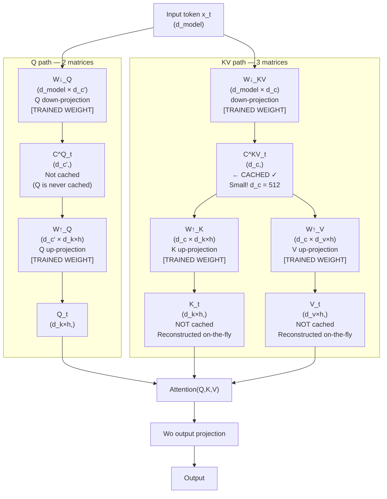

# Lesson 3.1 — Multi-Head Latent Attention (MLA)

> *Builds on: Lesson 2.3 (MQA & GQA)*
> *Paper: "DeepSeek-V2: A Strong, Economical, and Efficient Mixture-of-Experts Language Model" — DeepSeek-AI (2024)*

---

## Quick Recap: What Exactly Is the KV Cache?

Before understanding MLA, we need to be precise about what "KV cache" means — because this is where a lot of confusion starts.

In standard MHA, three **projection matrices** exist as model weights:
```
Wq  (d_model × d_model)  — Query projection weights
Wk  (d_model × d_model)  — Key projection weights
Wv  (d_model × d_model)  — Value projection weights
```

These are **fixed after training** — they live inside the model and never change at inference.

When a token at position t is processed, the model **applies** these projections to the token embedding `x_t`:
```
q_t = x_t · Wq    → a new vector, computed fresh every step
k_t = x_t · Wk    → a new vector, computed from this token
v_t = x_t · Wv    → a new vector, computed from this token
```

The **KV cache** is NOT the projection matrices `Wk, Wv` — those never move.
The **KV cache** is the **computed output tensors** `k_t` and `v_t` — the result of applying those projections to each past token's embedding. These must be reused every time a new token is generated, so they are saved.

```
KV cache stores:
  Layer 1: { k_1, k_2, ..., k_t }  and  { v_1, v_2, ..., v_t }
  Layer 2: { k_1, k_2, ..., k_t }  and  { v_1, v_2, ..., v_t }
  ...
  Layer L: { k_1, k_2, ..., k_t }  and  { v_1, v_2, ..., v_t }
```

For MHA with h=128 heads, d_k=128, in BF16, the cache for ONE position across ALL layers grows as:
```
2 (K and V) × 128 (heads) × 128 (d_k) × L (layers) × 2 bytes = huge
```

This is the memory being attacked. The projection matrices Wk and Wv themselves are not the issue — it's the accumulated **per-token computed K and V vectors** at every layer.

---

## The Problem: GQA Is a Structural Hack, Not a Learned Compression

GQA (Lesson 2.3) reduces the KV cache by using fewer K/V projection heads — instead of h separate `Wk_i` matrices, there are only g `Wk_group` matrices. The savings are real, but the approach is limited:

1. The sharing pattern is **fixed** — heads 1 and 2 always share the same K/V, regardless of what the tokens contain
2. You still store the computed `k_t` and `v_t` vectors in the cache — just with fewer heads
3. There's no mechanism for the model to learn a more compact, cross-head representation

**MLA takes a fundamentally different approach:**

> Instead of storing the computed K and V vectors, store a single **compressed latent vector** from which K and V for all heads can be reconstructed. The latent is much smaller than the full K+V vectors.

---

## MLA's Matrix Structure — All 5 New Projection Matrices

This is the most important thing to get right. MLA replaces the standard `(Wq, Wk, Wv)` with a different set of matrices:

### KV Side: 3 Matrices (replacing Wk and Wv)

```
W↓_KV  (d_model × d_c)      — KV Down-projection: compresses x_t → shared latent
W↑_K   (d_c × d_k × h)      — K Up-projection: reconstructs K for all h heads from latent
W↑_V   (d_c × d_v × h)      — V Up-projection: reconstructs V for all h heads from latent
```

At each token position `t`:
```
Step 1: Compress to latent
  C^KV_t = x_t · W↓_KV          # shape: (d_c,)  — ONE vector per token
                                  # d_c ≪ d_model (e.g. 512 vs 5120)

Step 2 (at attention time, NOT at cache time): Reconstruct K and V
  K_t = C^KV_t · W↑_K           # shape: (d_k × h,) — full K for all heads
  V_t = C^KV_t · W↑_V           # shape: (d_v × h,) — full V for all heads
```

**What the KV cache stores:** Only `C^KV_t` — the small latent vector — NOT the full `K_t` and `V_t`.

The K and V vectors are **never stored**. They are reconstructed on-the-fly from the cached latent whenever attention is computed.

### Q Side: 2 Matrices (replacing Wq)

```
W↓_Q   (d_model × d_c')     — Q Down-projection: compresses x_t → query latent
W↑_Q   (d_c' × d_k × h)     — Q Up-projection: reconstructs Q for all h heads
```

At each token position `t`:
```
C^Q_t = x_t · W↓_Q           # shape: (d_c',) — compressed query latent
Q_t   = C^Q_t · W↑_Q         # shape: (d_k × h,) — full Q for all heads
```

Note: Q is never cached (Q changes every step), so this compression is for **training memory efficiency**, not KV cache reduction.

### Summary: MLA vs MHA Projection Matrices

| Architecture | Q side | K side | V side | Total new matrices |
|---|---|---|---|---|
| **MHA** | `Wq` (1 matrix) | `Wk` (1 matrix) | `Wv` (1 matrix) | 3 |
| **GQA** | `Wq` (1 matrix) | `Wk_g` (g/h of the size) | `Wv_g` (g/h of the size) | 3 |
| **MLA** | `W↓_Q, W↑_Q` (2 matrices) | `W↓_KV, W↑_K` (shared down + 1 up) | `W↑_V` (1 up, shares W↓_KV) | **5** |

The 5 matrices are: **W↓_KV, W↑_K, W↑_V, W↓_Q, W↑_Q** (plus the output projection Wo, which all architectures share).



---

## Memory Savings: The Numbers

DeepSeek-V2 (d_model = 5120, h = 128 heads, d_k = d_v = 128):

| What is cached per token per layer | MHA | GQA (g=16) | MLA |
|---|---|---|---|
| K and V vectors | `128 × 128 + 128 × 128 = 32,768 dims` | `16×128 + 16×128 = 4,096 dims` | **0 dims** (not cached) |
| Latent C^KV | — | — | **512 dims** |
| **Total** | **32,768** | **4,096** | **512** |
| **vs MHA** | 1× | 8× smaller | **64× smaller** |


*C^KV has dimension d_c=512. The full K tensor (128 × 128 = 16,384 dims) is NEVER stored — reconstructed from C^KV each time using W↑_K.*

---

## The Associativity Inference Trick — Eliminating K Reconstruction

Even though K is reconstructed from C^KV, at inference we are doing this reconstruction just to immediately compute `Q · K^T`. Can we skip the reconstruction entirely?

**The key observation:**

```
score = Q · K^T
      = Q · (C^KV · W↑_K)^T            # substitute K = C^KV · W↑_K
      = Q · W↑_K^T · C^KV^T            # (AB)^T = B^T · A^T
      = (Q · W↑_K^T) · C^KV^T          # matrix multiplication is associative: A(BC) = (AB)C
```

So we can compute `Q · W↑_K^T` first (call it `Q_absorbed`), then dot it with the cached `C^KV`:

```
Q_absorbed = Q_t · W↑_K^T     # shape: (d_c,)  — Q projected into latent space
score      = Q_absorbed · C^KV_n^T   # for all past n — directly against cached latent!
```

**What this achieves:**
- `K_t` (shape `d_k × h` per position per layer) is **never reconstructed or stored**
- `C^KV_n` (shape `d_c`) is loaded from cache
- `W↑_K` gets "absorbed" into the Q projection: define a new combined weight `W_Q_absorbed = W_Q_final · W↑_K^T` and precompute it once at model load time
- **Zero extra cost at inference time** compared to standard attention


Similarly for V: absorb W↑_V into the output projection Wo:
```
output = (attention_weights · C^KV_all) · W↑_V · Wo
       = attention_weights · C^KV_all · (W↑_V · Wo)
```
Precompute `(W↑_V · Wo)` once — V is also never materialized.

---

## The RoPE Incompatibility — Step by Step

Now we understand the absorption trick. Here's exactly why standard RoPE breaks it.

### What RoPE Does in Standard Attention

In standard attention, RoPE is applied to the computed `q` and `k` vectors before the dot product:
```
q_m_rope = RoPE(q_m, position=m)    # rotate q by angle proportional to m
k_n_rope = RoPE(k_n, position=n)    # rotate k by angle proportional to n

score(m, n) = q_m_rope · k_n_rope^T
```

The mathematical result is that `score(m, n)` depends only on the **relative distance** `(m - n)`, not on absolute positions — this is the whole point of RoPE.

### Why This Breaks the MLA Absorption Trick

In MLA, `k_n = C^KV_n · W↑_K`. If we apply RoPE to this:
```
k_n_rope = RoPE(C^KV_n · W↑_K, position=n)
         = R_n · (C^KV_n · W↑_K)        # R_n is the rotation matrix for position n
```

Now let's try to do the absorption trick:
```
score = q_m_rope · k_n_rope^T
      = q_m_rope · (R_n · C^KV_n · W↑_K)^T
      = q_m_rope · W↑_K^T · C^KV_n^T · R_n^T
```

**The problem is `R_n^T` at the end.** `R_n` is a **different rotation matrix for every cached position n**. To use the absorption trick, we need:
```
score = (q_m_rope · W↑_K^T) · (C^KV_n · R_n)^T    # rotate each cached latent by its position
```

This means to compute the score, we must rotate every `C^KV_n` by its own `R_n` before dotting. We'd have to load all cached `C^KV_n` values, rotate each one differently, then dot — we can't precompute anything. The absorption trick is completely broken.

The absorption trick works **only** when the transformation applied to K is a **fixed linear map** (the same W↑_K for all positions). RoPE's `R_n` is position-specific — it's a different transformation for every cached token.


---

## Decoupled RoPE — The Solution

DeepSeek-V2's solution: **split K (and Q) into two independent components** — one for semantic content (no RoPE, can absorb), and one for position (standard RoPE applied, cached separately).

### Step 1: Split K into Two Parts

Instead of one K vector per position, compute two:

```
# Part 1: Content component — from latent, NO RoPE
K_C_n = C^KV_n · W↑_K_C       # shape: (d_k_c × h,)
                                # NO rotation applied
                                # Can use absorption trick ✓

# Part 2: Position component — from a SEPARATE new projection, WITH RoPE
# ⚠ This is a SHARED key (like MQA) — one key vector shared by all h heads for position
K_R_n = RoPE(x_n · W_KR, position=n)   # shape: (d_r,)  — NOT d_r × h
                                         # Shared across all heads (like MQA for position)
                                         # Cached separately as a small vector
```

The full K vector is the **concatenation** of these two parts:
```
K_n = concat(K_C_n, K_R_n)    # shape: ((d_k_c + d_r) × h,)
```

### Step 2: Split Q to Match

Q must also be split to match K's two parts:
```
# Part 1: Content component — uses absorbed W↑_K_C
Q_C_m = (C^Q_m · W↑_Q) · W↑_K_C^T    # can be precomputed as one matrix

# Part 2: Position component — gets RoPE applied
Q_R_m = RoPE(x_m · W_QR, position=m)  # standard RoPE rotation
```

### Step 3: Compute Score from Both Parts

The final attention score is:
```
score(m, n) = Q_C_m · K_C_n^T + Q_R_m · K_R_n^T
             ────────────────   ────────────────
             Content term:       Position term:
             Absorption trick    Standard RoPE dot product
             works here ✓        works here ✓
```

**Content term:** `Q_C_m · K_C_n^T = (precomputed_Q_absorbed) · C^KV_n^T` — no rotation, full absorption trick applies ✓

**Position term:** `Q_R_m · K_R_n^T` — both are RoPE-rotated, standard relative-position property holds ✓


### **What gets cached with Decoupled RoPE:**

```
KV cache per position per layer:
  C^KV_n       → (d_c,)  dims — the latent (for content attention + V reconstruction)
  K_R_n        → (d_r,)  dims — the RoPE key, SHARED across all heads (like MQA)

Total = d_c + d_r
```

> **Important:** The paper calls K_R the "decoupled shared key" — it is one vector shared by all heads for positional scoring, analogous to how MQA shares a single key across all query heads. Only the content key (inside C^KV) is unique per-head.

Compare:
```
MHA:   h × (d_k + d_v) = 128 × (128 + 128) = 32,768 dims
GQA:   g × (d_k + d_v) = 16  × (128 + 128) = 4,096  dims
MLA:   d_c + d_r        = 512 + 64          = 576    dims   → ~57× smaller than MHA!
```

> Note: DeepSeek-V2's paper reports 93.3% KV cache reduction overall. This is consistent with the MLA cache (576 dims) vs MHA (32,768 dims) — 576/32768 ≈ 1.75% remaining ≈ 98% reduction. Small differences come from layer count, implementation details, and RoPE dimension configuration.

The full K and V tensors for ALL heads are still never cached — only the much smaller latent `C^KV_n` and the tiny shared positional key `K_R_n`.

### The New Complete Matrix Inventory

With Decoupled RoPE, the complete list of projection matrices in MLA is:

| Matrix | Shape | Purpose |
|---|---|---|
| `W^{DKV}` | (d_c × d_model) | KV down-projection — compress to latent (paper notation) |
| `W^{UK}` | (d_h × n_h × d_c) | K content up-projection — absorbed into W^Q at inference |
| `W^{UV}` | (d_h × n_h × d_c) | V up-projection — absorbed into W^O at inference |
| `W^{KR}` | (d_r × d_model) | K RoPE projection — **shared** across heads, gets RoPE, cached |
| `W^{DQ}` | (d_c' × d_model) | Q down-projection |
| `W^{UQ}` | (d_h × n_h × d_c') | Q content up-projection |
| `W^{QR}` | (d_r × d_model) | Q RoPE projection — gets RoPE |
| `W^O` | (d_v × n_h × d_model) | Output projection (same as MHA) |

---

## Full Comparison: MHA → GQA → MLA

| Property | MHA | GQA (g=8) | MLA |
|---|---|---|---|
| **Matrices for K/V** | W^K, W^V (2) | W^K_g, W^V_g (2, smaller) | W^{DKV}, W^{UK}, W^{UV} (+ W^{KR} shared RoPE) |
| **What is cached** | Full k_t, v_t per head | Full k_t, v_t per group | Latent c^KV + shared RoPE key k^R |
| **KV cache per token** | h × (d_k + d_v) | g × (d_k + d_v) | d_c + d_r (shared k^R, like MQA) |
| **Compression type** | None | Fixed block replication | Learned low-rank + shared positional key |
| **Absorption trick** | N/A | N/A | Yes: W^UK→W^Q, W^UV→W^O |
| **RoPE compatible** | ✅ directly | ✅ directly | ⚠️ Requires Decoupled RoPE |
| **Used in** | LLaMA-1/2, BERT, GPT | LLaMA-3, Mistral | DeepSeek-V2/V3/R1 |

---

## Limitations

**1. Training from scratch required:**
MLA's architecture (W↓_KV, two-part K/Q, Decoupled RoPE) must be baked in from the start. There is no clean conversion from a GQA or MHA checkpoint — the entire projection structure is different.

**2. Implementation complexity:**
Two separate K computation paths (content from latent, position from W_KR) with different caching strategies. The absorbed projections (W↑_K absorbed into Q, W↑_V absorbed into Wo) must be precomputed and stored separately from the unabsorbed weights.

**3. Custom kernels needed:**
Flash Attention kernels are built for standard MHA/GQA — they assume K and V are provided directly. MLA's latent-reconstruct path requires custom CUDA kernels.

**4. Small K_R still adds to cache:**
Even though it's much smaller than full K, the RoPE key `K_R_n` (d_r × h dims per position) still grows linearly with sequence length and must be cached.

---

## Summary

- The **KV cache** is NOT the projection matrices `Wk, Wv` — it is the **computed k_t, v_t tensors** produced by applying those projections to each past token. These accumulate per-position per-layer.
- MLA replaces `(Wk, Wv)` with a 3-matrix system: `W↓_KV` (shared down-projection) + `W↑_K` + `W↑_V` (separate up-projections). Only the small latent `C^KV = x_t · W↓_KV` is cached — K and V are reconstructed on-the-fly.
- Q is also compressed: `W↓_Q` + `W↑_Q` — reducing activation memory during training (Q is never cached).
- **Total new matrices: 5** (`W↓_KV, W↑_K, W↑_V, W↓_Q, W↑_Q`) plus output projection — replacing MHA's 3 (`Wq, Wk, Wv`).
- **Absorption trick**: `score = Q · K^T = Q · (C^KV · W↑_K)^T = (Q · W↑_K^T) · C^KV^T`. K is never materialized; `W↑_K` is precomputed into Q's projection. Same for V into Wo.
- **Standard RoPE breaks the absorption trick**: RoPE applies a different rotation `R_n` to each cached position. You'd need to rotate every `C^KV_n` by its own `R_n` at query time — killing the absorption benefit.
- **Decoupled RoPE**: split K into `K_C` (from latent, no RoPE → absorption works) and `K_R` (from a separate projection `W_KR`, with RoPE → cached as a small vector). Score = content_score + position_score. Both halves work correctly.

---

## Interview Q&A

**Q: What exactly does the KV cache store in standard MHA?**
The computed K and V tensors for each past token — the result of `k_t = x_t · Wk` and `v_t = x_t · Wv`. Not the projection matrices Wk and Wv themselves (those are model weights, stay fixed). The cache accumulates these per-position vectors at every layer, growing linearly with sequence length.

**Q: What exactly gets cached in MLA?**
Two things: (1) the KV latent `c^KV` (dimension d_c) — compressed representation for ALL h heads; (2) the decoupled **shared** key `k^R` (dimension d_r) — ONE key shared by all h heads for positional scoring (like MQA). The full K and V tensors are never cached. Total cache per position per layer = d_c + d_r.

**Q: You said MLA has 5 projection matrices — what are they and what does each do?**
(1) `W^{DKV}`: projects input to the shared KV latent c^KV — this is what gets cached. (2) `W^{UK}`: up-projects latent to full K for all heads — absorbed into W^Q at inference, never explicitly computed. (3) `W^{UV}`: up-projects latent to full V for all heads — absorbed into W^O. (4) `W^{DQ}`: down-projects input to compressed query latent (training memory). (5) `W^{UQ}`: up-projects query latent to full Q.

**Q: What is the associativity trick in MLA?**
`Q · K^T = Q · (C^KV · W^{UK})^T = (Q · W^{UK}^T) · C^{KV}^T`. Since W^{UK} is a fixed matrix (same for all positions), it can be absorbed into Q's projection — compute `Q_absorbed = Q · W^{UK}^T` once, then score = `Q_absorbed · C^{KV}^T`. The paper explicitly states: "W^{UK} can be absorbed into W^Q, and W^{UV} can be absorbed into W^O, we even do not need to compute keys and values out for attention."

**Q: Why does standard RoPE break the absorption trick?**
RoPE applies a different rotation matrix `R_n` to K at each cached position n. With the absorption trick you'd need: `score = Q_absorbed · (R_n · C^KV_n)^T` — requiring rotation of every cached C^KV_n by its own R_n at query time, which varies per position and can't be precomputed. This destroys the absorption benefit entirely.

**Q: How does Decoupled RoPE solve this?**
Split K into two parts: `k^C` (content, from latent C^KV, no RoPE → absorption trick works) and `k^R` (position, from separate projection W^{KR}, with standard RoPE). The paper calls k^R the "decoupled **shared** key" — ONE key shared across all h heads for position (like MQA). Score = content_term + position_term. Cache stores C^KV (d_c dims) + shared k^R (d_r dims).

**Q: How does MLA differ from GQA?**
GQA reduces KV heads from h to g — still stores full k_t, v_t per group (just fewer of them). MLA stores neither K nor V — it stores a compressed latent C^KV and a shared positional key k^R. GQA is a structured head-replication; MLA is a learned low-rank compression with a completely different projection matrix structure (W^{DKV}, W^{UK}, W^{UV} vs. standard Wk, Wv).
