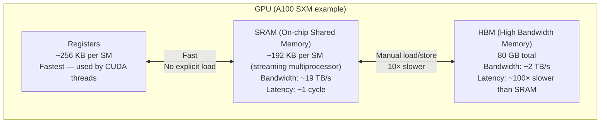
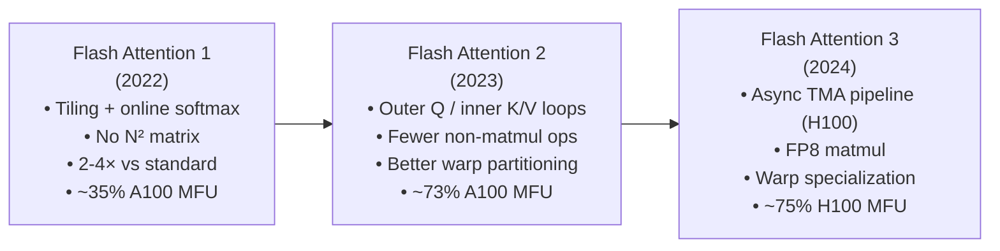

# Lesson 3.2 — Flash Attention 1, 2, and 3: Algorithm Deep Dive

> *Builds on: Lesson 1.3 (Multi-Head Attention), basic awareness of GPU memory hierarchy*
> *Papers: FlashAttention (Dao et al. 2022), FlashAttention-2 (Dao 2023), FlashAttention-3 (Shah et al. 2024)*

---

## The Problem: Standard Attention is IO-Bound, Not Compute-Bound

Standard attention materializes the full `(N × N)` score matrix in GPU HBM (High Bandwidth Memory). For N = 32K tokens and h = 32 heads in FP16:
```
Score matrix: N × N × h × 2 bytes = 32768 × 32768 × 32 × 2 ≈ 69 GB
```
This makes attention **memory-bound**, not compute-bound. The GPU spends most of its time moving data between HBM and SRAM — not doing arithmetic.

**Key insight from the FlashAttention paper:**
> The attention operation is correct as computed — but the intermediate N×N matrix is never needed all at once. If we could compute attention tile by tile, keeping each tile in fast SRAM, we'd eliminate most of the HBM traffic.

---

## GPU Memory Hierarchy

Understanding Flash Attention requires knowing where data lives on a GPU:



| Memory | Size | Bandwidth | Latency |
|---|---|---|---|
| **Registers** | ~256 KB per SM | Fastest | ~1 cycle |
| **SRAM (shared)** | ~192 KB per SM | ~19 TB/s | ~1 cycle |
| **HBM** | 40–80 GB | ~2 TB/s | ~100 cycles |

The gap between SRAM bandwidth and HBM bandwidth is ~10×. The gap between HBM and compute throughput on A100 is ~15× for FP16. Reading from HBM is the bottleneck for attention.

---

## Standard Attention: IO Analysis

Standard attention reads and writes the following HBM operations:

```
Forward pass:
  Read Q, K:        2 × N × d   elements   (compute QKᵀ)
  Write scores S:   N × N       elements   (write full score matrix to HBM)
  Read scores S:    N × N       elements   (read back for softmax)
  Write weights P:  N × N       elements   (write softmax output to HBM)
  Read weights P:   N × N       elements   (read back for weighted sum P·V)
  Read V:           N × d       elements   (for weighted sum)
  Write output O:   N × d       elements

Total HBM reads/writes: O(N·d + N²) 
Dominant term: O(N²) for N >> d
```

For N=32K, the N² term is 32768² ≈ 10⁹ elements = ~2 GB for FP16. This must be read and written multiple times per layer.

---

## Flash Attention 1: The Tiling Algorithm

**Core idea:** Tile Q, K, V into blocks that fit in SRAM. Process one tile at a time without ever writing the N×N score matrix to HBM.

The challenge: softmax requires the **global sum** across all N keys to normalize. If you process one block of K at a time, you don't have the full sum yet.

**Solution: Online Softmax** — maintain a running normalization factor that is updated as you process each tile.

### Online Softmax — Step by Step

For a single query row q attending to N keys k₁...kₙ, split into T tiles:

Standard softmax: `softmax(x)_i = exp(xᵢ) / Σⱼ exp(xⱼ)` — requires all xⱼ first.

Online softmax processes tiles incrementally with three running statistics:
- `m_j` — running maximum of scores seen so far (for numerical stability)
- `ℓ_j` — running sum of exp(score - running_max) seen so far
- `O_j` — running weighted sum of values seen so far

**Initialize:**
```
m₀ = -∞
ℓ₀ = 0
O₀ = 0
```

**For each tile block j = 1 to T:**
```
# 1. Load block of K_j, V_j from HBM to SRAM
# 2. Compute scores for this block
s_j = q · K_jᵀ / √d_k             # scores for this tile (small vector, fits in SRAM)

# 3. Update running maximum
m_j = max(m_{j-1}, max(s_j))      # new max (could have increased)

# 4. Correct previous running sum for new max
ℓ_j = exp(m_{j-1} - m_j) · ℓ_{j-1}  +  sum(exp(s_j - m_j))
#       ↑ rescale old sum to new max      ↑ add new tile's contribution

# 5. Correct previous running output for new max
O_j = exp(m_{j-1} - m_j) · O_{j-1}  +  exp(s_j - m_j) · V_j
#      ↑ rescale old output              ↑ add new tile's contribution

# 6. Move to next tile
```

**Final:**
```
output = O_T / ℓ_T    # divide by total sum to get proper softmax normalization
```

This produces the **exact same result** as full softmax — no approximation. The running rescaling `exp(m_{j-1} - m_j)` corrects for the fact that we found a larger maximum later.

> **Interview note:** "Walk me through online softmax." This is the core of Flash Attention. The key update is: when you see a new maximum `m_new`, all previous exp values were computed with `exp(x - m_old)`, but they should have been `exp(x - m_new) = exp(x - m_old) × exp(m_old - m_new)`. So multiply old `ℓ` and old `O` by `exp(m_old - m_new)` to correct. Then add the new tile's contribution computed with `exp(x - m_new)`.

### IO Complexity of Flash Attention

```
For each of N query rows (outer loop over Q tiles):
  For each of T key-value tiles (inner loop over K, V tiles):
    Load K_tile, V_tile from HBM: O(d × B_KV)  where B_KV = tile size
    Compute scores: O(B_Q × B_KV)  in SRAM
    Update running (m, ℓ, O): O(B_Q × B_KV)  in SRAM

Total HBM reads: Q, K, V = O(N × d)
Write output O:            = O(N × d)

Total IO: O(N × d)  — NO N² term!
```

Formally: `O(N² d² / M)` where M = SRAM size. As long as M ≥ d² (the block fits the head dimension squared), this is much better than O(N²).

**Backward pass:** Standard attention must store the N×N attention matrix for the gradient computation. Flash Attention avoids this by **recomputing** the forward pass tile by tile during the backward pass. This trades compute (running the forward pass again) for memory (not storing N×N). The extra compute is small (~2×) compared to the memory savings.

---

## Flash Attention 1 vs Standard Attention

| | Standard Attention | Flash Attention 1 |
|---|---|---|
| **N×N matrix** | Materialized in HBM | Never materialized |
| **HBM IO** | O(N²) | O(N·d) |
| **SRAM usage** | O(B²) per tile | O(B·d) per tile |
| **Backward storage** | O(N²) — full attention matrix | O(N·d) — recompute forward |
| **Math equivalent** | Exact | Exact (no approximation) |
| **Speed (A100)** | 1× baseline | 2–4× faster |
| **Memory** | O(N²) | O(N) |

---

## Flash Attention 2: Three Key Improvements

Flash Attention 2 (Dao, 2023) achieves ~2× additional speedup over FA1 with three algorithmic changes:

### Change 1: Outer Loop on Q, Inner Loop on K/V

FA1 loops: **outer over K/V blocks, inner over Q blocks**
FA2 loops: **outer over Q blocks, inner over K/V blocks**

Why does this matter? Each Q block is loaded once from HBM and kept in SRAM while iterating through all K/V tiles. This reduces Q loads from HBM by the factor of K/V tiles. FA1 loaded each Q block once per K/V tile; FA2 amortizes Q loading across all K/V tiles.

Also: FA2 writes the output O for each Q block only once (after the full inner K/V loop finishes). FA1 had to incrementally write partial outputs.

### Change 2: Reduced Non-Matrix-Multiply FLOPs

The online softmax update involves per-element operations (exp, division) that aren't matmuls. On modern GPUs, tensor cores run at `~312 TFLOPS` for FP16 matmul but only `~20 TFLOPS` for element-wise ops — a 15× gap.

FA2 reorganizes the update order to minimize element-wise ops:
- Defer the final `O / ℓ` normalization to the end of each Q block (not per-tile)
- Batch the running-max corrections as much as possible

This increases the fraction of time the GPU spends on matmuls (high throughput) vs element-wise (low throughput).

### Change 3: Better Warp Partitioning

A CUDA warp is 32 threads executing in lockstep. FA1 split work across warps in a way that caused **register contention** — warps had to synchronize to share partial results, introducing overhead.

FA2 assigns warps to independent Q blocks — each warp handles a contiguous Q block with no cross-warp communication needed. Less synchronization = better GPU utilization.

**Net result:** FA2 reaches ~73% of theoretical maximum GPU utilization on A100, compared to ~35% for FA1.

---

## Flash Attention 3: Hopper-Specific Optimizations

Flash Attention 3 (Shah et al. 2024) targets NVIDIA Hopper (H100) architecture features:

### Hopper: Asynchronous Memory Pipeline

H100 introduces **TMA (Tensor Memory Accelerator)** — a hardware unit that can load data from HBM to SRAM asynchronously, while CUDA cores compute on already-loaded data.

FA3 uses a **software pipeline** to overlap:
- **Tile n+1:** loading K/V from HBM (via TMA, async)
- **Tile n:** computing softmax + matmul on current tile (CUDA cores)

This hides HBM latency behind compute — the GPU never waits idle for data.

### FP8 Precision

H100 has dedicated FP8 tensor cores with 2× the throughput of FP16. FA3 runs the inner matmul (QKᵀ and attention weights × V) in FP8 while keeping the softmax in FP32 for numerical stability. This effectively doubles arithmetic throughput.

### Warp Specialization

FA3 uses Hopper's **warpgroup** abstraction — some warps are dedicated to data loading (DMA warps) while others compute (MATH warps). This pipeline is implemented at the hardware level, unlike FA2's software scheduling.

**Results:** FA3 achieves ~75% MFU (Model FLOP Utilization) on H100, compared to ~35% for FA1 on A100.

---

## Flash Decoding: Addressing Long-Context Decode Latency

FA1 and FA2 are optimized for training and prefill — they parallelize over Q blocks. But during decode, there's only **one query token** — no Q parallelism is possible.

For long KV caches (N_past = 128K+ tokens), a single query must attend over a huge K/V — all serially. FA2's parallelism over Q blocks doesn't help.

**Flash Decoding** (Tri Dao, 2023) splits the K/V sequence into S shards across multiple thread blocks:

```
Thread block 1: compute partial softmax over K[0 : N/S], V[0 : N/S]
                → get partial (m₁, ℓ₁, O₁)

Thread block 2: compute partial softmax over K[N/S : 2N/S], V[N/S : 2N/S]
                → get partial (m₂, ℓ₂, O₂)

...

Final reduction: merge all (mₛ, ℓₛ, Oₛ) using the online softmax combination rule
                → exact result
```

The online softmax combination rule generalizes: given two partial results, they can be merged as:
```
m_merged = max(m₁, m₂)
ℓ_merged = exp(m₁ - m_merged) × ℓ₁ + exp(m₂ - m_merged) × ℓ₂
O_merged = exp(m₁ - m_merged) × O₁ + exp(m₂ - m_merged) × O₂
output   = O_merged / ℓ_merged
```

This enables **O(N_past / S) parallel work** instead of O(N_past) serial. Flash Decoding is now standard in inference runtimes.

---

## Positional Encoding Integration with Flash Attention

**RoPE:** Applied to Q and K **before** Flash Attention's tiling loop. Each Q and K vector is rotated by the appropriate angle for its position before being tiled into SRAM blocks. The tiling and online softmax are position-agnostic.

**ALiBi:** Applied **inside** the tiling kernel — the linear position bias `m × |i - j|` is added to each score within the SRAM tile computation. This is one reason ALiBi can conflict with FA: you need to know the global position indices when computing each tile's scores.

---

## Summary: FA1 → FA2 → FA3



---

## Limitations of Flash Attention

**1. SRAM size constrains tile size:**
Tile size B is bounded by SRAM capacity. If `B × d_k` doesn't fit in SRAM (e.g., very large head dimensions), you can't tile efficiently. Very large d_k = 256+ (as in some MLA configs) may require tuning.

**2. Custom CUDA kernel required:**
Flash Attention cannot be implemented in standard PyTorch operations. It requires hand-written CUDA/Triton kernels. Not all hardware or frameworks support it.

**3: Math is identical, not approximate:**
FA does not change attention's mathematical output — it's an exact IO-optimized implementation. This is a strength (no accuracy loss) but also means it can't approximate or sparsify attention patterns.

**4. FA2/FA3 are architecture-specific:**
FA3 is optimized for Hopper (H100). A100 benefits from FA2. On AMD/Intel GPUs, alternative kernels (Triton-based) achieve similar but not identical optimization.

---

## Interview Q&A

**Q: Walk me through how online softmax works in Flash Attention.**
Maintain three running statistics: running max `m`, running sum of exp-values `ℓ`, and running weighted output `O`. For each new tile, compute its scores, update `m` to the new maximum, rescale old `ℓ` and `O` by `exp(m_old - m_new)` to correct for the new baseline, then add the new tile's `exp(s_j - m_new)` contributions to `ℓ` and `O`. At the end, `O / ℓ` gives the exact softmax result.

**Q: Does Flash Attention change the attention output (is it approximate)?**
No. Flash Attention computes the exact same result as standard attention. It's an IO-optimal reorganization of the computation, not an approximation. Online softmax is mathematically equivalent to full softmax.

**Q: What changed in Flash Attention 2 vs 1?**
Three things: (1) Switched outer/inner loops — outer over Q blocks, inner over K/V, reducing Q loads from HBM. (2) Reduced non-matmul FLOPs (element-wise softmax ops) which are 15× slower than matmul on GPU. (3) Better warp partitioning to eliminate cross-warp synchronization bottlenecks.

**Q: What is IO-optimal attention?**
Attention where the number of HBM read/write operations is O(N·d) — scaling linearly with sequence length — rather than O(N²) from materializing the full score matrix. Flash Attention achieves IO-optimality.

**Q: Why doesn't Flash Attention help during decode?**
During decode, there's only one query (the new token), so there's no Q-block parallelism. Flash Decoding addresses this separately by parallelizing over the K/V sequence dimension instead.
