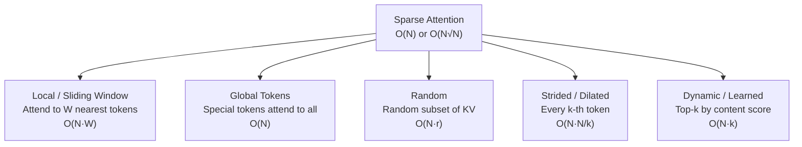
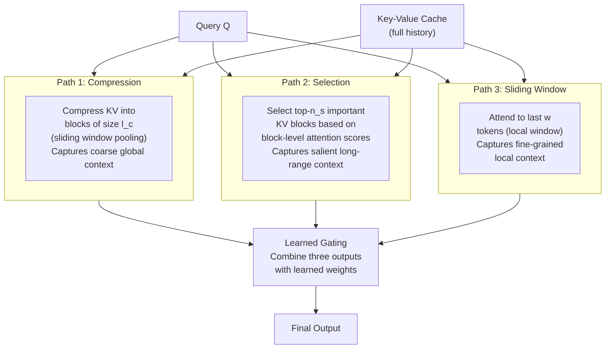

# Lesson 3.3 — Sparse Attention and DeepSeek Native Sparse Attention (NSA/DSA)

> *Builds on: Lesson 3.1 (MLA), Lesson 3.2 (Flash Attention)*
> *Papers: Longformer (Beltagy et al. 2020), BigBird (Zaheer et al. 2020), DeepSeek NSA (2025)*

---

## The Problem: Full Attention is Quadratic in Sequence Length

Standard attention computes a score between **every pair** of tokens. For N tokens:
- Score matrix: N × N entries
- Compute: O(N² × d)
- Memory: O(N²)

For N = 4K (LLaMA-2 context): manageable.
For N = 128K (Claude, Gemini long context): 128K² = 16 billion score entries = ~32 GB in FP16. Infeasible even with Flash Attention (which avoids materializing it but still computes all N² scores).

The core observation: **not all token pairs are equally important**. A token about "cats" attending to a token about "astronomy" 50,000 positions away is mostly noise. Can we attend to only the relevant subset?

**Sparse Attention** computes only a carefully chosen subset of the N×N scores — reducing O(N²) to sub-quadratic complexity.

---

## Sparse Attention Patterns: The Design Space

Different sparse patterns make different assumptions about which token pairs matter:



### Pattern Visualizations

**Local Window (sliding window):**
```
Token 1: attends to [1, 2, 3]
Token 2: attends to [1, 2, 3, 4]
Token 3: attends to [2, 3, 4, 5]
Token 4: attends to [3, 4, 5, 6]
```
Each token attends to its W nearest neighbors. Complexity: O(N × W). Works well for short-range syntactic patterns, fails for long-range dependencies.

**Global tokens:**
```
[CLS]: attends to ALL tokens
All tokens: attend to [CLS]
```
One (or a few) designated global tokens see the full sequence. All regular tokens attend to the global token. Introduces a bottleneck through which long-range information can flow.

---

## Longformer — Linear Complexity with Global Tokens

*Beltagy et al. (2020). ICLR 2021.*

**Problem solved:** BERT-style models can't process long documents because bidirectional full attention is O(N²). For tasks like document classification or long-context QA (N = 4096+), this is prohibitive.

**Solution:** Replace full attention with:
1. **Local window attention** — each token attends to its W nearest neighbors (both directions, bidirectional)
2. **Global tokens** — task-specific tokens (e.g., [CLS], question tokens) attend to all tokens and are attended by all tokens

```
Complexity: O(N × W) for local + O(N × k) for global tokens
          = O(N) for fixed W, k
```

**Limitation:** Window size W is a fixed hyperparameter. Information can only flow more than W positions through multiple layers — "local receptive field grows with depth." For tasks requiring very long-range dependencies, many layers are needed. Also, the fixed window may miss important but distant tokens within the window.

---

## BigBird — Universal Approximation with Sparse Patterns

*Zaheer et al. (2020). NeurIPS 2020.*

**Problem solved:** Longformer's local + global pattern isn't theoretically complete — can it represent all the functions that full attention can?

**Solution:** Combines three sparse pattern types:
1. **Local window** — short-range dependencies (W tokens)
2. **Global tokens** — long-range bottleneck
3. **Random attention** — r random key-value pairs per query

```
Complexity: O(N × (W + g + r)) = O(N) for fixed W, g, r
```

**Key theoretical result:** BigBird's sparse attention pattern is a **universal approximator** of sequence-to-sequence functions — it can express any function that full attention can, given sufficient model depth.

**Limitation:** Random attention is random — it doesn't know which distant tokens are actually important. The "right" random token might not be in the selected r. This is the fundamental weakness of static sparse patterns.

---

## The Gap: Static Patterns Can't Know What's Important

Both Longformer and BigBird use **predefined static patterns** — the same pattern regardless of input. For any given input, the truly important token pairs depend on the content:
- In a legal document, the conclusion clause may be highly relevant to the opening definition — but if they're 50K tokens apart and outside the window, they're never connected
- A numerical value at position 5000 may be crucial for a question at position 1000 — random attention may or may not include it

**Dynamic/Content-Aware Sparse Attention** selects which tokens to attend to based on the actual content of the input. This is what DeepSeek NSA achieves.

---

## DeepSeek Native Sparse Attention (NSA)

*"Native Sparse Attention: Hardware-Aligned and Natively Trainable Sparse Attention" — DeepSeek (2025)*

### The Core Idea: Three Complementary Sparse Paths

NSA computes attention using three parallel, specialized sparse patterns that together cover local, compressed-global, and dynamic-content attention:



### Path 1: Compressed (Global) Attention

The KV history is divided into blocks of size `l_c`. Each block is compressed to a single representative vector via **mean pooling**:

```python
# KV cache: (seq_len, d)
# Split into blocks of size l_c
# block_K[i] = mean(K[i*l_c : (i+1)*l_c], dim=0)  # one vector per block
# block_V[i] = mean(V[i*l_c : (i+1)*l_c], dim=0)

# Attend Q over compressed blocks
# O(N / l_c × d) — much fewer K/V pairs to attend
```

This captures **coarse long-range context** — summaries of distant history. A block representing 16 past tokens attends as one unit.

### Path 2: Token Selection (Dynamic Sparse)

This is NSA's key innovation — **content-based dynamic KV block selection**:

1. Group KV history into blocks of size `l_s`
2. Compute a coarse attention score from Q against each block's representative key
3. Select the **top-n_s blocks** with highest scores
4. Attend Q over only the selected blocks at full granularity


```python
# Block-level scoring
block_reps = K.reshape(N // l_s, l_s, d).mean(dim=1)   # (N/l_s, d)
block_scores = (Q @ block_reps.T) / sqrt(d)             # (N/l_s,) scores per block

# Select top-n_s blocks
top_block_indices = block_scores.topk(n_s).indices

# Attend only over selected tokens
selected_K = K[expand_blocks(top_block_indices)]         # (n_s × l_s, d)
selected_V = V[expand_blocks(top_block_indices)]
attn_out_sel = attention(Q, selected_K, selected_V)
```

The selection is **differentiable at training time** (gradients flow through the selected blocks) and deterministic at inference.

### Path 3: Sliding Window (Local)

Standard sliding window attention over the last `w` tokens — captures fine-grained local syntactic dependencies.

### Combining the Three Paths

```python
# Three attention outputs
O_compress   = attend(Q, compressed_KV)     # coarse global
O_select     = attend(Q, selected_KV)       # salient long-range
O_slide      = attend(Q, last_w_tokens)     # local fine-grained

# Learned gating: combine with input-dependent weights
gates = softmax(Q @ W_gate)                 # (3,) learned weights
output = gates[0] * O_compress + gates[1] * O_select + gates[2] * O_slide
```

The gating weights are **different per token and per layer** — the model can learn that some tokens need more global context, others more local context.

---

## The Quantization Problem and Hadamard Rotation

One optimization NSA uses for the KV cache is quantization (INT8/FP8). Standard quantization fails on attention K/V because of **outlier values**: a few dimensions have very large magnitude (10–100×), causing quantization bins to be too coarse for the normal-range values.


**The Hadamard Rotation Fix:**

Before quantizing K and V, apply a **random Hadamard transform** `H`:
```
K_rotated = K · H    (H is a fixed random orthogonal matrix)
V_rotated = V · H

# Quantize K_rotated, V_rotated to INT8
# At inference: de-rotate after dequantization (absorb H into projection matrices)
```

The Hadamard rotation **spreads outlier values** across dimensions — transforming a distribution with a few large outliers into a distribution with many moderate values. This makes quantization much more accurate.

**Why a Hadamard specifically?**
- It's orthogonal — preserves distances (attention scores are unchanged: `(KH)ᵀ(QH) = KᵀQ`)
- Fast to compute: `O(d log d)` using the Fast Walsh-Hadamard Transform
- Well-studied in quantization literature (LLM.int8(), QuIP#)

> **Interview note:** "Why does naive quantization fail on KV cache?" — The key (K) and value (V) projections produce tensors with significant outlier dimensions — a few values are 10–100× larger than typical. Standard uniform INT8 quantization sets the scale based on the max value, which wastes most quantization levels on the outliers. The Hadamard transform redistributes these outlier values across dimensions, making the distribution more uniform and quantization-friendly.

---

## Attention Sinks and Streaming LLM

### What Are Attention Sinks?

In causal LLMs, the **first 1–4 tokens** (especially the `<BOS>` token) consistently receive disproportionately high attention weights across layers and heads — even when they're semantically irrelevant to the current query.


**Why this happens:**
In causal attention, every token can attend to position 0. When the model can't find any highly relevant token (attention weights must sum to 1), it "dumps" excess probability mass on position 0. The model learns to treat position 0 as a "soft sink" for this mass during training.

This means: **removing token 0 from the KV cache causes attention patterns to collapse**, even if token 0's meaning is irrelevant. The model depends on its existence as an organizational anchor.

### StreamingLLM — Infinite Context on Fixed Memory

*Xiao et al. (2023). "Efficient Streaming Language Models with Attention Sinks."*

**Problem:** To serve LLMs on very long or infinite sequences (streaming conversations), you can't keep the full KV cache. But simple sliding window fails — removing early tokens causes model collapse (because attention sinks at early positions are lost).

**Solution:** Keep:
1. **Attention sinks** — the first 4 tokens (even if semantically old, their KV must stay)
2. **Recent window** — the last W tokens for local context
3. **Evict everything else** — middle tokens discarded

```
KV cache layout:
[tokens 1–4 (sinks)] + [tokens (N-W) to N (recent window)]
= 4 + W tokens max — fixed size regardless of sequence length
```

The model runs stably on infinite sequences with this fixed-size cache. Quality degrades slightly (no access to middle context) but is dramatically better than simple sliding window.

> **Interview note:** "What is an attention sink?" — Attention sinks are the phenomenon where initial tokens receive disproportionately high attention weights in causal LLMs, regardless of their semantic content. This happens because softmax must distribute probability mass and early tokens serve as "anchor" positions. StreamingLLM exploits this by retaining sink tokens in the KV cache while evicting middle context, enabling infinite-length streaming inference with fixed memory.

---

## NSA Performance Results


- **2–3× training speedup** over full attention for sequences >64K
- **30–40% memory reduction** compared to full MHA
- **Quality match to full attention** (perplexity and downstream tasks) on long-context benchmarks

---

## NSA Training: The Two-Stage Approach


Training NSA directly with sparse selection from scratch is unstable — the selection network doesn't know what to select without having learned attention patterns first.

**Stage 1 — Warm-up (dense to sparse):**
- Train the model with full attention for a short warm-up period
- During this phase, also train the compression and block-scoring networks on the same forward pass
- The selection network learns to mimic the full attention pattern

**Stage 2 — Sparse end-to-end training:**
- Switch to NSA's sparse computation
- The trained selection network now accurately selects the important blocks
- Full sparse training with gradient flow through selected blocks

---

## Comparison: Static vs Dynamic Sparse Attention

| Method | Pattern Type | Long-range | Complexity | Quality | Used In |
|---|---|---|---|---|---|
| **Full Attention** | Dense | ✅ All pairs | O(N²) | Best | GPT, LLaMA, etc. |
| **Longformer** | Static: local + global | ✅ Via global | O(N·W) | Good | Long-doc NLP |
| **BigBird** | Static: local + global + random | ✅ Theoretically | O(N) | Good | Scientific NLP |
| **Sliding Window (Mistral)** | Static: local only | ❌ Hard limit | O(N·W) | Good for short | Mistral 7B |
| **NSA** | Dynamic: compress + select + window | ✅ Content-based | O(N·k) | Matches full | DeepSeek |

---

## Limitations

**1. NSA selection adds training complexity:**
Two-stage training is more complex than standard pretraining. The selection network must be pre-warmed before sparse training begins.

**2. Approximation vs full attention:**
NSA's selection step is a heuristic — it may miss important token pairs that scored low at the block level but would have been highly relevant at the token level (rare but possible).

**3. Hardware-specific kernel needed:**
Like Flash Attention, NSA requires custom CUDA kernels that implement the three-path parallel computation efficiently. Not available out-of-the-box in standard libraries.

**4. Streaming LLM trades quality for memory:**
The evicted middle context is permanently lost. For tasks requiring access to information from the middle of a long context, StreamingLLM will fail. It's best suited for ongoing conversation/streaming, not deep long-document retrieval.

---

## Summary

- **Sparse attention** reduces O(N²) to sub-quadratic by attending to a subset of tokens per query
- **Longformer**: local window + global tokens — linear complexity O(N)
- **BigBird**: adds random attention — theoretically universal approximator
- **Static patterns** (Longformer, BigBird, sliding window) don't know which tokens are truly important
- **NSA (DeepSeek)**: three parallel paths — compressed global, dynamic content-selected blocks, local window — combined with learned gating
- **NSA's selection**: top-k KV blocks chosen by content score — 2–3× speedup, matches full attention quality at long contexts
- **Hadamard rotation** enables INT8/FP8 KV quantization by removing outlier concentration
- **Attention sinks**: first tokens always receive high attention weight — streaming inference must preserve them
- **StreamingLLM**: keeps sink tokens + recent window for infinite-length streaming at fixed memory

---

## Interview Q&A

**Q: What are the main sparse attention patterns?**
Local/sliding window (attend to W nearest neighbors), global tokens (a few tokens attend to all), random (random subset of KV pairs), and dynamic/content-based (select top-k relevant tokens by score). Static patterns (Longformer, BigBird) use predefined combinations; dynamic patterns (NSA) select per-input.

**Q: How does NSA select which tokens to attend to?**
NSA computes block-level attention scores: KV history is grouped into blocks, each block is mean-pooled to a representative vector, and these are scored against the current query. The top-n_s blocks are selected for full-granularity attention. This is differentiable at training time.

**Q: What is an attention sink and why does it matter?**
Attention sinks are early tokens (especially BOS) that receive disproportionately high attention weight in causal LLMs regardless of semantic relevance. The model learns to use them as probability mass anchors. Removing them from the KV cache collapses model performance. StreamingLLM leverages this by retaining sink tokens while evicting middle-context tokens.

**Q: Why does naive FP8/INT8 quantization of KV cache fail?**
K and V tensors have outlier dimensions — a few values 10–100× larger than typical. Standard uniform quantization sets the scale to the max value, wasting most quantization levels on a few outliers. The Hadamard rotation redistributes these outliers across dimensions, making the distribution uniform and quantization more accurate.

**Q: When would you choose sparse attention over Flash Attention?**
Flash Attention is IO-optimal but still O(N²) in compute. For sequences >64K tokens, even IO-optimal O(N²) compute is too slow. Sparse attention (NSA, Longformer) reduces the number of attention pairs to O(N) or O(N·k), enabling true long-context efficiency at the cost of some model expressivity.
