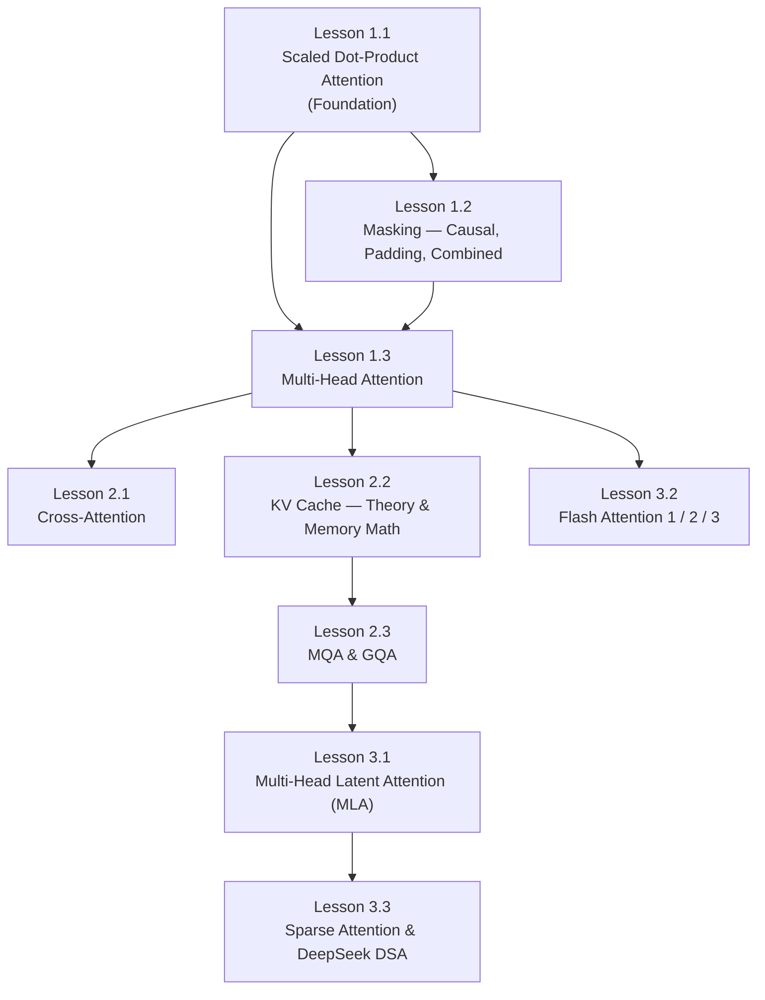

# Attention Mechanisms — Deep Dive Notes

> **Scope:** Scaled dot-product attention → MHA → masking → cross-attention → KV cache → MQA / GQA / MLA → Flash Attention → Sparse Attention.

---

## How to Read These Notes

Each lesson follows this structure:
1. **Problem** — what limitation or gap motivated this technique
2. **Solution** — what the paper/method introduced and the math behind it
3. **Limitations / When it fails** — when not to use it, where it breaks down
4. **Interview Q&A** — specific questions with model answers
5. **Images** — referenced from `../llm_basic/assets/attentions/` (no duplication)

> *Start at Lesson 1.1. Each lesson lists its prerequisites at the top.*

---

## Dependency Map

---

## Lesson Index

---

### Lesson 1.1 — Scaled Dot-Product Attention
**File:** [`Lesson_1_1.md`](Lesson_1_1.md)
**Prerequisites:** Basic neural network / embedding knowledge
**Paper:** *Attention Is All You Need* — Vaswani et al. (2017)

| Section | Topics Covered |
|---|---|
| Problem | Static embeddings have no context — "bank" looks identical next to "river" or "money" |
| Core Mechanics | Q / K / V intuition as soft lookup database; what each projection matrix *learns* |
| The √d_k Scaling | Full variance proof — why dot product variance = d_k and how division normalizes it |
| d_v ≠ d_k | Why V can have a different dimension; what changes downstream (output projection) |
| Attention Types | Additive (Bahdanau) vs Multiplicative (Luong) vs Scaled Dot-Product — trade-offs table |
| Complexity | O(N²·d) full derivation; when N dominates vs when d dominates |
| Worked Example | 3-token sequence with actual numbers, step by step |
| Interview Q&A | "Why √d_k?", "What does Wk learn?", "Can d_v ≠ d_k?", "What is attention really doing?" |

**Images used:**
- `../llm_basic/assets/attentions/Screenshot 2026-03-17 100314.png` — Q/K/V matrix dimensions (d_v=128 vs d)
- `../llm_basic/assets/attentions/Screenshot 2026-03-17 100453.png` — masked attention formula overview

---

### Lesson 1.2 — Masking: Causal, Padding, and Combined
**File:** [`Lesson_1_2.md`](Lesson_1_2.md)
**Prerequisites:** Lesson 1.1
**Papers:** GPT (Radford 2018), BERT (Devlin 2018)

| Section | Topics Covered |
|---|---|
| Problem | Self-attention sees future tokens — model "cheats" during training |
| Causal Mask | Construction of lower-triangular mask; the −∞ trick with numerical example |
| Padding Mask | Variable-length batching; PAD tokens and why they must be ignored |
| Combined Mask | How causal + padding are merged in real implementations |
| Mask Placement | Always before softmax — why (not after, not before QKᵀ) |
| BERT vs GPT | Bidirectional vs unidirectional — how the training objective dictates the mask |
| Cross-Attention Masks | Encoder side gets padding mask only; no causal mask — why |
| Limitations | Causal attention's upper bound on parallelism during generation |
| Interview Q&A | "What happens if you apply the mask after softmax?", "Why does BERT not use a causal mask?" |

**Images used:**
- `../llm_basic/assets/attentions/Screenshot 2026-03-17 100453.png` — formula with mask matrix M

---

### Lesson 1.3 — Multi-Head Attention
**File:** [`Lesson_1_3.md`](Lesson_1_3.md)
**Prerequisites:** Lesson 1.1, 1.2
**Paper:** *Attention Is All You Need* — Vaswani et al. (2017)

| Section | Topics Covered |
|---|---|
| Problem | Single head learns one relationship type; can't simultaneously capture syntax + semantics |
| Architecture | h parallel heads; each with own Wq_i, Wk_i, Wv_i projections |
| Head Dimension Math | Why d_k = d_model / h; the computational equivalence argument (same total FLOPs) |
| Output Projection Wo | Purpose — mixing head outputs; why concat alone isn't sufficient; dimensions |
| Parameter Budget | Full parameter count worked example (GPT-2 style model) |
| Head Specialization | What different heads learn empirically (syntactic, coreference, positional) |
| Attention Dropout | Where it's applied; how it regularizes |
| Limitations | Quadratic memory; all heads collapse to similar patterns (overparameterization risk) |
| Interview Q&A | "Why divide dimension by h?", "What does Wo do?", "What if all heads learn the same thing?" |

**Images used:**
- `../llm_basic/assets/attentions/Screenshot 2026-03-17 100633.png` — MHA with 4 heads, concat, Wo projection

---

### Lesson 2.1 — Cross-Attention
**File:** [`Lesson_2_1.md`](Lesson_2_1.md)
**Prerequisites:** Lesson 1.2, 1.3
**Paper:** *Attention Is All You Need* — Vaswani et al. (2017), encoder-decoder section

| Section | Topics Covered |
|---|---|
| Problem | Self-attention can't connect two different sequences (e.g., source and target in translation) |
| Core Change | Q from decoder; K and V from encoder — the only structural difference |
| Where It Appears | Encoder-decoder models (T5, original Transformer, Whisper); absent in decoder-only (GPT, LLaMA) |
| Masking in Cross-Attention | Encoder side: padding mask only; no causal mask; decoder Q still causal |
| Concrete Example | Machine translation step by step — which encoder token gets high attention when |
| Limitations | Requires encoder output to be materialized; adds latency; decoder-only avoids this entirely |
| Interview Q&A | "Where does cross-attention appear?", "Why doesn't GPT need cross-attention?", "What masks are used?" |

**Images used:**
- `../llm_basic/assets/transformer_arch.png` — full encoder-decoder architecture

---

### Lesson 2.2 — KV Cache: Theory, Memory Math, and Optimization
**File:** [`Lesson_2_2.md`](Lesson_2_2.md)
**Prerequisites:** Lesson 1.3
**Context:** Inference optimization; vLLM covered briefly, not in full depth

| Section | Topics Covered |
|---|---|
| Problem | Recomputing K and V for all past tokens at every decode step is O(N²) redundant work |
| Prefill vs Decode | Two distinct phases — prefill is compute-bound, decode is memory-bandwidth-bound |
| What Gets Cached | K and V only; why Q is never cached (depends on current token) |
| Memory Formula | `2 × L × H_kv × d_head × S × B × bytes` — fully worked with DeepSeek numbers |
| KV Cache Growth | Linear with sequence length; becomes the primary memory bottleneck |
| Optimization Strategies | Brief survey: KV quantization (INT8/INT4), eviction (H2O, StreamingLLM), PagedAttention (brief) |
| Limitations | Memory bottleneck at long contexts; batch size limited by KV cache size |
| Interview Q&A | "How much memory does KV cache use?", "Why is decode memory-bound?", "What can you do to reduce KV size?" |

**Images used:**
- `../llm_basic/assets/attentions/Screenshot 2026-03-17 100800.png` — KV caching diagram (k1…k7 cached, q7 new)
- `../llm_basic/assets/attentions/Screenshot 2026-03-17 100917.png` — memory formula: 2 × KV dim × Precision × #Heads × #Layers × Seq.Length (DeepSeek R1/V3 = 131 GB)

---

### Lesson 2.3 — Multi-Query Attention (MQA) and Grouped-Query Attention (GQA)
**File:** [`Lesson_2_3.md`](Lesson_2_3.md)
**Prerequisites:** Lesson 2.2
**Papers:** MQA — Shazeer (2019); GQA — Ainslie et al. (2023)

| Section | Topics Covered |
|---|---|
| Problem | MHA stores h separate K/V copies in cache — memory bandwidth bottleneck at decode |
| MQA | One shared K and V across all query heads; 128× KV cache reduction |
| MQA Limitations | Quality degradation; single K/V is underpowered for complex tasks |
| GQA | g groups each sharing one K/V — the spectrum between MHA and MQA |
| GQA as Special Cases | GQA(g=h) = MHA; GQA(g=1) = MQA |
| Memory Comparison | MHA 4 MB / MQA 31 KB / GQA 500 KB per token (from asset images) |
| Low-Rank Interpretation | GQA as factored projection; bridge to MLA |
| Production Models | Which models use which: Llama-3 (GQA), Falcon (MQA), Mistral (GQA) |
| Limitations | GQA still caches per-group K/V; structured replication not fully expressive |
| Interview Q&A | "What is the difference between MQA and GQA?", "Why didn't MQA replace MHA entirely?", "How do you choose g?" |

**Images used:**
- `../llm_basic/assets/attentions/Screenshot 2026-03-17 101018.png` — MQA: single shared K/V, 4 MB → 31 KB
- `../llm_basic/assets/attentions/Screenshot 2026-03-17 101121.png` — GQA: 2 groups K/V, 8× reduction → 500 KB
- `../llm_basic/assets/attentions/Screenshot 2026-03-17 101226.png` — GQA key expansion via block matrix
- `../llm_basic/assets/attentions/Screenshot 2026-03-17 101238.png` — GQA key expansion diagram 2
- `../llm_basic/assets/attentions/Screenshot 2026-03-17 101316.png` — combined KV projection W^KV
- `../llm_basic/assets/attentions/Screenshot 2026-03-17 101403.png` — low-rank factorization view

---

### Lesson 3.1 — Multi-Head Latent Attention (MLA)
**File:** [`Lesson_3_1.md`](Lesson_3_1.md)
**Prerequisites:** Lesson 2.3
**Paper:** *DeepSeek-V2* — DeepSeek-AI (2024)

| Section | Topics Covered |
|---|---|
| Problem | GQA's shared K/V uses structured (block) replication — can learned compression do better? |
| KV Compression | Down-projection C^KV = X·W↓_KV; compress to latent dimension d_c ≪ d_model |
| Key/Value Reconstruction | Up-projections W↑_K, W↑_V reconstruct full K and V per head |
| KV Cache Reduction | Cache only C^KV (size d_c), not full K/V (size d_k·h + d_v·h) |
| Associativity Inference Trick | Absorbing W↑_K into Wq at inference — avoids materializing full K |
| Query Compression | Q also compressed; reduces activation memory during training, not KV cache |
| RoPE Incompatibility | Why absorbing W↑_K breaks with standard RoPE (rotation doesn't commute with projection) |
| Partial (Decoupled) RoPE | Two-component K: one with RoPE, one without — the DeepSeek solution (brief; full RoPE in positional_encodings/) |
| MHA → GQA → MLA Comparison | Full table with memory numbers (DeepSeek V2/V3 concrete) |
| Limitations | More complex to implement; RoPE handling adds engineering complexity |
| Interview Q&A | "How does MLA differ from GQA?", "What is the associativity trick?", "Why is MLA incompatible with RoPE?" |

**Images used:**
- `../llm_basic/assets/attentions/Screenshot 2026-03-18 102836.png` — MLA architecture: down-proj C^KV, up-proj W↑
- `../llm_basic/assets/attentions/Screenshot 2026-03-18 121206.png` — query compression
- `../llm_basic/assets/attentions/Screenshot 2026-03-17 102110.png` — MLA inference trick
- `../llm_basic/assets/attentions/Screenshot 2026-03-17 102148.png` — MLA computation graph
- `../llm_basic/assets/attentions/Screenshot 2026-03-17 102237.png` — partial RoPE solution
- `../llm_basic/assets/attentions/Screenshot 2026-03-17 102247.png` — decoupled RoPE diagram 2
- `../llm_basic/assets/attentions/Screenshot 2026-03-17 102304.png` — decoupled RoPE diagram 3
- `../llm_basic/assets/attentions/Screenshot 2026-03-17 102634.png` — RoPE incompatibility problem
- `../llm_basic/assets/attentions/Screenshot 2026-03-17 102700.png` — RoPE incompatibility 2
- `../llm_basic/assets/attentions/Screenshot 2026-03-17 102716.png` — RoPE incompatibility 3

---

### Lesson 3.2 — Flash Attention 1, 2, and 3: Algorithm Deep Dive
**File:** [`Lesson_3_2.md`](Lesson_3_2.md)
**Prerequisites:** Lesson 1.3, basic GPU architecture awareness
**Papers:** FlashAttention (Dao et al. 2022), FlashAttention-2 (Dao 2023), FlashAttention-3 (Shah et al. 2024)

| Section | Topics Covered |
|---|---|
| Problem | Standard attention materializes N×N matrix in slow HBM — memory-bound, not compute-bound |
| GPU Memory Hierarchy | SRAM vs HBM — bandwidth gap and size constraints |
| Standard Attention IO Profile | Exact HBM read/write count; O(N²) IO complexity derived |
| Flash Attention 1 | Tiling Q/K/V into SRAM blocks; online softmax with running (m, ℓ, O); backward via recomputation |
| Online Softmax Algorithm | Step-by-step tile update equations — how correct softmax is accumulated without the full N×N |
| IO Complexity | O(N²d²/M) vs standard O(N²) — proof sketch |
| Flash Attention 2 | Outer loop on Q blocks (fewer HBM writes); reduced non-matmul FLOPs; better warp partitioning |
| Flash Attention 3 | Hopper async pipelining; FP8 precision; ~75% MFU |
| Flash Decoding | Why FA is slow for long-context decode; splitting across KV sequence dimension |
| Positional Encoding Integration | Where RoPE (pre-applied to Q/K) and ALiBi (inside kernel) slot into the tiling loop |
| Limitations | SRAM size limits tile size; requires custom CUDA kernel; not beneficial on all hardware |
| Interview Q&A | "Walk me through online softmax", "What is IO-optimal?", "What changed in FA2?", "Does FA change the math?" |

---

### Lesson 3.3 — Sparse Attention and DeepSeek DSA
**File:** [`Lesson_3_3.md`](Lesson_3_3.md)
**Prerequisites:** Lesson 3.1, 3.2
**Papers:** Longformer (Beltagy 2020), BigBird (Zaheer 2020), DeepSeek DSA (2024)

| Section | Topics Covered |
|---|---|
| Problem | Full attention O(N²) cost makes long contexts (>100K tokens) infeasible |
| Sparse Attention Patterns | Local/sliding window; global tokens; random; strided/dilated — visual pattern comparison |
| Longformer | Window attention + global tokens; linear complexity O(N) |
| BigBird | Window + global + random — proven universal approximator |
| Limitations of Fixed Patterns | Static patterns may miss important distant tokens |
| DeepSeek Lightning Indexer | Dynamic top-k token selection using compressed QK index score |
| DSA Training | Two-stage: warm-up (indexer only), then sparse end-to-end |
| Quantization with Rotation | Why naive quantization fails; Hadamard transform for value mixing before quantization |
| DSA Performance | 2–3× speedup; 30–40% memory reduction on long sequences |
| Streaming LLM | Attention sinks; why first tokens always attract high attention; sink token trick |
| Limitations | Lightning Indexer adds training complexity; approximation vs full attention |
| Interview Q&A | "What are the main sparse attention patterns?", "How does DSA select tokens?", "What is an attention sink?" |

**Images used:**
- `../llm_basic/assets/attentions/Screenshot 2026-03-18 124455.png` — Lightning Indexer diagram 1
- `../llm_basic/assets/attentions/Screenshot 2026-03-18 124710.png` — Lightning Indexer diagram 2
- `../llm_basic/assets/attentions/Screenshot 2026-03-18 124928.png` — Lightning Indexer diagram 3
- `../llm_basic/assets/attentions/Screenshot 2026-03-18 125046.png` — DSA token selection
- `../llm_basic/assets/attentions/Screenshot 2026-03-18 130435.png` — Hadamard quantization comparison
- `../llm_basic/assets/attentions/Screenshot 2026-03-18 130717.png` — quantization error comparison
- `../llm_basic/assets/attentions/Screenshot 2026-03-18 131657.png` — DSA performance results
- `../llm_basic/assets/attentions/Screenshot 2026-03-18 132727.png` — DSA training stages

---

## Quick Reference — Image Asset Map

| Image File | Content | Used In |
|---|---|---|
| `100314.png` | Q/K/V dimensions, d_v=128 shown separately | Lesson 1.1 |
| `100453.png` | Attention formula with mask M | Lesson 1.1, 1.2 |
| `100633.png` | MHA: 4 heads, concat, Wo | Lesson 1.3 |
| `100800.png` | KV caching diagram | Lesson 2.2 |
| `100917.png` | KV memory formula (DeepSeek 131 GB example) | Lesson 2.2 |
| `101018.png` | MQA: single K/V, 4 MB → 31 KB | Lesson 2.3 |
| `101121.png` | GQA: 2-group K/V, 8× reduction | Lesson 2.3 |
| `101226.png` | GQA key expansion block matrix | Lesson 2.3 |
| `101238.png` | GQA expansion diagram 2 | Lesson 2.3 |
| `101316.png` | W^KV combined projection | Lesson 2.3 |
| `101403.png` | Low-rank factorization | Lesson 2.3 |
| `102836.png` | MLA architecture | Lesson 3.1 |
| `121206.png` | MLA query compression | Lesson 3.1 |
| `102110.png` | MLA inference trick | Lesson 3.1 |
| `102148.png` | MLA computation graph | Lesson 3.1 |
| `102237.png` | Partial/Decoupled RoPE solution | Lesson 3.1 |
| `102247.png` | Decoupled RoPE diagram 2 | Lesson 3.1 |
| `102304.png` | Decoupled RoPE diagram 3 | Lesson 3.1 |
| `102634.png` | RoPE incompatibility with MLA | Lesson 3.1 |
| `102700.png` | RoPE incompatibility 2 | Lesson 3.1 |
| `102716.png` | RoPE incompatibility 3 | Lesson 3.1 |
| `124455.png` | Lightning Indexer (DSA) | Lesson 3.3 |
| `124710.png` | Lightning Indexer 2 | Lesson 3.3 |
| `124928.png` | Lightning Indexer 3 | Lesson 3.3 |
| `125046.png` | DSA token selection | Lesson 3.3 |
| `130435.png` | Hadamard quantization | Lesson 3.3 |
| `130717.png` | Quantization error comparison | Lesson 3.3 |
| `131657.png` | DSA performance | Lesson 3.3 |
| `132727.png` | DSA training stages | Lesson 3.3 |
| `transformer_arch.png` | Full encoder-decoder architecture | Lesson 2.1 |

---

## What Is Covered Briefly (Not In Depth)

| Topic | Brief Coverage In | Full Coverage In |
|---|---|---|
| RoPE, ALiBi, Sinusoidal, Learned PE | Lesson 3.1 (RoPE+MLA incompatibility only) | `../positional_encodings/` |
| PagedAttention / vLLM | Lesson 2.2 (concept paragraph only) | Separate vLLM/inference notes |
| Full Transformer architecture | Lesson 2.1 (cross-attention context) | `../llm_basic/04_tranformer.ipynb` |
