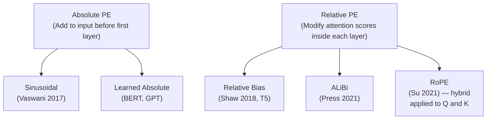

# Lesson 1 — Why Transformers Need Positional Encoding

> *Prerequisites: Self-attention / transformer basics*
> *This lesson is the foundation for all subsequent positional encoding lessons.*

---

## The Core Problem: Self-Attention is Permutation-Invariant

Self-attention computes, for each token, a weighted sum of all token values using dot-product similarity as weights. The critical property: **the computation is identical regardless of token order**.

Consider: `"dog bites man"` and `"man bites dog"`.

The token embeddings are the same three vectors — only their arrangement changes. But standard self-attention would produce **identical attention score matrices** for both sequences, because the dot products `Q · Kᵀ` depend only on which vectors exist, not on their positions. The model cannot distinguish subject from object.

Formally: if you permute the input sequence X by a permutation matrix P, the attention output permutes in the same way:
```
Attention(PX, PX, PX) = P · Attention(X, X, X)
```
This is called **permutation equivariance** — the output shuffles exactly as the input does. The model has no inherent positional sense.

**What language needs:**
- "The cat sat on the mat" — word order defines meaning
- Subject-verb agreement requires knowing which token comes first
- Long-range dependencies ("The key to the cabinets *are* lost" — subject-verb agreement across 5 tokens) require tracking relative positions

---

## Where Positional Information Is Injected

There are two fundamentally different locations in the architecture where position can be introduced:



### Absolute: Add to Input

```
x_with_position = token_embedding[t] + positional_encoding[pos]
```

The positional vector is injected **once**, before the first layer. All subsequent attention layers see the combined token+position representation. The model must implicitly preserve and use positional information through all its layers.

### Relative: Modify Attention Scores

```
score(i, j) = (Q_i · K_j) / √d_k + bias(i, j)
```

The bias term directly encodes position information into each attention score. This is injected at **every attention layer**, ensuring positional information is always directly available to the score computation regardless of how deep the network is.

---

## What a Good Positional Encoding Must Achieve

For a positional encoding to be useful, it must satisfy:

| Requirement | Why It Matters | Which Methods Achieve It |
|---|---|---|
| **Unique per position** | Different positions must be distinguishable | All methods (approximately) |
| **Smooth variation** | Close positions should be similar, distant ones dissimilar | Sinusoidal, RoPE, ALiBi |
| **Generalizes beyond training length** | Model should handle longer sequences than seen during training | Sinusoidal (partially), RoPE extensions |
| **Encodes relative distance** | "k positions apart" should be detectable regardless of absolute location | RoPE, ALiBi, Relative bias |
| **No extra parameters** | Fewer parameters = simpler, less prone to overfitting | Sinusoidal, RoPE, ALiBi |
| **Compatible with efficient attention** | Flash Attention, linear attention, etc. | RoPE (mostly), Sinusoidal |

No single method achieves all of these perfectly — the lessons that follow trace how each successive method addressed the gaps of its predecessors.

---

## Two Families and Their Trade-offs

### Absolute Positional Encoding

Each token's representation is modified based on its own position index, independently of all other tokens. The position vector for position 5 is always the same, regardless of context.

**Strength:** Simple to implement; position information is available everywhere in the network.

**Weakness:** The model must implicitly compute relative distances from two absolute positions. If a subject at position 2 must relate to a verb at position 8, the model must learn to extract the relative distance `8 - 2 = 6` from two separate position vectors — an indirect, harder learning problem.

### Relative Positional Encoding

Position information is injected directly as the relative distance `i - j` between query token i and key token j. The score for the pair (i, j) explicitly incorporates how far apart they are.

**Strength:** Relative distances are first-class information, not derived. The model doesn't need to compute distances from absolute coordinates.

**Weakness:** More complex; must be applied at every attention layer; some are incompatible with efficient attention variants (see Lesson 6 — RoPE limitations).

---

## Summary

- Self-attention is inherently permutation-equivariant — it has no concept of order
- Positional encodings inject order information either into the input (absolute) or the attention scores (relative)
- The key properties a PE must achieve: uniqueness, smoothness, relative-distance encoding, length generalization
- No method achieves all simultaneously — the subsequent lessons trace each method's design decisions and trade-offs

---

## Interview Q&A

**Q: What would happen if you removed positional encodings from a transformer?**
The model would be completely permutation-invariant — "dog bites man" and "man bites dog" would produce identical outputs. It would lose all ability to encode word order, making it useless for any order-sensitive task (i.e., nearly all NLP tasks).

**Q: Why not just use token indices (0, 1, 2, ...) as positional encoding?**
A single scalar integer fails several requirements: (1) it doesn't fit into the embedding space (you'd need to embed it as a vector), (2) it has no inherent smoothness property — the jump from index 0 to 100 looks as large as from 0 to 1, (3) it can't be learned to distinguish nearby vs distant tokens naturally, and (4) it doesn't generalize to arbitrary lengths.

**Q: What is the difference between absolute and relative PE?**
Absolute PE encodes each token's position independently, adding a position-specific vector to the token embedding (or to Q/K). Relative PE encodes the distance between token pairs directly into the attention score computation. Relative PE makes distance a first-class input; absolute PE requires the model to compute distances indirectly.
