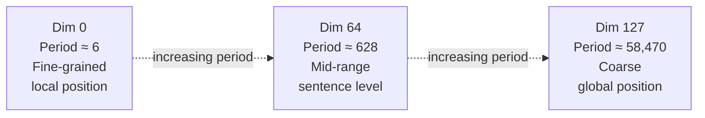

# Lesson 2 — Sinusoidal Positional Encoding

> *Prerequisites: Lesson 1 (Why PE is needed)*
> *Paper: "Attention Is All You Need" — Vaswani et al. (2017)*

---

## The Problem

The model needs a positional signal but there's no obvious "right" way to design one. The requirements from Lesson 1:
- Unique per position ✓
- Smooth variation ✓
- Works for any sequence length (no learned parameters → no hard limit) ✓
- Ideally encodes relative distances

Vaswani et al. designed a fixed formula using sinusoidal waves that satisfies the first three cleanly, and the fourth partially.

---

## The Formula

For a token at position `pos`, its positional embedding is a vector of length `d_model`. Each dimension `i` is:

$$PE(pos,\ 2i)\ =\ \sin\!\left(\frac{pos}{10000^{\ 2i\,/\,d_{\text{model}}}}\right)$$

$$PE(pos,\ 2i+1)\ =\ \cos\!\left(\frac{pos}{10000^{\ 2i\,/\,d_{\text{model}}}}\right)$$

Even-indexed dimensions use **sine**, odd-indexed use **cosine**. Each dimension pair `i` gets a different angular frequency:

$$\omega_i = \frac{1}{10000^{\ 2i\,/\,d_{\text{model}}}}$$

This is the argument of both sin and cos for dimension pair `i` at position `pos`: `pos × ω_i`.

```python
import torch
import math

def sinusoidal_pe(max_seq_len, d_model):
    pe = torch.zeros(max_seq_len, d_model)
    positions = torch.arange(0, max_seq_len).unsqueeze(1)  # (N, 1)
    
    # Frequencies for each dimension pair
    # omega_i = 1 / (10000 ^ (2i / d_model))
    dim_pairs = torch.arange(0, d_model, 2)   # [0, 2, 4, ..., d_model-2]
    freqs = 1.0 / (10000.0 ** (dim_pairs / d_model))  # one per pair
    
    angles = positions * freqs               # (N, d_model/2)
    
    pe[:, 0::2] = torch.sin(angles)         # even dims ← sin
    pe[:, 1::2] = torch.cos(angles)         # odd dims ← cos
    return pe   # (max_seq_len, d_model)

# Usage: add to token embeddings
# input_with_pos = token_embeddings + pe[:seq_len, :]
```

---

## The Multiscale Structure — What Each Dimension Encodes

The key to understanding sinusoidal PE is the **spectrum of frequencies**.

For `d_model = 256`, dimension pair `i` has:

| Dimension pair `i` | Exponent `2i/d_model` | ω_i | Period T = 2π/ω_i |
|---|---|---|---|
| 0 | 0.0 | 1.000000 | 6.28 positions — fastest |
| 32 | 0.25 | 0.100000 | 62.8 positions |
| 64 | 0.50 | 0.010000 | 628 positions |
| 96 | 0.75 | 0.001000 | 6,283 positions |
| 127 (max) | ~0.992 | 0.000107 | ~58,470 positions — slowest |

**Early dimension pairs** (small `i`): High frequency. Complete a full sine wave every ~6 tokens. These dimensions change significantly between adjacent positions → fine-grained local ruler.

**Later dimension pairs** (large `i`): Low frequency. Complete a full cycle only every thousands of positions. These barely change for nearby tokens → coarse global ruler.



This multiscale structure allows the model to simultaneously reason about:
- Whether two tokens are adjacent (high-frequency dims)
- Whether two tokens are in the same paragraph (mid-frequency)
- Whether two tokens are in the first vs second half of a document (low-frequency)

---

## Why Use Both Sine AND Cosine — The Full Derivation

This is one of the most commonly skipped explanations. The answer is not aesthetic — it is mathematical.

### What We Want: A Linear Shift Property

Ideally, shifting position by a fixed offset `k` should correspond to a **fixed linear transformation** of the PE vector — a matrix M_k that depends only on `k`, not on `pos`:

$$PE(pos + k) = M_k \cdot PE(pos) \quad \text{for all } pos$$

If this holds, the model's Q and K weight matrices can learn to apply M_k and detect "these two tokens are always k apart" through learned weights alone — regardless of where in the sequence they appear.

### Why Sine Alone Fails

With sine only: `PE(pos, i) = sin(pos · ω_i)`

Can we express `sin((pos + k)ω_i)` as a linear function of `sin(pos · ω_i)` alone?

Expand with the angle addition formula:

$$\sin((pos + k)\omega_i) = \sin(pos\cdot\omega_i)\cos(k\omega_i)\ +\ \cos(pos\cdot\omega_i)\sin(k\omega_i)$$

The first term involves `sin(pos · ω_i)` ✓ — in our embedding.
The second term involves `cos(pos · ω_i)` ✗ — **not in our embedding** with sine only.

There is no way to write the shifted value as a linear combination of sine-only terms. No consistent M_k exists. The required information is absent.

### How Adding Cosine Fixes It

With both `sin` and `cos` for each dimension pair:
- `PE(pos, 2i)   = sin(pos · ω_i)`
- `PE(pos, 2i+1) = cos(pos · ω_i)`

Apply angle addition to both:

$$\sin((pos+k)\omega_i) = \sin(pos\cdot\omega_i)\cos(k\omega_i)\ +\ \cos(pos\cdot\omega_i)\sin(k\omega_i)$$

$$\cos((pos+k)\omega_i) = \cos(pos\cdot\omega_i)\cos(k\omega_i)\ -\ \sin(pos\cdot\omega_i)\sin(k\omega_i)$$

Both `sin(pos·ω_i)` and `cos(pos·ω_i)` are available! Write as a 2×2 matrix equation:

$$\begin{bmatrix} \sin((pos+k)\omega_i) \\ \cos((pos+k)\omega_i) \end{bmatrix} = \underbrace{\begin{bmatrix} \cos(k\omega_i) & \sin(k\omega_i) \\ -\sin(k\omega_i) & \cos(k\omega_i) \end{bmatrix}}_{R(k\omega_i)} \begin{bmatrix} \sin(pos\cdot\omega_i) \\ \cos(pos\cdot\omega_i) \end{bmatrix}$$

The 2×2 matrix `R(kω_i)` is a **rotation matrix** — it rotates the (sin, cos) pair by angle `k·ω_i`. Every entry depends only on `k` and `ω_i`, not on `pos` at all.

Stacking all `d/2` dimension pairs, the full transformation is a **block-diagonal rotation**:

$$M_k = \begin{bmatrix} R(k\omega_0) & & & \\ & R(k\omega_1) & & \\ & & \ddots & \\ & & & R(k\omega_{d/2-1}) \end{bmatrix}$$

This M_k depends only on `k`. The linear shift property holds exactly:

$$PE(pos + k) = M_k \cdot PE(pos) \quad \text{for all } pos \quad \checkmark$$

> **Interview note:** The rotation matrix structure here is not a coincidence — it directly inspired **RoPE** (Lesson 6). RoPE takes this idea and applies the rotation directly to Q and K at attention time, rather than adding fixed PE to the input.

---

## Why the Base is 10,000

The base `B = 10,000` controls the spread of the frequency spectrum. Too small collapses it; too large stretches it.

### Too Small (B = 100)

All dimensions oscillate fast. Similarity collapses quickly with distance:

| Pair | Distance | Cosine Similarity |
|---|---|---|
| sim(500, 510) | 10 | 0.36 |
| sim(500, 550) | 50 | 0.04 |
| sim(500, 600) | 100 | −0.07 |

Positions 50 apart already look nearly unrelated. The model loses the ability to represent global structure.

### Too Large (B = 1,000,000)

All dimensions oscillate very slowly. Even distant positions remain similar:

| Pair | Distance | Cosine Similarity |
|---|---|---|
| sim(0, 10) | 10 | 0.78 |
| sim(0, 100) | 100 | 0.61 |
| sim(0, 5000) | 5000 | 0.30 |

The model cannot distinguish adjacent tokens from tokens 50 positions apart — local position is invisible.

### B = 10,000 (Goldilocks)

Smooth, gradual decay — supports both local and global reasoning:

| Pair | Distance | Cosine Similarity |
|---|---|---|
| sim(500, 501) | 1 | 0.972 |
| sim(500, 510) | 10 | 0.675 |
| sim(500, 600) | 100 | 0.456 |
| sim(500, 1000) | 500 | 0.269 |
| sim(500, 2500) | 2000 | 0.048 |

Adjacent tokens are very similar (0.97). Large distances become nearly unrelated (0.05). This gradient is ideal — both fine-grained and coarse-grained positional reasoning are supported simultaneously.

---

## Can Sinusoidal PE Handle Infinitely Long Sequences?

**Short answer: Theoretically yes, practically no — bounded by two separate limits.**

### Theoretically Unbounded

The formula accepts any integer `pos` with no upper bound. Plugging in `pos = 1,000,000` produces a valid vector. The math never breaks.

### Practical Limit 1 — Uniqueness Breaks Down Past the Longest Period

The slowest dimension (for d_model=256) has period ≈ 58,470. Once `pos` exceeds this:
- That dimension starts repeating values
- Positions `pos` and `pos + 58,470` become identical in that dimension
- Other dimensions still differ, but as `pos` grows further, more dimensions begin aliasing
- Distinct positions start looking increasingly similar to each other

### Practical Limit 2 — Model Was Never Trained on Those Positions

Even if the formula produces a valid vector at `pos = 500,000`, the model has no learned behavior for it. Attention patterns — how Q and K interact with those position vectors — were never optimized for out-of-range positions. Empirically, performance degrades noticeably beyond training context length.

> **A valid embedding is not the same as a useful one.**

**Correct framing:** The formula is infinite. The uniqueness guarantee is finite (~1 period of the slowest dimension). The model's ability to use those embeddings is bounded by training.

---

## The Remaining Limitation — Absolute, Not Relative

Despite the rotation matrix property above, sinusoidal PE is still **absolute** — each token's embedding depends only on its own position index. The M_k matrix *exists* mathematically, but the model must discover and exploit it through learned Q and K weights. The distance `pos_i - pos_j` is never directly computed and fed into the attention score — it must be inferred from two separate absolute position vectors.

This is the gap that **Relative Positional Embeddings** (Lesson 4) and **RoPE** (Lesson 6) address — encoding `pos_i - pos_j` directly into the attention score computation.

---

## Properties Summary

| Property | Detail |
|---|---|
| Learned during training | No — fully deterministic |
| Unique per position | Yes (practically, up to the longest period) |
| Extends beyond training length | Partially — formula works, but model behavior degrades |
| Encodes relative distances | Implicitly, via the M_k rotation matrix property |
| Type | Absolute, fixed |
| Parameters | 0 |

---

## Interview Q&A

**Q: Why use both sine and cosine?**
Sine alone cannot represent a position shift as a linear transformation. Adding cosine provides the missing term: `sin((pos+k)ω)` can now be expressed as a linear combination of `sin(pos·ω)` and `cos(pos·ω)`. Together, the (sin, cos) pair forms a 2D unit circle coordinate, and shifting position corresponds to rotating this coordinate by angle `k·ω` — a fixed linear transformation independent of `pos`.

**Q: What do the frequencies represent in sinusoidal PE?**
Each dimension pair gets a frequency `ω_i = 1/10000^(2i/d)`. Early dimension pairs (small `i`) have high frequency — they complete a full sine wave every ~6 positions, encoding fine-grained local position. Later pairs (large `i`) have low frequency — they cycle only every tens of thousands of positions, encoding coarse global position. Together they form a multiscale positional "ruler."

**Q: Can sinusoidal PE generalize beyond training context length?**
Partially. The formula computes valid vectors for any position. But (1) uniqueness degrades once positions exceed the slowest dimension's period (~58K for d=256), and (2) the model's weights were not optimized for out-of-range positions — Q and K learned to interpret angles within the training range. Performance degrades beyond training length even though the formula still runs.

**Q: Why is the base 10,000 specifically?**
It's the value that gives smooth cosine similarity decay across a useful range of distances. Too small (B=100) causes nearby positions to look unrelated; too large (B=1M) causes even distant positions to look similar. B=10,000 was chosen empirically/heuristically to support both local and global positional reasoning simultaneously.

**Q: What is the rotation matrix property and why does it matter?**
`PE(pos+k) = M_k · PE(pos)` where M_k is a block-diagonal rotation matrix depending only on `k`, not `pos`. This means the Q and K weight matrices can learn to detect a fixed relative distance `k` by learning to apply `M_k` — even though position is encoded absolutely. It's what gives sinusoidal PE its partial relative distance capability, and it directly inspired RoPE.
