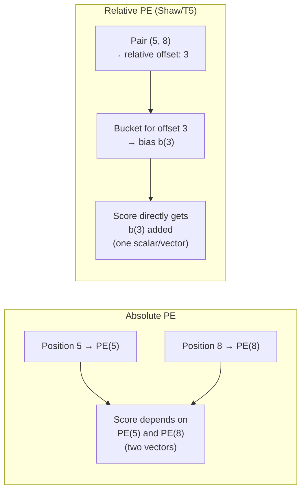

# Lesson 4 — Relative Position Bias (Shaw et al. and T5)

> *Prerequisites: Lesson 2 (Sinusoidal), Lesson 3 (Learned Absolute)*
> *Papers: Shaw et al. "Self-Attention with Relative Position Representations" (2018); T5 (Raffel et al. 2019)*

---

## The Problem: Absolute PE Misses Relative Semantics

Both sinusoidal and learned absolute PE encode each token's position independently. When the model computes the attention score between token i and token j, it has access to `PE(i)` and `PE(j)` — two separate vectors baked into the token representations.

The problem: in language, **relative distance** often matters more than absolute position.

- "The dog that chased the cat *was* tired" — the verb "was" must agree with "dog" regardless of where in the document this sentence appears
- A dependency parser doesn't care if the subject is at position 5 or position 5005 — it cares that the verb is 3 positions to the right

With absolute PE, if the model learns that subject-verb agreement involves tokens at positions (5, 8), it must generalize this to positions (5005, 5008) through the Q and K weight matrices — an indirect, harder learning problem.

**Relative PE encodes the distance `i − j` directly** into the attention score computation.

---

## Shaw et al. (2018) — The Core Mechanism

Shaw et al. propose adding a **learned relative position bias** to the attention key computation.

### Modified Score Formula

Standard attention score for query at position i, key at position j:
```
standard:   e_ij = (Q_i · K_j) / √d_k
```

Modified with relative position:
```
relative:   e_ij = (Q_i · (K_j + a_ij^K)) / √d_k
```

Where `a_ij^K` is a learned embedding for the relative offset `(i - j)`. Similarly for values:
```
output_i = Σ_j α_ij · (V_j + a_ij^V)
```

The relative position `(i - j)` is clipped to a maximum distance `k`:
```
clip(i - j, -k, k)
```

Distances beyond `k` all share the same embedding. This means:
- The model learns distinct representations for relative distances in `[-k, k]`
- All distances > k in magnitude share one embedding each direction (left/right)

### Parameter Count

```
Two sets of embeddings:
  a^K: (2k + 1) × d_k   — one embedding per relative position offset, for keys
  a^V: (2k + 1) × d_v   — one embedding per relative position offset, for values
```

For k = 16: `33 × d_k` parameters per head — much smaller than full sinusoidal PE.

### Implementation

```python
import torch
import torch.nn as nn

class RelativePositionAttention(nn.Module):
    def __init__(self, d_model, num_heads, max_relative_position=16):
        super().__init__()
        self.d_k = d_model // num_heads
        self.max_rel = max_relative_position
        # Learned embeddings for each relative offset in [-max_rel, max_rel]
        num_positions = 2 * max_relative_position + 1
        self.rel_embeddings_k = nn.Embedding(num_positions, self.d_k)
        
    def relative_position_bucket(self, relative_position):
        # Clip to [-max_rel, max_rel], then shift to [0, 2*max_rel]
        clipped = relative_position.clamp(-self.max_rel, self.max_rel)
        return clipped + self.max_rel  # offset to make non-negative index
    
    def forward(self, Q, K, V):
        seq_len = Q.size(-2)
        # Compute relative positions: i - j for all pairs
        positions = torch.arange(seq_len, device=Q.device)
        relative_positions = positions.unsqueeze(0) - positions.unsqueeze(1)  # (N, N)
        
        # Get relative position embeddings
        bucket_ids = self.relative_position_bucket(relative_positions)  # (N, N)
        rel_emb = self.rel_embeddings_k(bucket_ids)  # (N, N, d_k)
        
        # Standard QK scores + relative position contribution
        standard_scores = torch.matmul(Q, K.transpose(-2, -1)) / self.d_k**0.5  # (N, N)
        # Q_i · a_ij^K: einsum over head dimension
        rel_scores = torch.einsum('bhi,ijk->bhijk', Q, rel_emb).squeeze(-1)  # simplified
        
        scores = standard_scores + rel_scores
        # ... rest of attention (softmax, weighted sum with V + a_ij^V)
```

---

## Key Properties of Shaw-Style Relative PE

**1. Distance, not absolute position:**
The score between tokens i and j depends on `(i-j)`, not on `i` or `j` individually. If a pattern works at positions (5, 8), the same learned embedding works at positions (205, 208).

**2. No change to token input:**
Unlike absolute PE, nothing is added to the token embeddings. Position enters only in the attention computation.

**3. Applied at every layer:**
Since relative PE is part of the attention score computation, it's automatically applied at every attention layer — no need for a separate injection step.

**4. Clipping / bucketing is necessary:**
Storing one embedding per relative distance would require O(N) embeddings for a sequence of length N — impractical. Clipping at `k` reduces this to `2k+1` embeddings, with the assumption that distances beyond `k` are "equally far."

**Limitation:** The clipping strategy means the model can't distinguish "50 positions apart" from "500 positions apart" if both exceed `k`. This is a lossy approximation for long-range dependencies.

---

## T5 — Relative Position Bias with Learned Buckets

*Raffel et al. (2019). "Exploring the Limits of Transfer Learning with a Unified Text-to-Text Transformer"*

T5 uses a simpler but more flexible variant of relative PE: **scalar biases in buckets**, added directly to attention logits.

### T5 Mechanism

```
score_ij = (Q_i · K_j) / √d_k + b(i, j)
```

Where `b(i, j)` is a scalar bias that depends only on the relative position `(i - j)`, selected from a table of learned scalar biases indexed by a **bucket scheme**.

### T5 Bucketing

T5 uses 32 buckets total:
- The first 16 buckets cover positions 0 to 15 (one per position — fine-grained for nearby tokens)
- The remaining 16 buckets logarithmically cover positions 16 to a maximum distance (coarser for distant tokens)

```python
def t5_relative_position_bucket(relative_position, bidirectional=True, num_buckets=32, max_distance=128):
    """
    Assign each relative position to a bucket.
    Half the buckets for fine-grained nearby positions, half for log-scale distant ones.
    """
    ret = 0
    n = -relative_position  # negate for left-to-right convention
    
    if bidirectional:
        num_buckets //= 2
        ret += (n < 0).long() * num_buckets  # separate buckets for left and right
        n = torch.abs(n)
    else:
        n = torch.max(n, torch.zeros_like(n))
    
    max_exact = num_buckets // 2  # first half for exact positions
    is_small = n < max_exact
    
    # Log-scale bucket for distant positions
    val_if_large = max_exact + (
        torch.log(n.float() / max_exact)
        / math.log(max_distance / max_exact)
        * (num_buckets - max_exact)
    ).long().clamp(max=num_buckets - 1)
    
    ret += torch.where(is_small, n, val_if_large)
    return ret
```

**Advantages over Shaw et al.:**
- Only 32 scalar biases per attention head — much more parameter-efficient
- Logarithmic bucketing is better than uniform clipping for long sequences (more resolution close, less resolution far)
- One bias per bucket shared across heads (in some T5 variants)

**Same fundamental limitation:** Positions beyond the maximum distance share one bucket. Long-range structure is encoded coarsely.

---

## Comparison: Absolute vs Relative Position Bias



| Property | Absolute PE | Shaw/T5 Relative |
|---|---|---|
| What's encoded | Each token's absolute position | Distance between token pairs |
| Generalizes position shift | No (must re-learn per absolute position) | Yes (same bias at any location) |
| Applied | Once, to input | Every layer, to every score |
| Parameters | max_len × d | 2k+1 × d (Shaw) or 32 (T5) |
| Beyond max clip distance | Unique embeddings for all positions | All positions share one embedding |
| Length generalization | Poor (hard cap) | Moderate (beyond max clip = same as max) |

---

## Limitations

**1. Clipping loses long-range information:**
All pairs further than `k` positions apart share the same bucket embedding. If `k = 16`, "17 apart" and "17,000 apart" receive identical bias. Long-range structure is encoded identically regardless of actual distance.

**2. Per-layer overhead:**
Unlike absolute PE (added once to input), relative PE must be computed at every attention layer. For T5, the bucket computation and bias lookup repeat at each of 12+ layers.

**3. Still doesn't extrapolate well:**
Shaw/T5 clip at a maximum distance. Beyond that, all extrapolated positions look the same. For context lengths much longer than training, the model can't differentiate distances — length generalization remains limited.

**4. Added parameters per head:**
Shaw's approach adds `(2k+1) × d_k` parameters per head. In a 32-head model with k=16, this adds 33 × 64 × 32 ≈ 67K parameters per layer — not huge, but nonzero.

---

## Summary

- Shaw et al. add learned relative position embeddings `a_ij` to key (and optionally value) computations — score depends on `(i-j)`, not on absolute positions
- T5 uses 32 learned scalar biases with logarithmic bucketing — more parameter-efficient, similar principle
- **Key advantage:** distance-dependent reasoning generalizes across absolute positions
- **Key limitation:** clipping beyond max distance means truly long-range pairs are indistinguishable — length generalization remains incomplete
- These methods set the stage for ALiBi (zero-parameter, no clipping) and RoPE (continuous, applied to Q/K)

---

## Interview Q&A

**Q: What is the difference between absolute and relative positional encoding?**
Absolute PE encodes each token's position independently — the model sees `PE(5)` and `PE(8)` and must compute "3 apart" implicitly. Relative PE encodes the distance `i-j` directly into the attention score — `b(3)` or `a(3)` is added directly, making distance a first-class input that generalizes across positions.

**Q: How does T5 handle position?**
T5 uses 32 learned scalar biases indexed by bucketed relative offsets. The first 16 buckets cover positions 0–15 exactly; the remaining 16 use logarithmic bucketing up to a max distance. These biases are added directly to attention logits at every layer.

**Q: Why clip relative positions at a maximum distance?**
Storing one embedding per possible relative offset would require O(N) parameters for a sequence of length N. Clipping at `k` keeps the parameter count fixed at `2k+1` regardless of sequence length, with the approximation that all distances beyond `k` are "equally far."

**Q: What's the main limitation of Shaw-style relative PE?**
Beyond the clipping distance, all token pairs look equally far apart — the model can't distinguish "50 positions apart" from "5,000 positions apart." This limits long-context performance even though the method improves over absolute PE within the clip range.
