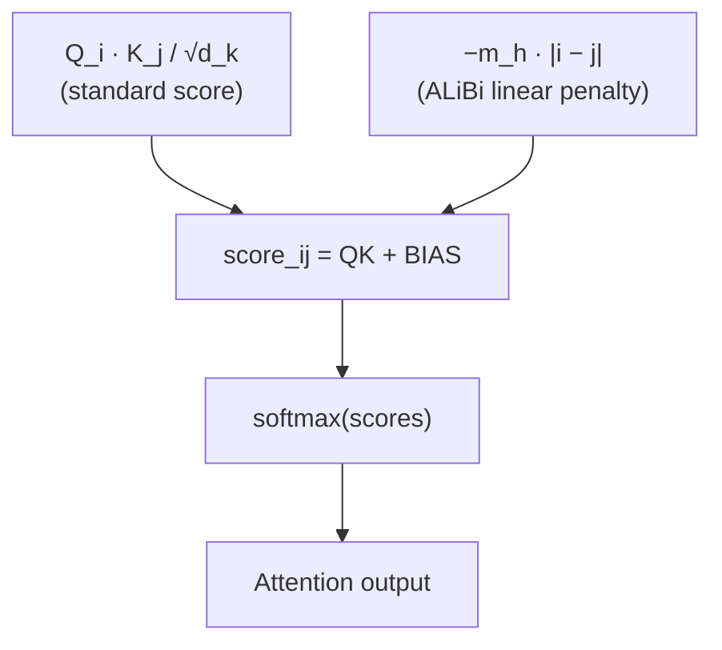

# Lesson 5 — ALiBi: Attention with Linear Biases

> *Prerequisites: Lesson 4 (Relative Position Bias)*
> *Paper: "Train Short, Test Long: Attention with Linear Biases Enables Input Length Extrapolation" — Press et al. (2021)*

---

## The Problem: Length Generalization Is Still Broken

Shaw and T5 improve over absolute PE by encoding relative distance. But they still struggle to generalize beyond their training length:
- Shaw clips at max distance `k` — all positions beyond k look identical
- T5 buckets logarithmically but still has a maximum distance bucket

Additionally, both have learnable parameters that must be trained. The learned biases only encode patterns seen at training length. At inference with longer sequences, the relative positions may fall into the final bucket — the model never learned to distinguish them.

**ALiBi's key insight:**
> What if we didn't learn position at all? Use a **fixed, static linear penalty** — no learned parameters. Penalize attention to distant tokens with a simple distance-proportional bias. This generalizes naturally to any length.

---

## The ALiBi Mechanism

Standard attention score:
```
score_ij = Q_i · K_j / √d_k
```

ALiBi adds a static linear bias that penalizes distance:
```
score_ij = Q_i · K_j / √d_k  −  m_h · |i − j|
```

Where:
- `|i − j|` is the absolute distance between positions i and j (always non-negative)
- `m_h` is a **head-specific slope** — different for each attention head
- The bias is **negative** — penalizes (discourages) attending to distant tokens
- The bias is **static** — the same formula at any position, any sequence length



Visually, the bias matrix for a 5-token causal sequence looks like:

```
         j=1   j=2   j=3   j=4   j=5
i=1  [   0    -m    -2m   -3m   -4m  ]
i=2  [   0     0    -m    -2m   -3m  ]
i=3  [   0     0     0    -m    -2m  ]
i=4  [   0     0     0     0    -m   ]
i=5  [   0     0     0     0     0   ]
```

Combined with the causal mask (−∞ above diagonal for decoder), ALiBi's penalty applies only to allowed (past) positions.

---

## Slope Assignment — One Per Head

Each head gets a different slope `m_h`. The slopes form a geometric progression that determines how aggressively each head discounts distance:

$$m_h = 2^{-8/h} \cdot 2^{-{(h_{\text{idx}}+1 - 1) \cdot 8/h}}$$

Simplified: for `h` heads, the slopes are evenly spaced on a log scale:

$$m_1 = 2^{-8/h},\ m_2 = (2^{-8/h})^2,\ \ldots,\ m_h = (2^{-8/h})^h = 2^{-8}$$

For `h = 8` heads, `m_h = 2^{-8/8} = 2^{-1} = 0.5` for the steepest head, down to `m_1 = 2^{-8} = 1/256 ≈ 0.004` for the gentlest slope.

```python
import math
import torch

def get_alibi_slopes(num_heads):
    """
    Compute ALiBi slopes for each head.
    Returns tensor of shape (num_heads,).
    """
    def get_slopes_power_of_2(n):
        start = 2 ** (-(2 ** -(math.log2(n) - 3)))
        ratio = start
        return [start * ratio**i for i in range(n)]
    
    if math.log2(num_heads).is_integer():
        return torch.tensor(get_slopes_power_of_2(num_heads))
    else:
        # Handle non-power-of-2 head counts
        closest_power_of_2 = 2 ** math.floor(math.log2(num_heads))
        base_slopes = get_slopes_power_of_2(closest_power_of_2)
        extra_slopes = get_slopes_power_of_2(2 * closest_power_of_2)[0::2][:num_heads - closest_power_of_2]
        return torch.tensor(base_slopes + extra_slopes)

def compute_alibi_bias(seq_len, num_heads):
    """
    Compute ALiBi bias matrix: (num_heads, seq_len, seq_len)
    """
    slopes = get_alibi_slopes(num_heads)  # (num_heads,)
    
    # Relative distances: (seq_len, seq_len) — position j relative to i
    positions = torch.arange(seq_len)
    distance = positions.unsqueeze(0) - positions.unsqueeze(1)  # (seq_len, seq_len)
    # ALiBi uses: −m · |i − j| where distance is i − j, but we only look left (past)
    # For causal: penalty = -m * (i - j) for j <= i (distances are non-negative when looking left)
    alibi = slopes.unsqueeze(1).unsqueeze(1) * distance.unsqueeze(0)  # (heads, seq_len, seq_len)
    return alibi   # Add this to attention scores before softmax

# In practice: alibi_bias is precomputed once and added inside every attention layer
```

**The slope hierarchy and what it means:**

| Head | Slope m | Penalty at distance 100 | Effective "reach" |
|---|---|---|---|
| Steepest (h=8, h_idx=7) | 0.5 | −50 (huge penalty) | Very local — attends only a few tokens |
| Medium | ~0.01 | −1 (moderate) | Mid-range |
| Gentlest (h_idx=0) | ~0.004 | −0.4 (small) | Long-range — can attend far |

Different heads naturally specialize: steep-slope heads focus locally, gentle-slope heads look globally. No explicit supervision required.

---

## Why ALiBi Extrapolates to Longer Sequences

The fundamental question in "Train Short, Test Long":

**Standard attention:** At inference position 5000, the model has never computed attention patterns with this many tokens. Absolute PE at position 5000 is out-of-distribution. Relative PE beyond its max bucket is identical to the furthest bucket.

**ALiBi:** The penalty `−m · |i − j|` is a simple arithmetic formula. At distance 5000, the penalty is larger than at distance 100 — but the model has *seen linear penalties* during training. The function simply extrapolates — larger distance → larger penalty. The attention distribution naturally becomes more concentrated on recent tokens as sequences grow, without requiring any novel patterns.

Concretely: a model trained on 1K tokens and tested on 4K tokens with ALiBi:
- Sees distances up to 4K
- Penalty at distance 4K = `m · 4000`
- The model has seen `m · 1000` — but the linearity means the behavior at `m · 4000` is a clean extrapolation of the pattern learned at `m · 1000`

> **Interview note:** This is ALiBi's key claim: a linear penalty function extrapolates more gracefully than learned position embeddings or complex sinusoidal functions. The model can "predict" behavior at unseen distances by extrapolating the simple linear penalty. This doesn't mean quality is perfect — but it degrades more gradually than hard failures from absolute PE.

---

## ALiBi vs Other Methods at Length Extrapolation

| Method | Trained Length | Performance at 2× length | At 4× |
|---|---|---|---|
| Learned Absolute PE | 1K | Hard failure | Hard failure |
| Sinusoidal PE | 1K | Significant degradation | Severe |
| T5 Relative | 1K | Moderate degradation | Poor |
| **ALiBi** | **1K** | **Mild degradation** | **Moderate** |
| RoPE | 1K | Moderate degradation | Poor |
| RoPE + YaRN fine-tuning | 1K | Good (after fine-tuning) | Good |

ALiBi doesn't match fine-tuned RoPE at extreme lengths, but it doesn't require any fine-tuning either — it's the best zero-shot length generalization among the early methods.

---

## Why ALiBi Eventually Lost to RoPE

Despite its elegant extrapolation, ALiBi fell out of favor for frontier models. Several reasons:

**1. Weaker quality on standard benchmarks within training length:**
Across many tasks, RoPE-based models showed slightly better perplexity and downstream performance within the training context. The linear penalty is a strong prior that may penalize some valid long-range attention patterns.

**2. Conflicts with Flash Attention's tiling:**
Flash Attention processes Q/K/V in tiles (Lesson 3.2 in attention notes). ALiBi's bias depends on **absolute position indices** `i` and `j` — the tiling kernel needs to know these to add the correct bias for each score. This requires passing position indices into the kernel, adding complexity. RoPE, in contrast, is pre-applied to Q and K before they enter the attention kernel — no position information is needed inside the kernel itself.

**3. No interaction with content:**
ALiBi's penalty is fixed (`−m · |i−j|`) regardless of what the tokens contain. RoPE's rotation creates position-content interactions — nearby tokens with similar content may have high attention even without distance proximity. ALiBi rigidly penalizes all distance the same way.

**4. RoPE's relative-distance property is more principled:**
RoPE guarantees `Q_m · K_n = f(q, k, m-n)` — the score depends only on the relative distance and the content. ALiBi achieves a softer form of this (bias depends on distance, content score is unchanged) but doesn't have this clean mathematical property.

---

## Models That Used ALiBi

ALiBi was adopted by several significant models before RoPE became dominant:

| Model | Notes |
|---|---|
| **BLOOM** (176B) | BigScience; one of the largest open models at the time |
| **MPT** (7B, 30B) | MosaicML; popular for long-context experiments |
| **BloomZ** | Fine-tuned BLOOM for multilingual instruction following |

All subsequent major models (LLaMA, Mistral, Qwen, Falcon, Gemma) switched to RoPE.

---

## Implementation: Adding ALiBi to Any Attention Layer

ALiBi doesn't change the architecture — it's added to the attention score computation:

```python
class ALiBiAttention(nn.Module):
    def __init__(self, d_model, num_heads):
        super().__init__()
        self.num_heads = num_heads
        self.d_k = d_model // num_heads
        self.qkv_proj = nn.Linear(d_model, 3 * d_model, bias=False)
        self.out_proj = nn.Linear(d_model, d_model, bias=False)
        
        # Precompute slopes — fixed, not learned
        slopes = get_alibi_slopes(num_heads)  # (num_heads,)
        self.register_buffer('slopes', slopes)  # not a parameter

    def forward(self, x, causal_mask=None):
        B, N, D = x.shape
        Q, K, V = self.qkv_proj(x).chunk(3, dim=-1)
        
        # Split heads
        Q = Q.view(B, N, self.num_heads, self.d_k).transpose(1, 2)
        K = K.view(B, N, self.num_heads, self.d_k).transpose(1, 2)
        V = V.view(B, N, self.num_heads, self.d_k).transpose(1, 2)
        
        scores = (Q @ K.transpose(-2, -1)) / self.d_k**0.5  # (B, h, N, N)
        
        # ALiBi bias: (1, h, N, N) — computed from relative positions
        positions = torch.arange(N, device=x.device)
        distances = positions.unsqueeze(0) - positions.unsqueeze(1)  # (N, N)
        # Use negative absolute distance (penalty for looking back)
        alibi = -self.slopes.view(1, -1, 1, 1) * distances.abs().unsqueeze(0).unsqueeze(0)
        
        scores = scores + alibi
        if causal_mask is not None:
            scores = scores + causal_mask
        
        weights = torch.softmax(scores, dim=-1)
        out = (weights @ V).transpose(1, 2).contiguous().view(B, N, D)
        return self.out_proj(out)
```

---

## Summary

- ALiBi adds a **static, parameter-free linear penalty** `−m · |i−j|` to attention scores
- Different slopes per head: steep slopes → local focus, gentle slopes → long-range
- **Zero learned parameters** for position encoding
- **Extrapolates beyond training length** more gracefully than absolute or fixed-pattern relative PE — because the linear formula extends naturally
- **Lost to RoPE** because: (1) slightly weaker quality within training length, (2) incompatible with Flash Attention tiling (requires position indices inside kernel), (3) fixed penalty ignores content
- Used by: BLOOM, MPT — not adopted by subsequent frontier models

---

## Interview Q&A

**Q: What is ALiBi?**
ALiBi adds a fixed linear bias `−m · |i−j|` to attention scores before softmax. The penalty increases linearly with distance, discouraging attention to distant tokens. No parameters are learned for position — the slopes `m_h` per head are fixed by a geometric formula.

**Q: How are slopes assigned in ALiBi?**
The `h` head slopes form a geometric progression: `m_h = 2^(-8/h)` for the steepest head, down to `2^(-8)` for the gentlest. The steepest slope causes strong penalties at any distance (local head). The gentlest slope barely penalizes even at large distances (global head).

**Q: Why does ALiBi extrapolate better than learned PE?**
ALiBi's linear penalty is a simple arithmetic formula — `−m · d` at distance d. The model sees linear penalties `−m · 1, −m · 2, ..., −m · 1000` during training. At inference with d=4000, the model extrapolates the same linear pattern. Learned PE or complex sinusoidal PE has no such clean extrapolation property — out-of-distribution positions produce inconsistent or degraded signals.

**Q: Why did ALiBi lose to RoPE?**
RoPE has a cleaner mathematical relative-distance property (`Q_m · K_n = f(content, m-n)`), slightly better perplexity within training length, and is pre-applied to Q/K before the attention kernel (compatible with Flash Attention tiling). ALiBi requires position indices inside the kernel (complicating Flash Attention), applies a content-agnostic penalty, and shows slightly weaker quality on most benchmarks.
