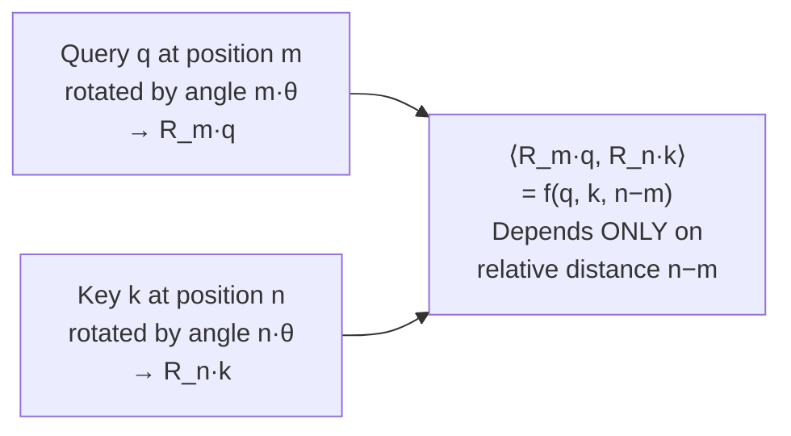

# Lesson 6 — RoPE: Rotary Position Embedding

> *Prerequisites: Lesson 2 (Sinusoidal PE — especially the rotation matrix derivation), Lesson 5 (ALiBi)*
> *Paper: "RoFormer: Enhanced Transformer with Rotary Position Embedding" — Su et al. (2021)*

---

## The Problem: The Gap Between Absolute and Relative

Methods so far either:
- **Absolute PE** (sinusoidal, learned): Encode each position independently → model must infer relative distances indirectly through Q/K weights → doesn't generalize well
- **Relative bias** (Shaw, T5, ALiBi): Add a separate bias to scores → requires extra parameters or fixed formulas → applied on top of, not inside, the Q·K dot product

The ideal: position information should be encoded **inside the Q·K dot product itself** such that the result depends naturally on relative distance — without adding a separate bias term or injecting into the input.

**RoPE's insight:** The dot product `Q_m · K_n` depends on relative distance `m−n` if — and only if — you rotate Q and K by angles proportional to their position **before** computing the dot product. The rotation cancels in just the right way.

---

## The 2D Intuition: Rotating on a Circle

Start with 2-dimensional Q and K vectors (one dimension pair).

A vector `q = [q₁, q₂]` at position `m` is rotated by angle `m · θ`:

$$R_m \cdot q = \begin{bmatrix} \cos(m\theta) & -\sin(m\theta) \\ \sin(m\theta) & \cos(m\theta) \end{bmatrix} \begin{bmatrix} q_1 \\ q_2 \end{bmatrix} = \begin{bmatrix} q_1\cos(m\theta) - q_2\sin(m\theta) \\ q_1\sin(m\theta) + q_2\cos(m\theta) \end{bmatrix}$$

Now compute the dot product between the rotated query at position `m` and the rotated key at position `n`:

$$\langle R_m q,\ R_n k \rangle = (R_m q)^T (R_n k) = q^T R_m^T R_n k = q^T R_{n-m} k$$

Since rotation matrices are orthogonal: `R_m^T = R_{-m}`, and `R_{-m} · R_n = R_{n-m}`.

**The key result:** The dot product depends on the **relative angle** `(n−m) · θ`:

$$\langle R_m q,\ R_n k \rangle = f(q, k, n-m)$$

This is the core of RoPE. The dot product is a function of content (`q`, `k`) and relative position (`n−m`). Absolute positions `m` and `n` have vanished.



---

## Extending to Full Dimension d_k

The 2D intuition extends to `d_k` dimensions by treating the vector as `d_k/2` independent 2D pairs:

$$\text{RoPE}(x, m) = \begin{bmatrix} x_1\cos(m\theta_0) - x_2\sin(m\theta_0) \\ x_1\sin(m\theta_0) + x_2\cos(m\theta_0) \\ x_3\cos(m\theta_1) - x_4\sin(m\theta_1) \\ x_3\sin(m\theta_1) + x_4\cos(m\theta_1) \\ \vdots \end{bmatrix}$$

Each dimension pair `i` gets its own frequency:
$$\theta_i = \frac{1}{10000^{2i/d}}$$

This is the same spectrum as sinusoidal PE — same base (10,000), same dimension pair indexing. But now it's applied to Q and K vectors, not to token embeddings.

**Block-diagonal rotation matrix form:**

$$R_m = \text{diag}(R(m\theta_0),\ R(m\theta_1),\ \ldots,\ R(m\theta_{d/2-1}))$$

Each `R(m·θ_i)` is a 2×2 rotation by angle `m·θ_i`. The full rotation is block-diagonal.

---

## Efficient Implementation: No Explicit Rotation Matrix

Explicitly constructing the `d_k × d_k` block-diagonal rotation matrix and multiplying would be expensive. Instead, RoPE uses element-wise operations:

$$\text{RoPE}(x, m)_{2i} = x_{2i}\cos(m\theta_i) - x_{2i+1}\sin(m\theta_i)$$
$$\text{RoPE}(x, m)_{2i+1} = x_{2i}\sin(m\theta_i) + x_{2i+1}\cos(m\theta_i)$$

In vector form, define two operations:
- `x` — original vector: `[x₁, x₂, x₃, x₄, ...]`
- `x_rotated` — each pair swapped and negated: `[−x₂, x₁, −x₄, x₃, ...]`

Then:
$$\text{RoPE}(x, m) = x \odot \cos(m\theta) + x_{\text{rotated}} \odot \sin(m\theta)$$

```python
import torch
import math

def precompute_freqs_cis(d_k, max_seq_len, base=10000):
    """Precompute complex frequencies for RoPE — the standard approach."""
    # θ_i = 1 / 10000^(2i/d) for i = 0, 1, ..., d/2-1
    theta = 1.0 / (base ** (torch.arange(0, d_k, 2).float() / d_k))  # (d_k/2,)
    
    # Positions 0 to max_seq_len-1
    positions = torch.arange(max_seq_len).float()  # (N,)
    
    # Outer product: angles[m, i] = m * theta_i
    angles = torch.outer(positions, theta)  # (N, d_k/2)
    
    # Complex representation: cos + i*sin — one per dimension pair
    freqs_cis = torch.polar(torch.ones_like(angles), angles)  # (N, d_k/2) complex
    return freqs_cis

def apply_rotary_emb(xq, xk, freqs_cis):
    """
    Apply RoPE to query and key.
    xq, xk: (batch, seq_len, num_heads, d_k) — float32
    freqs_cis: (seq_len, d_k/2) — complex64
    """
    # Reshape to pairs
    xq_r = xq.float().reshape(*xq.shape[:-1], -1, 2)  # (..., d_k/2, 2)
    xk_r = xk.float().reshape(*xk.shape[:-1], -1, 2)
    
    # Complex multiplication = rotation
    xq_c = torch.view_as_complex(xq_r)    # (..., d_k/2) complex
    xk_c = torch.view_as_complex(xk_r)
    
    freqs = freqs_cis[:xq.shape[1]]       # (seq_len, d_k/2)
    
    xq_out = torch.view_as_real(xq_c * freqs).flatten(-2)  # (..., d_k)
    xk_out = torch.view_as_real(xk_c * freqs).flatten(-2)
    
    return xq_out.type_as(xq), xk_out.type_as(xk)

# Usage in transformer:
# freqs_cis = precompute_freqs_cis(d_k, max_seq_len)
# Q, K = apply_rotary_emb(Q, K, freqs_cis)
# scores = (Q @ K.transpose(-2, -1)) / math.sqrt(d_k)  # naturally relative!
```

**Key efficiency:** No rotation matrix is constructed. Just element-wise multiply with precomputed cos/sin vectors. Zero extra parameters — cos and sin are computed from the fixed formula, not learned.

---

## Why RoPE Is Applied to Q and K Only — Not V

In standard MHA, all three projections `Q, K, V` can in principle receive positional information. RoPE rotates only Q and K.

**The reason:** V is the "payload" — the actual information that each token delivers to others. V is not involved in the **matching** (score computation `QKᵀ`). Only Q and K participate in determining which tokens attend to which. Rotating V would:
1. Distort the delivered information without serving any purpose in the score
2. Require compensating for position in the output, complicating the architecture

RoPE's relative-distance property lives entirely in the dot product `Q_m · K_n`. V doesn't need to participate.

---

## Absolute + Relative Hybrid — RoPE's Dual Nature

> **Interview note:** "Is RoPE absolute or relative positional encoding?"

This is a nuanced question. RoPE is **both simultaneously**:

- **Absolute** in its mechanism: Each Q and K vector at position `m` is rotated by angle `m · θ` — an absolute-position-dependent rotation
- **Relative** in its output: The dot product `Q_m · K_n` depends only on `m−n` — the score is determined by relative distance

The rotation is absolute (each token knows its own position); the attention is relative (the interaction only depends on distance). This hybrid nature is unique to RoPE and is why it outperforms both pure absolute and simple relative methods.

---

## Six Limitations of RoPE

*(Covered in depth in the notebook; summarized here as they directly motivate Lesson 7)*

| Limitation | Root Cause | Impact |
|---|---|---|
| **1. Degrades beyond training length** | Rotation angles `m·θ_i` outside trained range | Sharp performance collapse |
| **2. Non-monotonic long-range decay** | Oscillating dimensions can constructively interfere | Unexpected high attention at long distances |
| **3. Incompatible with linear attention** | `R_m^T R_n` coupling prevents Q/K kernel factorization | Can't use O(N) attention approximations |
| **4. High-frequency aliasing** | Fixed base causes fast dimensions to wrap around at long contexts | Positions wrap and become indistinguishable |
| **5. No explicit global position signal** | Purely relative by design | Harder for absolute-position tasks |
| **6. Breaks MLA absorption trick** | Position-dependent rotation prevents matrix merging | Requires Decoupled RoPE in DeepSeek |

**Limitation 4** in detail — the aliasing problem:

For `θ_0 = 1.0` (dimension pair 0, d=64), the period is `2π ≈ 6.28` positions. A sequence of 4K tokens causes this dimension to complete `4000/6.28 ≈ 637 full rotations`. Two tokens `m=637 × 2π` apart have identical rotation angle in this dimension — the model cannot distinguish them here.

This is why simply training longer doesn't fully solve the problem and why extensions are needed.

---

## RoPE's Mathematical Property: The Formal Proof

For query `q` at position `m` and key `k` at position `n`, after rotation:

$$Q_m = R_m q, \quad K_n = R_n k$$

The attention score:
$$Q_m \cdot K_n = (R_m q)^T (R_n k) = q^T R_m^T R_n k$$

Since R_m is an orthogonal rotation: `R_m^T = R_{-m}`. And `R_{-m} R_n = R_{n-m}` (rotations compose additively). Therefore:

$$Q_m \cdot K_n = q^T R_{n-m} k = \langle q, R_{n-m} k \rangle$$

This is a function of content `q, k` and relative position `n−m` only. Absolute positions `m` and `n` have factored out and cancelled. ∎

---

## Why RoPE Became the Standard

| Property | Sinusoidal | Learned Abs. | ALiBi | RoPE |
|---|---|---|---|---|
| Zero parameters | ✅ | ❌ | ✅ | ✅ |
| Relative distance by construction | ❌ | ❌ | ✅ (via bias) | ✅ |
| Applied to Q/K (not input) | ❌ | ❌ | ✅ | ✅ |
| No separate bias needed | ✅ | ✅ | ❌ | ✅ |
| Flash Attention compatible | ✅ | ✅ | ⚠️ (complex) | ✅ |
| Long context generalization | Poor | ❌ (hard cap) | Good (linear) | Moderate (with extensions) |

RoPE wins across nearly every dimension: no parameters, relative by construction, no bias injection, and compatible with Flash Attention (pre-applied to Q/K before the kernel).

**Adopted by:** LLaMA 1/2/3, Mistral, Mixtral, Qwen, Falcon, Gemma, GPT-NeoX, Command R, DeepSeek — essentially every frontier open model since 2023.

---

## Summary

- RoPE rotates Q and K by angle `m·θ` at position `m` — the dot product `Q_m·K_n` then depends only on `m−n`
- Frequencies `θ_i = 1/10000^(2i/d)` — same spectrum as sinusoidal PE but applied to Q/K
- Implemented via element-wise multiply with cos/sin, no explicit rotation matrices, **zero parameters**
- Applied to Q and K only — V is the payload, not involved in matching
- Hybrid absolute-relative: absolute mechanism, relative output
- Six limitations: length degradation, non-monotonic decay, linear attention incompatibility, aliasing, no global signal, MLA incompatibility
- The dominant PE method in modern LLMs — extended by YaRN, NTK, LongRoPE (Lesson 7)

---

## Interview Q&A

**Q: How does RoPE encode position?**
RoPE rotates the Q and K vectors by an angle proportional to position before computing the dot product. Q at position m is rotated by `m·θ`, K at position n by `n·θ`. The dot product `(R_m·q)^T(R_n·k) = q^T R_{n-m} k` depends only on the relative distance `n−m`.

**Q: Is RoPE absolute or relative?**
Both. It's absolute in mechanism (each token is rotated by its own absolute position) but relative in output (the attention score depends only on relative distance). This hybrid is unique to RoPE.

**Q: Why is RoPE better than ALiBi?**
RoPE encodes position within the Q·K dot product itself — the relative distance is a mathematical property of the computation. ALiBi adds a separate linear bias on top. RoPE is pre-applied to Q/K before the attention kernel (fully Flash Attention compatible); ALiBi requires position indices inside the kernel. RoPE also shows slightly better quality within training length.

**Q: What does rotating Q and K achieve?**
It makes the inner product `Q_m · K_n` a function of only `m−n`, not of `m` and `n` individually. This is the relative distance property — the score between any two tokens depends purely on how far apart they are and what their content vectors are.

**Q: Why is RoPE applied only to Q and K, not V?**
V is the payload — the information that gets passed from attended-to tokens. It's not involved in the score computation. Rotating V would distort the delivered content without adding any positional benefit (position is already encoded in the scores through rotated Q·K).

**Q: What is the main limitation of RoPE?**
Performance degrades sharply beyond training context length. The rotation angles `m·θ_i` were calibrated for positions 0 to L during training. Beyond L, the model sees angle combinations it never encountered — attention scores become inconsistent and performance collapses. This is addressed by the RoPE extensions in Lesson 7.
