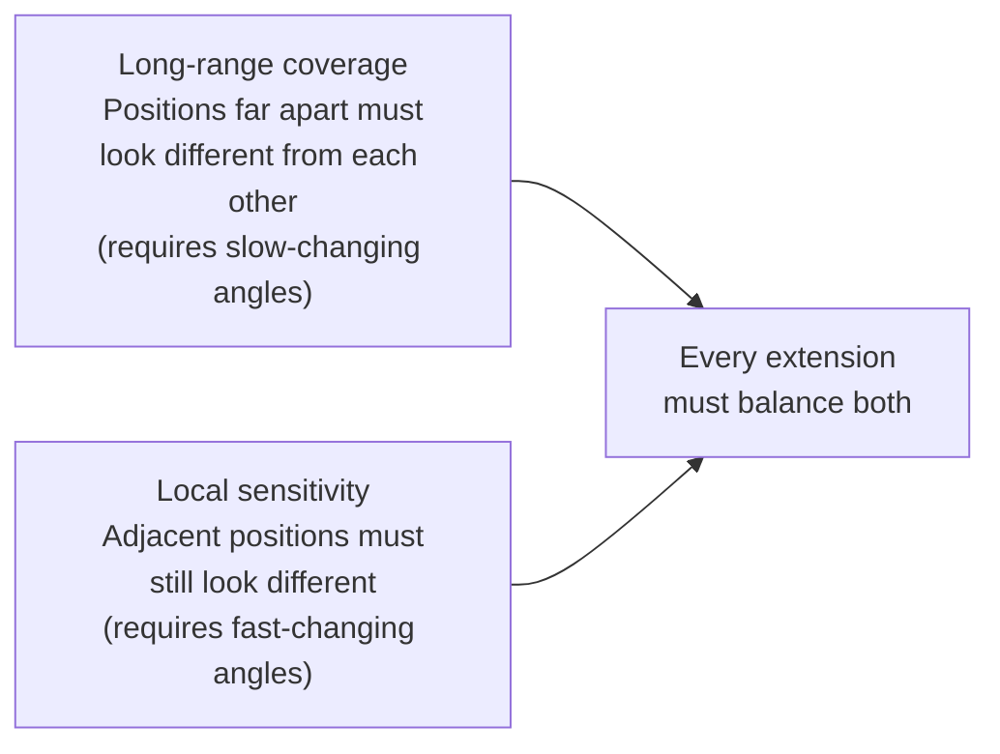

# Lesson 7 — RoPE Extensions: Scaling Context Beyond Training Length

> *Prerequisites: Lesson 6 (RoPE — must understand angle `m·θ_i` and aliasing)*
> *Papers: Position Interpolation (Chen et al. 2023); YaRN (Peng et al. 2023); LongRoPE (Ding et al. 2024)*

---

## The Problem: RoPE Fails at Lengths > Training Context

RoPE's rotation angles are `m · θ_i` where `θ_i = 1/10000^(2i/d)`. During training, the model sees positions `m` up to maximum `L` (the training context length). The model learns to interpret angle combinations in the range `[0, L·θ_i]` for each dimension pair `i`.

At inference with position `m > L`:
- Angles `m · θ_i` fall **outside the range seen during training**
- The model has no learned behavior for these angle combinations
- For high-frequency dimensions (small `i`), the angles wrap around `2π` — the same angle at a position 5,000 tokens away looks identical to a nearby position
- Performance doesn't degrade gracefully — it **collapses sharply** once `m > L`

All RoPE extensions answer the same question:
> **How do we manipulate the rotation angles `m · θ_i` so that out-of-distribution positions produce familiar, in-distribution angle patterns for the model?**

---

## The Core Tension All Extensions Must Navigate



Any change to angles that helps one hurts the other. The extensions differ in how cleverly they navigate this trade-off.

---

## Why High-Frequency Dimensions Are the Root Cause

Recall the dimension frequencies:

| Dimension pair `i` (d=256) | θ_i | Period T = 2π/θ_i |
|---|---|---|
| 0 (fastest) | 1.0 | 6.28 positions |
| 32 | 0.1 | 62.8 positions |
| 64 | 0.01 | 628 positions |
| 127 (slowest) | 0.000107 | 58,470 positions |

For a training context of `L = 4,096`:
- Dimension 0 completes `4096 / 6.28 ≈ 652 full rotations` — angle wraps 652 times. At long contexts, aliasing is severe.
- Dimension 127 completes `4096 / 58470 ≈ 0.07 rotations` — barely moves. No aliasing.

**The problem is concentrated in high-frequency (small `i`) dimensions.** Low-frequency dimensions have no aliasing issues within typical context lengths. Any fix should focus on high-frequency dimensions without harming them further.

---

## Approach 1 — Position Interpolation (PI)

*Chen et al., 2023 — "Extending Context Window of Large Language Models via Positional Interpolation"*

### The Idea

Instead of letting position indices grow beyond `L`, compress them so they always stay within `[0, L]`. For new context length `L'` > `L`, replace every position `m` with scaled `m'`:

$$m' = m \cdot \frac{L}{L'}$$

The rotation angle becomes:
$$\text{angle}_{m,i} = m' \cdot \theta_i = m \cdot \frac{L}{L'} \cdot \theta_i$$

### Concrete Example

Training context `L = 4096`, target `L' = 8192`, scale factor = `4096/8192 = 0.5`.

```
Position 8192 (new last token) → m' = 8192 × 0.5 = 4096  (back inside training range)
Position 4096 → m' = 2048
Position 1    → m' = 0.5   (non-integer — between trained positions)
```

Every angle is now **inside the range the model saw during training**. The model is interpolating between known angle values, not extrapolating beyond them.

### The Trade-Off — Local Sensitivity Degrades

Adjacent positions `m` and `m+1` now differ by:

$$\Delta\theta_i^{\text{PI}} = \frac{L}{L'} \cdot \theta_i$$

Compare to original:
$$\Delta\theta_i^{\text{original}} = \theta_i$$

The angle difference between adjacent tokens is now `L/L'` times smaller. For `L'/L = 2`:
- Adjacent tokens look **twice as similar** to each other as before
- The model's ability to distinguish fine-grained local positions degrades proportionally

**Fix:** Fine-tune for ~1,000 steps on long sequences after applying PI. The paper found this was sufficient to recover most local sensitivity. The out-of-distribution angles are now in-distribution; fine-tuning teaches the model to use the denser angle spacing.

---

## Approach 2 — YaRN (Yet another RoPE extensioN)

*Peng et al., 2023 — "YaRN: Efficient Context Window Extension of Large Language Models"*

### The Problem with PI

PI scales **all dimensions** uniformly by `L/L'`. But this wastes an opportunity:

- **Dimension 0** (period 6.28): Already cycles many times within training context. No aliasing. Scaling it down makes adjacent tokens look more similar **for no benefit** — we're hurting local sensitivity unnecessarily.
- **Dimension 127** (period 58,470): Only completes 7% of a rotation within training context `L=4096`. This dimension **needs** rescaling for longer contexts — it's the one that aliases.

**PI treats all dimensions the same. YaRN treats them differently based on their period.**

### The Three-Zone Strategy

YaRN partitions dimensions into three groups based on their wavelength `λ_i = 2π/θ_i` relative to context lengths `L` (training) and `L'` (target):

```
Zone 1 — High frequency (λ_i << L, period << training length):
  Already cycles many times. No aliasing issue. Leave unchanged.
  scale_i = 1  →  θ_i^new = θ_i

Zone 2 — Low frequency (λ_i >> L', period >> target length):
  Barely moves across the whole sequence. Apply full interpolation.
  scale_i = L/L'  →  θ_i^new = (L/L') · θ_i

Zone 3 — Middle frequency (period between L and L'):
  Apply smooth ramp — linear blend from scale=1 (Zone 1) to scale=L/L' (Zone 2)
  (NTK-aware interpolation formula)
```

The three-zone selection based on wavelength:
```python
# YaRN zone classification for each dimension pair i
lambda_i = 2 * math.pi / theta_i   # period of dimension i

if lambda_i < L:          # high frequency — many cycles in training context
    scale_i = 1.0         # Zone 1: no change
elif lambda_i > L_prime:  # low frequency — barely one cycle in target context
    scale_i = L / L_prime # Zone 2: full interpolation
else:                      # middle — partial interpolation
    scale_i = ramp_function(lambda_i, L, L_prime)   # Zone 3: smooth blend
```

### Temperature Scaling

After per-dimension rescaling, the interpolated embeddings have smaller magnitude differences between positions. Softmax attention produces **flatter distributions** — the model attends more uniformly and less selectively.

YaRN corrects this with a temperature factor `√(1/t)` applied to attention logits:

$$\text{Attention} = \text{softmax}\!\left(\frac{Q_m K_n^T \cdot \sqrt{1/t}}{\sqrt{d_k}}\right) V$$

where `t > 1` (empirically around 1.1–1.3 for most models). This sharpens the softmax distribution back to its pre-extension level.

### YaRN Result

- Preserves local sensitivity far better than PI (high-frequency dimensions are untouched)
- Requires minimal or no fine-tuning for moderate extensions (2× to 4× context)
- Better perplexity on long documents than PI at the same extension ratio
- Adopted by: **Qwen, some LLaMA variants, Mistral-long**

---

## Approach 3 — Base Frequency Scaling

*Used in: LLaMA 3 (base = 500,000), CodeLlama (base = 1,000,000)*

### The Idea

Instead of changing position indices or per-dimension scales, simply increase the base `B` from 10,000 to a larger value `B'`:

$$\theta_i^{\text{new}} = \frac{1}{B'^{\ 2i/d}}$$

Since `B' > 10000`, every `θ_i^new < θ_i^original` — all frequencies decrease, all periods lengthen.

### What This Does to Periods

For base = 10,000: slowest period ≈ 58,470 (for d=256)

For base = 500,000:
$$T_{\max} = \frac{2\pi}{\theta_{127}^{\text{new}}} = \frac{2\pi}{1/500000^{0.992}} \approx 2{,}700{,}000 \text{ positions}$$

The model can now encode relative distances up to millions of tokens before aliasing.

### Relation to Other Methods

Increasing the base is equivalent to applying a **non-uniform, dimension-dependent scale** to θ:

$$\theta_i^{\text{new}} = \theta_i \cdot \left(\frac{10000}{B'}\right)^{2i/d}$$

The effective scale factor `(10000/B')^(2i/d)` varies per dimension — larger scaling for low-frequency dimensions (large `i`), smaller for high-frequency (small `i`). This is similar to YaRN but governed by a single scalar `B'` rather than per-dimension optimization.

**Trade-off:** All dimensions slow down. High-frequency dimensions that previously resolved adjacent tokens (period 6) now resolve less finely. Local sensitivity degrades — but for models trained from scratch with the new base, the model learns to compensate.

> LLaMA 3 trained from scratch with base=500,000. This avoids the degradation that occurs when switching base on a pre-trained model. It's the cleanest approach but requires training from scratch.

---

## Approach 4 — LongRoPE

*Ding et al., 2024 — "LongRoPE: Extending LLM Context Window Beyond 2 Million Tokens"*

### The Problem with YaRN

YaRN's three-zone strategy is hand-designed. The zone boundaries and blending formula are reasonable heuristics — but not guaranteed to be optimal for any specific model or training distribution.

LongRoPE asks: **what if we search for the optimal per-dimension rescaling factor?**

### Evolutionary Search

LongRoPE treats the rescaling factor for each dimension pair as a parameter to optimize:

$$\theta_i^{\text{new}} = \frac{\theta_i}{\lambda_i}$$

where `λ ∈ R^(d/2)` is a vector of per-dimension rescaling factors discovered by **evolutionary search** (population-based optimization).

The search minimizes perplexity on a set of long documents. The result:
- Specific to the model (different training distributions → different optimal λ)
- Not a general formula — must be re-discovered per model
- Different models with the same architecture but different training distributions end up with different optimal λ vectors

### Boundary Token Handling

LongRoPE observes that position 0 (first token) and the last token tend to receive disproportionately high attention — they serve as anchors (related to attention sinks, Lesson 3.3 in attention notes). Interpolating their positional embeddings distorts these anchor points.

LongRoPE applies reduced or no rescaling to the very first and last positions, preserving their positional identity.

### Two-Stage Extension

For very long contexts (e.g., 2M tokens):

1. Extend to intermediate length (256K) with evolutionary-search λ + minimal fine-tuning
2. Re-search for new λ values calibrated to the final target (2M) + fine-tune again

This staged approach avoids degradation from extending too far in one step.

**Used in:** Microsoft Phi-3 models.

---

## Unified View: All Extensions Manipulate the Same Angle

Every approach modifies the angle `m · θ_i`:

```
Original RoPE:           angle = m           × θ_i
Position Interpolation:  angle = m·(L/L')    × θ_i         (scale m)
YaRN:                    angle = m           × θ_i · scale_i (scale θ selectively)
LongRoPE:                angle = m           × θ_i / λ_i   (optimize scale per dim)
Base frequency scaling:  angle = m           × 1/B'^(2i/d) (change base)
```

All of them ensure that for positions `m, n` within the new context `L'`, the angle combination `(m·θ_i^new, n·θ_i^new)` resembles angle combinations the model saw during training on `[0, L]`.

---

## Comparison Table

| Method | What Changes | Local Sensitivity | Long-range | Fine-tuning | Complexity |
|---|---|---|---|---|---|
| **Position Interpolation** | Scale all positions by L/L' | Degrades uniformly | Good up to L' | Yes, small | Simple |
| **YaRN** | Scale dimensions selectively by zone | Mostly preserved | Good | Minimal | Moderate |
| **LongRoPE** | Optimize per-dimension λ_i | Best preserved | Best | Minimal | High — requires search |
| **Base Frequency Scaling** | Increase base B | Slight degradation | Very long range | Yes (if post-hoc) | Simple |

---

## What None of Them Fully Solve

All extensions are **approximations**. The model's weights were optimized for a specific angle distribution — any extension introduces some distribution shift.

The cleanest solution remains **training with long contexts from the start** — which is why LLaMA 3 uses base=500,000 from pretraining rather than applying extensions post-hoc.

However, for extending existing models (e.g., LLaMA-2 4K → LLaMA-2 long 128K), extensions + fine-tuning are the practical path.

---

## Which Models Use What

| Model | PE Method | Context Length |
|---|---|---|
| **LLaMA-2** | RoPE (base 10K) | 4,096 |
| **LLaMA-3** | RoPE (base 500K) | 8,192 (base), 128K (instruct with extensions) |
| **Mistral 7B** | RoPE + sliding window | 8,192 effective |
| **Mistral 7B Long** | RoPE + NTK-scaling | 32,768 |
| **Qwen-1.5/2** | YaRN | Up to 128K |
| **Phi-3** | LongRoPE | Up to 128K |
| **CodeLlama** | RoPE (base 1M) | 100K |
| **DeepSeek-V2/V3** | RoPE (Decoupled) + MLA | 128K |

---

## Summary

- RoPE fails beyond training length `L` because angles `m·θ_i` are out-of-distribution
- **Position Interpolation:** Compress positions to `[0, L]` — all angles in-distribution, but local sensitivity degrades uniformly
- **YaRN:** Scale dimensions selectively by zone — high-frequency untouched (local preserved), low-frequency interpolated (long range extended), temperature correction for softmax sharpness
- **Base Frequency Scaling:** Increase θ base — all periods lengthen, cleanest for from-scratch training (LLaMA 3)
- **LongRoPE:** Evolutionary search for per-dimension λ — model-specific, best quality, used in Phi-3
- All methods manipulate `m·θ_i` to keep angles in the distribution seen during training
- None fully substitute for training at the target length — they are approximations

---

## Interview Q&A

**Q: Why does RoPE degrade at sequences longer than training context?**
RoPE's angles `m·θ_i` were calibrated for positions 0 to L during training. Beyond L, two problems: (1) high-frequency dimensions alias (complete full rotations, positions look identical), and (2) all angle combinations are out-of-distribution — the model never optimized attention for them. Performance collapses sharply rather than degrading gradually.

**Q: How do you extend a model's context beyond its training length?**
Several methods: (1) Position Interpolation — compress position indices by L/L', keep all angles in-distribution, fine-tune briefly. (2) YaRN — scale dimensions selectively by period: high-frequency unchanged, low-frequency interpolated, add temperature correction. (3) Increase base frequency — all dimensions slow down, periods lengthen. Best combined with fine-tuning at target length.

**Q: What is YaRN and why is it better than plain position interpolation?**
YaRN applies per-dimension scaling based on wavelength zones. High-frequency dimensions (fast-changing, fine-grained) are left unchanged — preserving local sensitivity. Low-frequency dimensions (slow-changing, global) receive full interpolation. PI applies the same scaling to all dimensions, unnecessarily harming high-frequency local sensitivity. YaRN also adds temperature correction for softmax sharpness. Result: better perplexity at long contexts with less fine-tuning.

**Q: Why does linear interpolation hurt local attention?**
PI scales all positions by `L/L'`. Adjacent positions `m` and `m+1` now differ by angle `(L/L')·θ_i` instead of `θ_i` — the difference is `L/L'` times smaller. For `L'/L = 2`, adjacent tokens look twice as similar. The model can no longer distinguish nearby positions as well, degrading syntax-sensitive tasks.

**Q: What is LongRoPE?**
LongRoPE runs evolutionary search to find the optimal per-dimension rescaling factor `λ_i` for a specific model and target context length. Unlike YaRN's hand-designed zone formula, LongRoPE discovers the best scaling per dimension by minimizing perplexity on long documents. Result: better long-context quality than YaRN at the cost of a model-specific optimization step. Used in Phi-3.
