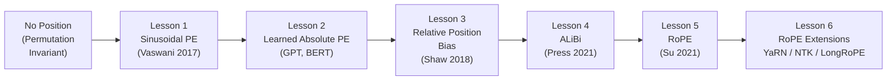

# Positional Encodings — Deep Dive Notes

> **Scope:** Why transformers need positional information → Sinusoidal → Learned Absolute → Relative Encodings → ALiBi → RoPE → RoPE extensions (YaRN, NTK, LongRoPE).
---

## How to Read These Notes

Each lesson follows this structure:
1. **Problem** — what limitation of the previous approach motivated this method
2. **Solution** — the mechanism, math, and design decisions
3. **Limitations / Failure modes** — length generalization, training cost, accuracy
4. **Interview Q&A** — specific questions with model answers

> *Lessons are ordered chronologically by research era. Start at Lesson 1 for foundations.*

---

## Evolution Timeline

---

## Lesson Index

---

### Lesson 1 — Why Transformers Need Positional Encoding
**File:** [`Lesson_1.md`](Lesson_1.md)
**Prerequisites:** Basic transformer / self-attention understanding

| Section | Topics Covered |
|---|---|
| The Core Problem | Self-attention is permutation-invariant — "cat sat on mat" = "mat on sat cat" without PE |
| What PE Must Achieve | Unique encoding per position; smooth variation; generalizable pattern |
| Where PE Is Injected | Added to token embeddings before the first layer (absolute) OR applied inside attention (relative) |
| Two Families | Absolute (add to input) vs Relative (modify attention scores directly) |
| Interview Q&A | "What would happen if you removed positional encodings?", "Why not just use token indices as-is?" |

---

### Lesson 2 — Sinusoidal Positional Encoding
**File:** [`Lesson_2.md`](Lesson_2.md)
**Prerequisites:** Lesson 1
**Paper:** *Attention Is All You Need* — Vaswani et al. (2017)

| Section | Topics Covered |
|---|---|
| Problem | Model needs position information but training data has no explicit position signal |
| Formula | `PE(pos, 2i) = sin(pos / 10000^(2i/d))`, `PE(pos, 2i+1) = cos(...)` — full derivation |
| Why Sin/Cos | Unique per position; bounded; relative positions expressible via linear transformation |
| Frequency Interpretation | Low-frequency dimensions = coarse position; high-frequency = fine position |
| What the Paper Showed | Sinusoidal vs learned had nearly identical performance on translation |
| Limitations | Fixed at training time; doesn't generalize to sequences longer than seen during training |
| Interview Q&A | "Why use sin and cos?", "Can sinusoidal PE generalize beyond training length?", "What do the frequencies represent?" |

---

### Lesson 3 — Learned Absolute Positional Embeddings
**File:** [`Lesson_3.md`](Lesson_3.md)
**Prerequisites:** Lesson 2
**Papers:** BERT (Devlin 2018), GPT (Radford 2018)

| Section | Topics Covered |
|---|---|
| Problem | Sinusoidal PE is fixed — can the model learn a better encoding for its specific task? |
| Mechanism | A lookup table of shape (max_seq_len, d_model) initialized randomly and trained with the model |
| Advantages | Task-adapted; may outperform sinusoidal for specific domains |
| Hard Length Limit | Cannot represent positions beyond max_seq_len seen during training — hard failure at inference |
| BERT vs GPT Comparison | BERT: max 512 tokens; GPT-2: max 1024 tokens — hard-coded capacity |
| Why Length Generalization Fails | The embeddings for unseen positions are literally uninitialized / out-of-table |
| Limitations | Hard cap on context length; increases model parameter count by max_seq_len × d_model |
| Interview Q&A | "Why did BERT have a 512 token limit?", "Can you fine-tune a model beyond its trained context length?" |

---

### Lesson 4 — Relative Positional Bias (Shaw et al.)
**File:** [`Lesson_4.md`](Lesson_4.md)
**Prerequisites:** Lesson 2, 3
**Paper:** *Self-Attention with Relative Position Representations* — Shaw et al. (2018)

| Section | Topics Covered |
|---|---|
| Problem | Absolute PE encodes position globally — but in language, relative distance between tokens often matters more than absolute position |
| Mechanism | Add learnable bias `a_{ij}` to attention scores based on relative offset `(i - j)`, clipped to a maximum distance |
| Formula | `e_{ij} = (x_i W^Q)(x_j W^K + a_{ij}^K)^T / √d_k` — key modification |
| Clipping | Distances beyond max clip distance share one embedding — the extrapolation strategy |
| T5 Bias | How T5 extended this with bucket-based relative biases |
| Limitations | Still adds learned parameters; bucket design is a hyperparameter; doesn't extrapolate cleanly |
| Interview Q&A | "What is the difference between absolute and relative positional encoding?", "How does T5 handle position?" |

---

### Lesson 5 — ALiBi (Attention with Linear Biases)
**File:** [`Lesson_5.md`](Lesson_5.md)
**Prerequisites:** Lesson 4
**Paper:** *Train Short, Test Long* — Press et al. (2021)

| Section | Topics Covered |
|---|---|
| Problem | Absolute and relative PE methods struggle to generalize to sequences longer than training length |
| Core Idea | Subtract a static linear penalty proportional to distance directly from attention scores (no learned parameters) |
| Formula | `softmax((QKᵀ/√d_k) - m·|i - j|)` — penalty increases linearly with distance |
| Slope Assignment | `m = 2^(-8/h)` per head — geometric progression; smaller m = head can attend further |
| Why Static (No Learning) | No extra parameters; distance-penalty is a prior, not learned |
| Length Extrapolation | Train at 1K tokens, infer at 4K — ALiBi degrades more gracefully than absolute PE |
| Why ALiBi Lost to RoPE | RoPE integrates position into Q and K directly (better scaling, better with modern architectures); ALiBi adds a separate bias which conflicts with Flash Attention tiling |
| Limitations | Doesn't capture fine-grained relative positions; linear penalty may penalize valid long-range dependencies |
| Models Using ALiBi | BLOOM, MPT — notable frontier models |
| Interview Q&A | "What is ALiBi?", "How are slopes assigned?", "Why does ALiBi extrapolate better than learned PE?", "Why did ALiBi lose to RoPE?" |

---

### Lesson 6 — RoPE (Rotary Position Embedding)
**File:** [`Lesson_6.md`](Lesson_6.md)
**Prerequisites:** Lesson 4, 5
**Paper:** *RoFormer: Enhanced Transformer with Rotary Position Embedding* — Su et al. (2021)

| Section | Topics Covered |
|---|---|
| Problem | Absolute PE and ALiBi either fail at long contexts or add separate biases; ideal is to encode position inside attention naturally |
| Core Insight | Rotate Q and K vectors by an angle proportional to position — the dot product then depends only on relative distance |
| 2D Rotation Intuition | Treat dimension pairs as complex number coordinates; rotating by `θ_m` encodes position m |
| Full Dimension Extension | Split d-dim vector into d/2 pairs; each pair gets a different frequency `θ_i = 1/10000^(2i/d)` |
| Mathematical Proof | `<R_m·q, R_n·k> = f(q, k, m-n)` — dot product is a function of `(m-n)` only |
| Efficient Implementation | No actual rotation matrix — implement via element-wise multiply with cos/sin vectors (no extra params) |
| Applied to Q and K Only | V does not get rotated — why (V is the "payload", doesn't participate in matching) |
| Absolute + Relative Hybrid | RoPE encodes absolute position (via angle) but produces relative scores |
| Why RoPE Became Standard | Used in LLaMA, Mistral, Qwen, Falcon, Gemma, GPT-NeoX; relative by construction; no extra parameters |
| Limitations | Still degrades at sequences much longer than training length (the base frequency is fixed) |
| Interview Q&A | "How does RoPE encode position?", "Why is RoPE better than ALiBi?", "What does rotating Q and K achieve?", "Is RoPE absolute or relative?" |

---

### Lesson 7 — RoPE Extensions: Context Length Scaling
**File:** [`Lesson_7.md`](Lesson_7.md)
**Prerequisites:** Lesson 6
**Papers:** NTK-aware scaling (blog 2023), YaRN (Peng et al. 2023), LongRoPE (Ding et al. 2024)

| Section | Topics Covered |
|---|---|
| Problem | RoPE trained at 4K context degrades at 8K, 32K, 128K — the base frequency is mismatched |
| Why Length Fails | High-frequency dimensions "wrap around" (aliasing) at long contexts; the model hasn't seen those rotation states |
| Linear Interpolation (simple) | Divide position indices by a scale factor; works but degrades near-range attention |
| NTK-Aware Scaling | Scale the base `θ` instead of position indices — preserves high-frequency (local) information while extending low-frequency (global) range |
| YaRN | Ramp function: don't scale high-frequency dims (local stays sharp), gradually scale low-frequency dims (global range extends); also adds a temperature `√t` to the attention score |
| LongRoPE | Search for optimal non-uniform scaling factors per dimension via evolutionary algorithm; used in Phi-3 |
| Dynamic NTK | Scale base frequency on-the-fly at inference based on actual sequence length |
| Which Models Use What | LLaMA-3 (RoPE + ABF); Mistral (NTK); Phi-3 (LongRoPE); Qwen (YaRN) |
| Limitations | All extensions are approximations; fine-tuning at target length is still best practice |
| Interview Q&A | "How do you extend a model's context beyond its training length?", "What is YaRN?", "Why does linear interpolation hurt local attention?" |

---

## Comparison Table — All Positional Encoding Methods

| Method | Type | Parameters | Max Length | Relative? | Length Extrapolation | Used In |
|---|---|---|---|---|---|---|
| **Sinusoidal** | Absolute | 0 | ∞ (fixed formula) | Partial | Poor | Original Transformer |
| **Learned Absolute** | Absolute | max_len × d | Hard cap | No | None (hard fail) | BERT, GPT-2 |
| **Relative Bias (Shaw)** | Relative | clip_dist × d | No hard cap | Yes | Clips beyond max | Earlier seq2seq |
| **T5 Relative** | Relative | ~32 buckets | No hard cap | Yes | Moderate | T5 family |
| **ALiBi** | Additive bias | 0 | No hard cap | Yes | Good (linear decay) | BLOOM, MPT |
| **RoPE** | Multiplicative | 0 | Training limit | Hybrid | Moderate | LLaMA, Mistral, Qwen |
| **NTK-RoPE** | Multiplicative | 0 | Scaled | Hybrid | Good | Mistral-long |
| **YaRN** | Multiplicative | 0 | Scaled | Hybrid | Very good | Qwen, some LLaMA |
| **LongRoPE** | Multiplicative | 0 | Optimized | Hybrid | Excellent | Phi-3 |

---

## What Is Covered Briefly (Not In Depth)

| Topic | Brief Coverage In | Full Coverage In |
|---|---|---|
| How RoPE integrates with attention (Q/K rotate) | Lesson 6 | Attention mechanism in `../kv_cache_reduce/Lesson_1_1.md` |
| RoPE incompatibility with MLA | Lesson 6 (brief mention) | `../kv_cache_reduce/Lesson_3_1.md` |
| Flash Attention + ALiBi inside kernel | Lesson 5 (brief) | `../kv_cache_reduce/Lesson_3_2.md` |
