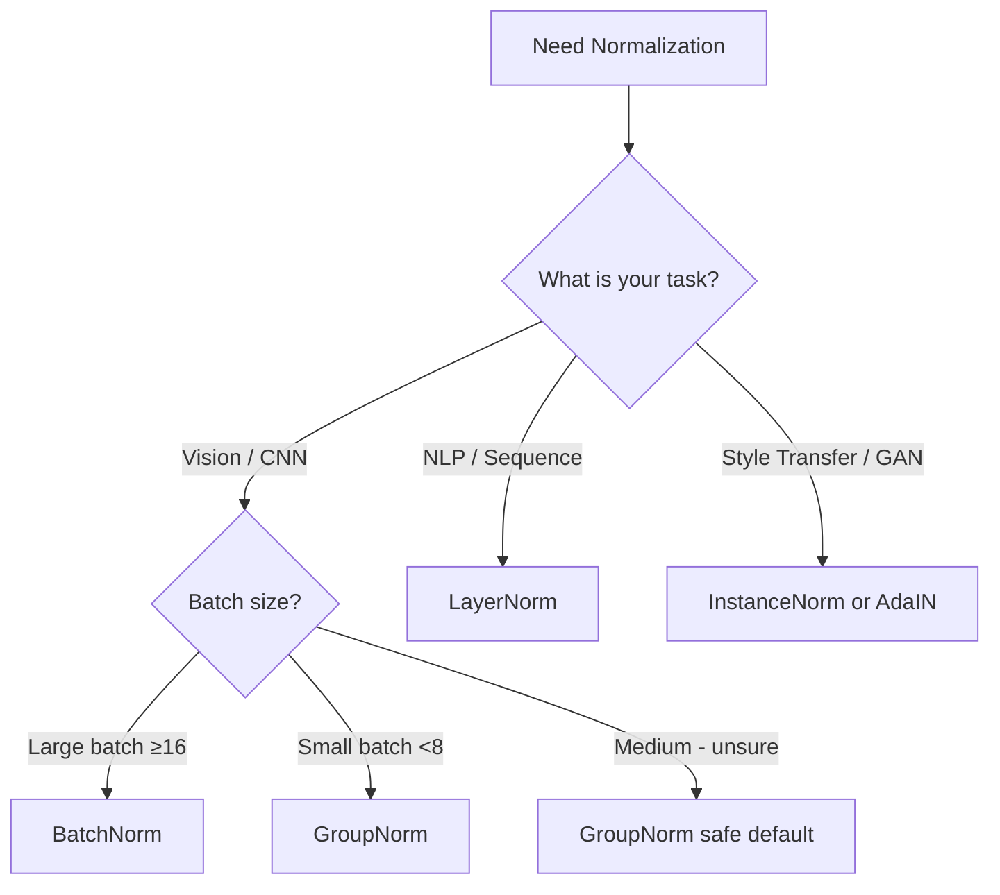

# Normalization

---

## The Problem

Deep networks are hard to train. As you stack more layers, a subtle but devastating problem emerges — **Internal Covariate Shift**.

When the weights of layer 3 update, the distribution of its outputs changes. Layer 4 now receives a different distribution than it was trained on. It adapts. But then layer 3 updates again. Layer 4 has to re-adapt. This keeps happening across all layers simultaneously — every layer is chasing a moving target set by the layers before it.

Consequences:
- You need very small learning rates or training becomes unstable
- Weights in early layers get tiny gradients — **vanishing gradient problem**
- Saturating activations (sigmoid, tanh) get pushed into flat regions — gradients die
- Training is slow, sensitive to initialization, and fragile

**What we need:** A way to keep the distribution of activations stable throughout training, regardless of how weights update.

---

## What Normalization Does (The General Idea)

Every normalization technique does the same three steps:

**Step 1 — Compute mean and variance** over some set of values.

**Step 2 — Normalize:**
$$\hat{x} = \frac{x - \mu}{\sqrt{\sigma^2 + \epsilon}}$$

**Step 3 — Scale and shift with learnable parameters γ, β:**
$$y = \gamma\hat{x} + \beta$$

The difference between all normalization techniques is **which axes you compute mean and variance over**. That one decision changes everything about where it works and where it breaks.

---

## 1. Batch Normalization

**Paper:** Ioffe & Szegedy, 2015

### The Idea

Normalize each feature across the **entire batch**. For a given feature, collect its values from all samples in the batch and normalize so that feature has mean=0, variance=1 across the batch.

For a tensor of shape `[B, V]` (batch × features):

$$\mu_v = \frac{1}{B}\sum_{b=1}^{B} x_{b,v} \qquad \sigma^2_v = \frac{1}{B}\sum_{b=1}^{B}(x_{b,v} - \mu_v)^2$$

Normalize every value using its feature's statistics. γ and β are vectors of size V — one per feature.

For sequences `[B, N, V]`, normalization is over B × N for each feature v (all batch items, all positions).

### Why γ and β?

Pure normalization forces every feature to mean=0, variance=1 always. This destroys the representational capacity of the layer — the network can't choose a different distribution even if that's what the task needs. γ and β give the network the ability to learn "how much normalization is actually useful here." If γ=1 and β=0, full normalization. Otherwise, the network adjusts. See the [earlier explanation](#) for the chef analogy.

### BatchNorm at Test Time — Critical Detail

During training, mean and variance are computed from the current batch. At test time you often have a single sample — batch statistics are meaningless.

**Solution: Running statistics.**

During training, BatchNorm maintains a **running mean and running variance** using exponential moving average:

$$\mu_{\text{running}} = \alpha \cdot \mu_{\text{running}} + (1-\alpha) \cdot \mu_{\text{batch}}$$

Typical α = 0.9 or 0.99.

At test time, these running statistics (computed over the entire training set) are used instead of batch statistics. The network is now deterministic — same input always gives same output.

```python
model.train()  # uses batch statistics, updates running stats
model.eval()   # uses frozen running statistics
```

**This is one of the most common bugs in practice** — forgetting to call `model.eval()` before inference. The model behaves differently because it's still using batch statistics.

### Where BatchNorm Normalizes

```
Tensor: [B, N, V]

For each feature v, normalize across B × N:

  B →  [■ ■ ■ ■]   sample 1, all positions, feature v
       [■ ■ ■ ■]   sample 2
       [■ ■ ■ ■]   sample 3
        N →

One μ and σ² computed from all ■ values → normalize all of them
```

### Pros and Cons

| Pros | Cons |
|---|---|
| Dramatically stabilizes training | Statistics depend on batch — problematic with small batches |
| Allows higher learning rates | Breaks with batch size 1 |
| Reduces sensitivity to initialization | Variable-length sequences + padding corrupts statistics |
| Acts as regularizer (noise from batch stats) | Train/test behavior difference (running stats bug risk) |
| Works extremely well for CNNs | Not suitable for RNNs/Transformers |

### When to Use

CNNs, vision models, any fixed-size dense inputs with reasonably large batches (B ≥ 16).

---

## 2. Layer Normalization

**Paper:** Ba et al., 2016 — motivated directly by BatchNorm's failure on RNNs.

### The Problem BatchNorm Doesn't Solve

RNNs process sequences one step at a time. At each timestep, the hidden state is updated. If you apply BatchNorm:
- Statistics depend on the batch — but different sequences have different lengths
- At test time, you often process one sequence at a time → B=1 → batch statistics collapse
- Statistics need to be maintained per-timestep, which is complex and memory-intensive

You need normalization that works **within a single sample**, independent of the batch.

### The Idea

Instead of normalizing each feature across the batch, normalize **each sample across all its features**.

For a single token vector of size V:

$$\mu = \frac{1}{V}\sum_{v=1}^{V} x_v \qquad \sigma^2 = \frac{1}{V}\sum_{v=1}^{V}(x_v - \mu)^2$$

Every token normalizes itself using its own feature values. No dependency on batch or other positions.

### Where LayerNorm Normalizes

```
Tensor: [B, N, V]

For each token (each b, n position), normalize across V:

  B=1, N=1: [■ ■ ■ ■ ■ ■ ■ ■]  ← normalize across these V values
  B=1, N=2: [■ ■ ■ ■ ■ ■ ■ ■]  ← independently
  B=2, N=1: [■ ■ ■ ■ ■■ ■ ■]  ← independently
              V →

Each row is self-contained. No cross-sample dependency.
```

γ and β are still size V — one per feature — but now learned across all tokens and all samples.

### Why This Works for Transformers

- No batch dependency → works with any batch size including B=1
- No sequence length dependency → handles variable-length sequences naturally
- Same behavior at train and test time → no running statistics needed, no eval() bug
- Each token's normalization is independent → parallelizable

This is why **every major Transformer** (BERT, GPT, T5, LLaMA) uses LayerNorm.

### Pre-LN vs Post-LN

Original Transformer (Vaswani 2017) used **Post-LN** — normalize after residual addition:

```
x → Attention → + → LayerNorm → output
         ↑_____|
```

Modern practice uses **Pre-LN** — normalize before the sublayer:

```
x → LayerNorm → Attention → + → output
         ↑___________________|
```

Pre-LN is more stable — gradients flow through the residual path without going through LayerNorm, reducing vanishing gradient risk. GPT-2 and most modern LLMs use Pre-LN.

### Pros and Cons

| Pros | Cons |
|---|---|
| Batch-size independent | Normalizes across features — assumes features are comparable |
| Same behavior train and test | Less effective than BatchNorm for CNNs (spatial structure ignored) |
| Works for variable-length sequences | Statistics from one sample can be noisy if V is small |
| Parallelizable across batch | |

---

## 3. Instance Normalization

**Paper:** Ulyanov et al., 2016 — introduced for style transfer.

### The Problem It Solves

In **style transfer**, you want the model to be invariant to the contrast and brightness of the input image — these are style properties you're trying to transfer, not content the model should depend on.

BatchNorm normalizes across the batch — style information from different images bleeds together. LayerNorm normalizes across all channels — mixes spatial and style information.

What you want: normalize each sample, each channel, **independently** — remove per-sample per-channel style statistics entirely.

### The Idea

For each sample and each channel, normalize across the **spatial dimensions (H × W)**.

For a tensor `[B, C, H, W]` (images):

$$\mu_{b,c} = \frac{1}{H \times W}\sum_{h,w} x_{b,c,h,w} \qquad \sigma^2_{b,c} = \frac{1}{H \times W}\sum_{h,w}(x_{b,c,h,w} - \mu_{b,c})^2$$

Each sample, each channel gets its own mean and variance computed from its spatial map.

### Where Instance Norm Normalizes

```
Tensor: [B, C, H, W]

For sample b=1, channel c=1 — normalize across H×W:

  ┌─────────────┐
  │ ■ ■ ■ ■ ■  │  ← spatial map for (b=1, c=1)
  │ ■ ■ ■ ■ ■  │     one μ and σ² from all these values
  │ ■ ■ ■ ■ ■  │
  └─────────────┘

For sample b=1, channel c=2 — completely separate statistics
For sample b=2, channel c=1 — completely separate statistics
```

### Why This Is Good for Style Transfer

Style is encoded in the mean and variance of feature maps per channel. By normalizing these out, you remove the original style. You can then re-inject style by setting γ and β to the style image's statistics (this is called **Adaptive Instance Normalization — AdaIN**, used in StyleGAN).

### Pros and Cons

| Pros | Cons |
|---|---|
| Removes per-sample style statistics | Statistics from H×W only — noisy for small feature maps |
| No batch dependency | Ignores batch and channel relationships |
| Great for generative models | Useless for classification (destroys useful content info) |
| Foundation for AdaIN (StyleGAN) | Not general purpose |

### When to Use

Style transfer, image generation (GANs), any task where per-sample per-channel normalization makes sense. Not for classification or NLP.

---

## 4. Group Normalization

**Paper:** Wu & He, 2018 — motivated by BatchNorm's failure with small batches.

### The Problem

BatchNorm degrades with small batch sizes. In tasks like **object detection and segmentation**, you can't use large batches — high-resolution images eat GPU memory. With B=2 or B=4, batch statistics are noisy and BatchNorm actively hurts performance.

InstanceNorm avoids the batch dependency but loses channel relationships. LayerNorm normalizes all channels together. What's the right middle ground?

### The Idea

Split the C channels into G groups. Normalize across the **spatial dimensions AND channels within each group** — for each sample independently.

For a tensor `[B, C, H, W]`, split C into G groups of size C/G:

$$\mu_{b,g} = \frac{1}{(C/G) \times H \times W}\sum_{c \in \text{group } g}\sum_{h,w} x_{b,c,h,w}$$

Each sample, each group gets its own statistics.

### Where Group Norm Normalizes

```
Tensor: [B, C, H, W]  with G=2 groups

Channels split into 2 groups: [c1,c2,c3] and [c4,c5,c6]

For sample b=1, group 1:
  normalize across c1,c2,c3 and all H×W positions together

For sample b=1, group 2:
  normalize across c4,c5,c6 and all H×W positions together

No cross-sample dependency.
```

### The G Parameter — Two Extremes

GroupNorm unifies InstanceNorm and LayerNorm:
- **G = C** (one channel per group) → Instance Normalization
- **G = 1** (all channels in one group) → Layer Normalization

G is a hyperparameter. Typical value: G=32 for ResNet-style networks.

### Why It Works for Small Batches

All statistics are computed within a single sample — no batch dimension involved. Whether B=2 or B=256, the normalization is identical. Performance doesn't degrade with small batches.

### Pros and Cons

| Pros | Cons |
|---|---|
| Batch-size independent | G is a hyperparameter to tune |
| Stable with small batches | Slightly worse than BatchNorm at large batch sizes |
| Works for detection/segmentation | Less common — fewer plug-and-play implementations |
| Unifies InstanceNorm and LayerNorm | Channel grouping assumption may not always be valid |

### When to Use

Object detection, segmentation, any vision task where batch size is constrained by memory. Recommended replacement for BatchNorm when B < 8.

---

## 5. Which Axes? — The Unifying View

This is the most important thing to remember. Every normalization is the same formula, different axes.

```
Tensor: [B, C, H, W]  or  [B, N, V]

             B        C/V       H,W/N
             (batch)  (feature) (spatial/sequence)

BatchNorm:   ✓                  ✓        normalize ACROSS batch & spatial, PER feature
LayerNorm:            ✓        ✓        normalize ACROSS features & sequence, PER sample
InstanceNorm:                   ✓        normalize ACROSS spatial only, PER sample PER channel
GroupNorm:            ✓*       ✓        normalize ACROSS spatial & channel group, PER sample
```

*within each group



---

## 6. Comparison Table

| | BatchNorm | LayerNorm | InstanceNorm | GroupNorm |
|---|---|---|---|---|
| Normalize over | B, H, W (per C) | C, N (per B,N) | H, W (per B,C) | C/G, H, W (per B,G) |
| Batch dependent | Yes | No | No | No |
| Works at B=1 | No | Yes | Yes | Yes |
| Train≠Test behavior | Yes (running stats) | No | No | No |
| Learns γ, β | Yes | Yes | Yes | Yes |
| Primary use | CNNs | Transformers | Style/GAN | Detection |

---

## 7. Tricky Interview Questions

**Q: BatchNorm behaves differently at train and test time. Why, and what can go wrong?**
> During training it uses current batch statistics — mean and variance from the batch. During test time it uses running statistics accumulated during training. If you forget `model.eval()`, the model uses batch statistics at inference — with a single test sample, this produces garbage outputs. Also, if the test distribution shifts from training, running statistics may be stale and wrong.

**Q: Why does BatchNorm act as a regularizer?**
> Because batch statistics are computed from a random mini-batch each step, they introduce noise into the normalization — the mean and variance fluctuate. This noise acts like a stochastic perturbation on the activations, similar in spirit to dropout. Larger batches → less noise → less regularization. This is one reason large-batch training can overfit more.

**Q: Why can't you use BatchNorm in a Transformer?**
> Three reasons. First, batch statistics depend on all samples in the batch — sequences of different lengths plus padding corrupt those statistics. Second, at inference you often process one sequence at a time, making batch statistics meaningless. Third, the train/test discrepancy from running statistics is more problematic for sequence models. LayerNorm avoids all three issues by normalizing within each token independently.

**Q: What is AdaIN and where is it used?**
> Adaptive Instance Normalization — used in style transfer and StyleGAN. First apply InstanceNorm to remove the content image's style statistics. Then re-inject style by setting γ and β to the style image's channel-wise mean and variance. The content structure is preserved but the style statistics are replaced. StyleGAN extends this: the generator receives a learned style vector that sets γ and β at each layer, controlling the generated image's style at different scales.

**Q: GroupNorm unifies LayerNorm and InstanceNorm — explain.**
> GroupNorm splits C channels into G groups and normalizes within each group over spatial dimensions, per sample. When G=C (one channel per group), normalization is only over H×W per channel per sample — that's InstanceNorm. When G=1 (all channels in one group), normalization is over all channels and spatial dimensions per sample — that's LayerNorm (for images). G is the dial between the two.

**Q: If BatchNorm is so good for CNNs, why not use it everywhere?**
> BatchNorm's statistics are computed across the batch dimension. For CNNs with fixed spatial inputs and large batches, this is stable and works beautifully. For sequences, the batch dependency is problematic (variable lengths, single-sample inference). For small-batch tasks (detection, segmentation), noisy batch statistics hurt. For generative models, you sometimes want per-sample control over statistics. Each failure mode motivated a different normalization technique.

**Q: Does normalization always help? When might it hurt?**
> Not always. For very small feature dimensions (small V in LayerNorm), statistics from few values are noisy. For tasks requiring the model to distinguish samples by their raw activation scale — some anomaly detection tasks — normalization removes exactly the signal you need. For shallow networks that don't suffer from covariate shift, normalization adds overhead without benefit. And incorrect placement (e.g., normalizing after the final output layer) can constrain the output range and hurt performance.