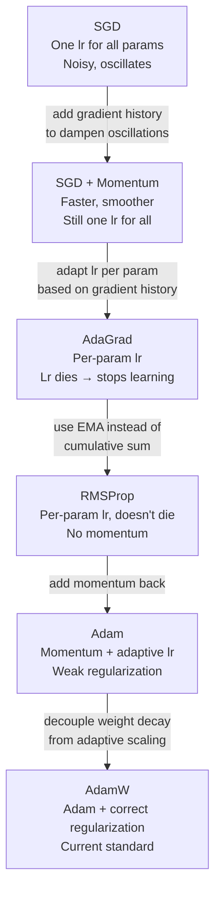

# Optimizers

> Each optimizer in this chapter exists because the previous one had a specific flaw. Read it that way.

---

## The Core Problem

We have a loss `L(θ)`. We want to find `θ` that minimizes it. We can't solve it analytically for deep networks, so we do it iteratively:

$$\theta \leftarrow \theta - \eta \cdot \nabla_\theta L$$

Everything in this chapter is a variation of this one line — changing *what* we subtract and *how much*.

---

## 1. Gradient Descent Variants

The question is: **which data do you compute the gradient on?**

### Batch Gradient Descent

Use the **entire dataset** to compute one gradient update.

$$\theta \leftarrow \theta - \eta \cdot \frac{1}{N}\sum_{i=1}^{N} \nabla L_i(\theta)$$

- Gradient is exact (no noise)
- One update per epoch
- Unworkable for large datasets — can't fit all data in memory, and one update per epoch is glacially slow

### Stochastic Gradient Descent (SGD)

Use **one random sample** per update.

$$\theta \leftarrow \theta - \eta \cdot \nabla L_i(\theta)$$

- Very fast updates
- Gradient is noisy — single sample is a poor estimate of the true gradient
- The noise actually helps escape shallow local minima, but makes convergence unstable

### Mini-Batch Gradient Descent

Use a **small batch** (typically 32–512 samples) per update. This is what everyone means when they say "SGD" in practice.

$$\theta \leftarrow \theta - \eta \cdot \frac{1}{B}\sum_{i \in \text{batch}} \nabla L_i(\theta)$$

- Gradient is a reasonable estimate — not exact, not as noisy as single sample
- Efficient on GPU (vectorized computation over batch)
- The standard approach

```
Batch size effect:
Small batch (8–32)   → noisy gradients, acts as regularization, slower hardware utilization
Large batch (512+)   → accurate gradients, fast, but can overfit and finds sharp minima
```

**Sharp vs flat minima:** Large batches tend to find **sharp minima** — narrow valleys where small parameter changes cause large loss increases (poor generalization). Small batches find **flat minima** — wide valleys that generalize better. This is an active research area, not fully settled.

---

## 2. The Problem Vanilla SGD Can't Solve

Plain SGD with a fixed learning rate has two related problems:

**Problem 1 — Oscillation in ravines.** If the loss surface is curved more steeply in one direction than another (common), gradients oscillate back and forth across the steep direction while making slow progress along the shallow direction.

```
Loss surface (top view):

  ←→←→←→←→←→←→
  ←→←→←→←→←→←→    ← Oscillating across narrow dimension
  ↓  ↓  ↓  ↓  ↓    ← Slow progress toward minimum
```

**Problem 2 — One learning rate for everything.** Every parameter gets the same η. Parameters that appear rarely (sparse features, embeddings) need large updates when they do appear. Parameters that appear constantly need small updates to stay stable.

Momentum solves Problem 1. AdaGrad solves Problem 2. RMSProp and Adam fix both.

---

## 3. Momentum

### The Idea

Instead of following the raw gradient each step, accumulate a **velocity** — a running average of past gradients. Move in the direction of accumulated history, not just the current noisy gradient.

$$v_t = \beta v_{t-1} + (1 - \beta) \nabla L_t$$
$$\theta \leftarrow \theta - \eta \cdot v_t$$

`β` is typically 0.9 — meaning 90% of the velocity comes from history, 10% from the current gradient.

### Why It Works

In the ravine scenario:
- Across the steep narrow dimension: gradients alternate signs (+, -, +, -). The exponential average **cancels them out** → velocity stays small → small oscillating steps
- Along the shallow long dimension: gradients consistently point the same direction. The average **reinforces them** → velocity builds up → larger steps

```
Without momentum:  zigzag path, slow progress
With momentum:     dampened oscillations, faster along true direction
```

### Physical Analogy

A ball rolling down a hill. It doesn't stop and change direction at every bump — it carries momentum. Small bumps (noise) are dampened; consistent slope builds speed.

### Nesterov Momentum

Standard momentum computes gradient at the **current position**, then applies velocity. Nesterov computes gradient at the **projected next position** — a lookahead that gives slightly better convergence:

$$v_t = \beta v_{t-1} + \nabla L(\theta - \beta v_{t-1})$$

In practice, the difference is small, but Nesterov is theoretically sounder and used in some frameworks.

---

## 4. AdaGrad

### The Problem It Solves

SGD uses one `η` for all parameters. But:
- A word embedding for "the" gets updated thousands of times per epoch — it needs a small lr
- A word embedding for "serendipitous" gets updated rarely — it needs a large lr when it does

AdaGrad adapts the learning rate **per parameter** based on historical gradient magnitudes.

### Update Rule

$$G_t = G_{t-1} + g_t^2 \quad \text{(accumulated squared gradients)}$$
$$\theta \leftarrow \theta - \frac{\eta}{\sqrt{G_t + \epsilon}} \cdot g_t$$

Parameters with large historical gradients get a **smaller effective lr**. Parameters with small historical gradients get a **larger effective lr**.

### The Fatal Flaw

`G_t` only ever increases — it's a sum that never shrinks. Eventually, the effective learning rate `η / √G_t` → 0 for every parameter. **AdaGrad's learning rate dies.**

This happens too early. The model stops learning before converging.

---

## 5. RMSProp

### The Fix

Instead of accumulating *all* past squared gradients, keep an **exponential moving average** — old gradients decay, recent gradients matter more.

$$G_t = \beta G_{t-1} + (1 - \beta) g_t^2$$
$$\theta \leftarrow \theta - \frac{\eta}{\sqrt{G_t + \epsilon}} \cdot g_t$$

`β ≈ 0.9` is typical. Old gradient history fades exponentially — the learning rate can recover if gradient magnitudes change.

### What RMSProp Gives You

- Per-parameter adaptive learning rates (like AdaGrad)
- No learning rate death (unlike AdaGrad)
- Works well for RNNs (Hinton's original motivation)
- No momentum — updates are still noisy

---

## 6. Adam

Adam = **Adaptive Moment Estimation**. It combines momentum (1st moment) with RMSProp's adaptive lr (2nd moment).

### Update Rule

**First moment** (mean of gradients — momentum):
$$m_t = \beta_1 m_{t-1} + (1 - \beta_1) g_t$$

**Second moment** (uncentered variance of gradients — RMSProp):
$$v_t = \beta_2 v_{t-1} + (1 - \beta_2) g_t^2$$

**Bias correction** (critical at early steps):
$$\hat{m}_t = \frac{m_t}{1 - \beta_1^t}, \quad \hat{v}_t = \frac{v_t}{1 - \beta_2^t}$$

**Update:**
$$\theta \leftarrow \theta - \frac{\eta}{\sqrt{\hat{v}_t} + \epsilon} \cdot \hat{m}_t$$

Default hyperparameters: `β₁ = 0.9`, `β₂ = 0.999`, `ε = 1e-8`, `η = 1e-3`

### Why Bias Correction?

At t=1, `m_1 = (1 - 0.9) * g_1 = 0.1 * g_1`. The moment is initialized at 0, so early estimates are heavily biased toward zero. Dividing by `(1 - β^t)` corrects this. At large t, `β^t → 0` and the correction disappears.

### What Adam Gives You

- Momentum → dampens oscillations, faster convergence
- Adaptive lr per parameter → handles sparse features, different gradient scales
- Bias correction → stable behavior at start of training
- Generally works well out of the box with default hyperparameters

### Adam's Known Failure Mode

Adam can **generalize worse than SGD** on some tasks, particularly image classification. The reason is debated, but the leading explanation: Adam's adaptive learning rates effectively change the loss surface being optimized. It may find sharp minima that don't generalize as well. Large-scale vision models (ResNets) are often trained with SGD + momentum + careful lr scheduling for this reason.

---

## 7. AdamW

### The Problem With Adam's L2 Regularization

L2 regularization adds `λ||θ||²` to the loss, which adds `λθ` to the gradient. In SGD this correctly penalizes large weights. In Adam, this regularization term goes through the adaptive scaling — it gets divided by `√v̂_t` just like the gradient. The effect is that the regularization strength becomes **inconsistent across parameters** and is effectively weaker than intended.

### The Fix: Decouple Weight Decay

AdamW separates weight decay from the gradient update:

$$\theta \leftarrow \theta - \frac{\eta}{\sqrt{\hat{v}_t} + \epsilon} \cdot \hat{m}_t - \eta \lambda \theta$$

The weight decay term `ηλθ` is applied **directly to the parameters**, not through the adaptive scaling. This is **decoupled weight decay**.

### Why This Matters

- Regularization actually works as intended — consistent penalty across all parameters
- Better generalization than Adam
- Now the **default optimizer** for training Transformers (BERT, GPT, ViT all use AdamW)
- Recommended over Adam in almost all cases when you're using weight decay

```python
# PyTorch
optimizer = torch.optim.AdamW(model.parameters(), lr=1e-4, weight_decay=0.01)
```

---

## 8. The Progression — Summary



---

## 9. Comparison Table

| Optimizer | Adaptive LR | Momentum | Weight Decay | Best For |
|---|---|---|---|---|
| SGD | No | No | Correct | Simple problems |
| SGD + Momentum | No | Yes | Correct | CV (with tuning) |
| AdaGrad | Yes | No | Correct | Sparse data (NLP old) |
| RMSProp | Yes | No | Correct | RNNs |
| Adam | Yes | Yes | Broken | General, NLP |
| AdamW | Yes | Yes | Correct | Transformers, default choice |

---

## 10. Practical Guidance

**When to use SGD + Momentum:**
Training image classifiers (ResNet, VGG) from scratch where you want best generalization. Requires careful lr scheduling (step decay or cosine annealing). Takes more tuning but can outperform Adam on CV tasks.

**When to use Adam/AdamW:**
Almost everything else — Transformers, NLP, multi-modal, fine-tuning. AdamW over Adam whenever you use weight decay (which you almost always should).

**Learning rate with Adam:**
Adam is less sensitive to lr than SGD, but `1e-3` is too high for fine-tuning pretrained models. Use `1e-4` to `5e-5` for fine-tuning.

**Gradient clipping:**
Used alongside any optimizer to prevent exploding gradients — clips the gradient norm to a maximum value before the update. Standard in RNN and Transformer training.

```python
torch.nn.utils.clip_grad_norm_(model.parameters(), max_norm=1.0)
optimizer.step()
```

---

## 11. Interview Questions

**Q: Why does Adam use β₂ = 0.999, much closer to 1 than β₁ = 0.9?**
> The second moment tracks gradient variance, which is typically noisy and needs a longer memory to get a stable estimate of the true scale. The first moment (direction) can adapt faster. Using a very high β₂ gives a stable denominator, preventing erratic step sizes.

**Q: Can Adam converge to a worse solution than SGD?**
> Yes, this is empirically observed in CV tasks. Adam's per-parameter adaptive scaling can find sharp minima that don't generalize as well as the flat minima SGD finds with careful tuning. For Transformers, this matters less — Adam consistently works well because the loss landscape is different.

**Q: What does ε do in Adam?**
> Prevents division by zero when `√v̂_t ≈ 0` (rarely updated parameters). It also acts as a floor on the effective learning rate: when `√v̂_t << ε`, the update reduces to `η * m̂_t / ε`, capping the effective lr.

**Q: Why is AdaGrad good for NLP but bad for deep networks?**
> NLP has extremely sparse gradients — most word embeddings get zero gradient for most steps. AdaGrad's large lr for rarely-seen parameters is exactly right for this. But for dense parameters in deep networks, `G_t` accumulates quickly and the lr dies before convergence.

**Q: SGD vs Adam — which should you use?**
> For Transformers: AdamW, always. For CNNs from scratch: SGD + momentum with cosine lr schedule often gives better final accuracy. For fine-tuning or when you don't want to tune lr carefully: Adam/AdamW. In practice, AdamW with a decent lr schedule is the safe default for most projects.