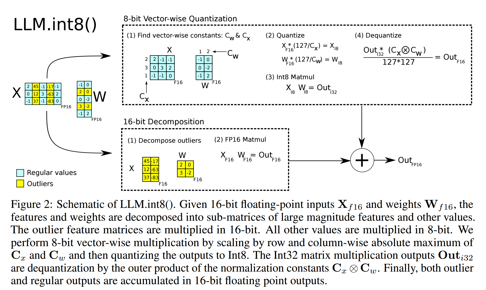

# Quantization Lesson 4 — Post-Training Quantization (PTQ) and LLM.int8()

---

## What Is Post-Training Quantization

Post-Training Quantization (PTQ) takes a model that was trained at full precision and converts it to a lower-precision format **after training is complete** — with no retraining, no fine-tuning, no gradient updates.

This is the most practical class of quantization methods because:
- You can quantize any model, even one you did not train.
- No GPU-hours of retraining.
- Works with publicly released FP16/BF16 checkpoints.

The challenge: you are trying to minimize quality loss from quantization using only the pre-trained weights and a small calibration dataset — no ability to correct errors through gradient descent.

---

## The Naive PTQ Approach: Weight-Only INT8

The simplest PTQ approach: quantize all linear layer weights to INT8 using per-channel absmax quantization. Leave everything else (activations, attention, normalization) in FP16.

```python
import torch
from transformers import AutoModelForCausalLM

def naive_int8_quantize(model: torch.nn.Module) -> torch.nn.Module:
    """
    Simplest possible PTQ: quantize all linear layer weights to INT8.
    """
    
    for name, module in model.named_modules():
        if isinstance(module, torch.nn.Linear):
            
            weight = module.weight.data  # FP16 weights
            
            # Per-channel quantization (one scale per output neuron)
            scales = weight.abs().max(dim=1).values / 127.0  # Shape: [out_features]
            
            # Quantize
            weight_int8 = (weight / scales.unsqueeze(1)).round().clamp(-127, 127).to(torch.int8)
            
            # Store quantized weights and scales
            module.weight_int8 = weight_int8
            module.weight_scales = scales
            
            # Replace forward method to dequantize before matmul
            original_forward = module.forward
            
            def quantized_forward(x, w_int8=weight_int8, scales=scales):
                # Dequantize on the fly
                w_fp16 = w_int8.to(torch.float16) * scales.unsqueeze(1)
                return torch.nn.functional.linear(x, w_fp16, None)
            
            module.forward = quantized_forward
    
    return model
```

**Memory savings of weight-only INT8:**
- The weights (largest component) go from FP16 to INT8: 2× compression
- The scales add back ~0.1% overhead
- Net result: approximately 2× memory reduction for model weights

**Quality:** For most tasks, weight-only INT8 using good per-channel quantization introduces negligible quality degradation. The weights themselves are the easy part.

---

## The Real Problem: Activation Outliers

In 2022, the LLM.int8() paper by Tim Dettmers et al. discovered something unexpected about large language models: **they develop massive activation outliers**.

At model sizes above ~6.7B parameters, a small number of feature dimensions (typically 0.1-1% of all dimensions) develop activations that are 100-1000× larger than the typical activation values.

```python
# Simulating what activation distributions look like in large models

import numpy as np

# Small model activations — roughly normal distribution
small_model_activations = np.random.normal(0, 1, size=(2048, 4096))
print(f"Max activation: {small_model_activations.max():.1f}")  # ~4-5

# Large model activations — with outliers
large_model_activations = np.random.normal(0, 1, size=(2048, 4096))
# Inject outliers into specific feature dimensions (as observed empirically)
outlier_dims = np.random.choice(4096, size=5, replace=False)
large_model_activations[:, outlier_dims] *= 200  # 200× larger
print(f"Max activation: {large_model_activations.max():.1f}")  # ~1000
```

**Why outliers destroy naive INT8 quantization of activations:**

If you try to quantize an activation tensor with a few values of magnitude 1000 and many values near 1, the scale becomes 1000/127 ≈ 7.87. Every value near 1 quantizes to either 0 or ±1. You lose all precision for 99%+ of the values.

```python
activations = np.concatenate([
    np.random.normal(0, 1, size=4091),  # Normal values
    np.array([500, -600, 800, -400, 700])  # Outliers
])

scale = np.max(np.abs(activations)) / 127  # ≈ 6.3
quantized = np.round(activations / scale).clip(-127, 127).astype(np.int8)

# Normal values after quantization:
normal_quantized = quantized[:-5]
print(f"Normal values quantized to range: [{normal_quantized.min()}, {normal_quantized.max()}]")
# Range: [-1, 1] — completely collapsed! All precision lost.
```

**This is why naive INT8 PTQ degrades LLM quality**, particularly for models above 6.7B parameters. The problem is not weight quantization — it is activation quantization.

---

## LLM.int8(): The Mixed-Precision Decomposition Solution

The LLM.int8() paper (Dettmers et al., 2022) solved the outlier problem with a clever observation: the outliers appear in **specific, consistent feature dimensions** across all tokens. So you can decompose the matrix multiplication into two parts:

1. **The outlier dimensions** — compute in FP16 (expensive but only a few dimensions)
2. **The non-outlier dimensions** — compute in INT8 (efficient, the vast majority)



### The Exact Outlier Detection Criteria (From the Paper)

The `threshold: float = 6.0` in the code below is a practical simplification of something the paper actually defines more precisely. A feature dimension only counts as a **systematic outlier** — worth pulling into the FP16 path — if it meets **all three** of these conditions simultaneously:

1. **Magnitude ≥ 6.0** — at least one activation value in that dimension has an absolute value of 6 or larger. (Empirically, perplexity degradation from outliers stopped once any feature crossing this threshold was isolated; going lower gave no further benefit.)
2. **Present in at least 25% of transformer layers** — the *same* feature dimension index must show this large-magnitude behavior across at least a quarter of all layers, not just once. This is what separates a genuinely systematic outlier from a random one-off spike — in the paper's smallest model (125M params), the most common outlier appeared in ≥25% of layers, while the next most common appeared in only ~2% of layers, giving a clean separation point.
3. **Present in at least 6% of sequence positions (tokens)** — the same dimension must show the large magnitude across at least 6% of tokens in the sequence, not just a single unusual token.

Only dimensions satisfying **all three** get the FP16 treatment. The code below approximates this with a single per-batch magnitude check (`(x.abs() > threshold).any(dim=(0,1))`) — the practical, runtime version of the same idea. In production, `bitsandbytes` detects outliers dynamically per batch rather than precomputing layer/token statistics offline.

To make "why bother with all this" concrete: at the 6.7B parameter mark, the paper found the same handful of outlier dimensions (as few as 6 total, across the *entire* model) accounted for roughly 150,000 outlier values per sequence. Despite being under 0.1% of all features, zeroing them out was found to degrade validation perplexity by 600–1000% and cut top-1 attention softmax probability mass by more than 20%. That's the empirical justification for treating them specially instead of accepting the error.

### Implementation

```python
def llm_int8_matmul(
    x: torch.Tensor,      # FP16 input activations [batch, seq, hidden]
    weight: torch.Tensor, # FP16 weight matrix [out, hidden]
    threshold: float = 6.0  # Outlier detection threshold
) -> torch.Tensor:
    """
    LLM.int8() matrix multiplication with mixed-precision decomposition.
    """
    
    # Step 1: Detect outlier dimensions in the input
    # A dimension is an outlier if any token in the batch exceeds the threshold
    outlier_mask = (x.abs() > threshold).any(dim=(0, 1))  # Shape: [hidden_dim]
    
    outlier_dims = outlier_mask.nonzero(as_tuple=True)[0]
    non_outlier_dims = (~outlier_mask).nonzero(as_tuple=True)[0]
    
    # Step 2: Split input and weight by outlier/non-outlier dimensions
    x_outlier = x[:, :, outlier_dims]          # FP16, small number of columns
    x_normal = x[:, :, non_outlier_dims]        # Will be quantized to INT8
    
    w_outlier = weight[:, outlier_dims]          # FP16, corresponding weight columns
    w_normal = weight[:, non_outlier_dims]       # Will be quantized to INT8
    
    # Step 3: FP16 matmul for outlier dimensions
    out_outlier = torch.matmul(x_outlier, w_outlier.T)  # FP16 × FP16
    
    # Step 4: INT8 matmul for normal dimensions
    
    # Quantize activations (per-token)
    x_scale = x_normal.abs().max(dim=-1, keepdim=True).values / 127.0
    x_int8 = (x_normal / x_scale).round().clamp(-127, 127).to(torch.int8)
    
    # Quantize weights (per-channel)
    w_scale = w_normal.abs().max(dim=-1, keepdim=True).values / 127.0
    w_int8 = (w_normal / w_scale).round().clamp(-127, 127).to(torch.int8)
    
    # INT8 matrix multiplication
    # (In practice, uses CUDA INT8 GEMM kernels for actual speedup)
    out_int8 = torch.matmul(x_int8.float(), w_int8.float().T)  # Simplified
    
    # Dequantize: scale by both activation and weight scales
    out_normal = out_int8 * (x_scale * w_scale.T)  # Back to FP16
    
    # Step 5: Combine
    return out_outlier.to(torch.float16) + out_normal.to(torch.float16)
```

> **Terminology check:** the code above is doing **symmetric** quantization (a single scale, range `[-127, 127]`, no zero-point/offset) computed **per-channel for weights** and **per-token for activations**. In the paper, this combination — a separate scale for each row/column involved in the matmul — is called **vector-wise quantization**. If you see that term elsewhere, it refers to exactly this scheme.

### Using LLM.int8() in Practice

The bitsandbytes library implements LLM.int8() with efficient CUDA kernels:

```python
from transformers import AutoModelForCausalLM, AutoTokenizer
import torch

# Load model with INT8 quantization
model = AutoModelForCausalLM.from_pretrained(
    "meta-llama/Llama-2-7b-hf",
    load_in_8bit=True,          # Enables LLM.int8()
    device_map="auto",          # Automatically places layers on available GPUs
    torch_dtype=torch.float16   # Non-quantized parts in FP16
)

tokenizer = AutoTokenizer.from_pretrained("meta-llama/Llama-2-7b-hf")

# Memory usage:
# FP16: ~14 GB
# INT8: ~7 GB  (approximately 2× reduction)

# Inspect quantized layers
for name, module in model.named_modules():
    if hasattr(module, 'weight'):
        print(f"{name}: {module.weight.dtype}")
# Linear layers: int8
# LayerNorm, embeddings: float16
```

**LLM.int8() in practice:**
- **Memory:** ~2× reduction vs FP16 (7B model: 14GB → ~7GB)
- **Speed:** Roughly comparable to FP16 on A100 (INT8 matmul speedup offset by decomposition overhead)
- **Quality:** Near-zero degradation (< 1% on most benchmarks for models ≥ 6.7B)
- **Threshold parameter:** 6.0 is the recommended default. Higher = fewer outlier dims extracted = faster but more error

---

## INT8 as a Compute Datatype (Not Just Storage)

It's worth being precise about something the code above glosses over: INT8 is unusual among quantized formats because it is genuinely used **for computation**, not only for storage.

- GPU tensor cores have **native hardware support** for INT8 × INT8 matrix multiplication, with results accumulated in INT32. This is real, dedicated silicon — the matmul itself runs in int8, and dequantization happens **after**, on the INT32 result (multiplying by the outer product of the activation scale and weight scale to recover the true FP16 magnitude, as the `out_normal = out_int8 * (x_scale * w_scale.T)` line above does).
- This is different from 4-bit formats like NF4 (used in QLoRA — see Lesson 3.5), which have no native compute hardware support: those must be dequantized to BF16 **before** any arithmetic happens, and the actual matmul FLOPs run in BF16. NF4's speed benefit is therefore memory-bandwidth-only; INT8's is both memory *and* genuine compute throughput.
- INT8 also doesn't need a lookup table the way NF4 does. INT8 uses **uniform (affine) quantization** — evenly spaced levels — so the code-to-value relationship is a simple formula, `value = code × scale`, computable with one multiply. NF4 spaces its 16 levels at the *quantiles* of a Gaussian distribution, which are irregular, non-arithmetic numbers — there's no formula from code to value, so NF4 has to store and index into an actual 16-entry table. INT8's uniform spacing is precisely what makes both the simple formula and the native hardware support possible.

| | INT8 (this lesson) | NF4 (QLoRA lesson) |
|---|---|---|
| Level spacing | Uniform | Quantile-based (non-uniform) |
| Code → value | Formula: `code × scale` | Lookup table (16 entries) |
| Native matmul hardware? | Yes | No — must dequantize to BF16 first |
| Dequantization timing | After the matmul (on the output) | Before the matmul (on the weights) |
| Memory savings | Yes | Yes |
| Compute speedup | Yes (real int8 tensor core throughput) | No (still BF16 FLOPs after dequant) |

---

## Why LLM.int8() Doesn't Need Fine-Tuning to Preserve Quality

It's worth contrasting this explicitly with quantization approaches that *do* require training (like QLoRA's NF4, Lesson 3.5) — the difference isn't that LLM.int8() is more tolerant of error. It's that the error is engineered down to near-zero *before* it ever reaches the model's output:

- The outlier dimensions — the values that cause almost all of the quantization error if mishandled — are pulled out and computed in full FP16 precision, exactly. No approximation there at all.
- The remaining ~99%+ of values have no outliers by construction (that's the whole point of extracting the outlier dims first), so they're well-behaved, low-dynamic-range numbers that INT8 quantizes with tiny, near-negligible error.
- Because both pieces individually introduce almost no error, the combined result is numerically very close to the original FP16 computation — close enough that downstream task metrics (perplexity, accuracy) don't move in a statistically meaningful way. This is verified empirically in the paper, not just argued theoretically.

Compare this to weight-only 4-bit formats like NF4: there, *every* weight is compressed to 4 bits with no outlier exception, at roughly double the compression ratio of INT8. The residual error is real and larger, which is why QLoRA pairs it with trainable LoRA adapters — the model needs a mechanism to *learn* its way back to good performance, rather than relying purely on the quantization scheme being lossless enough on its own. LLM.int8() never needs that step because, at 8-bit, careful precision allocation alone gets the error close enough to zero.

---

## Dynamic vs. Static Quantization

For completeness, two subclasses of PTQ:

**Dynamic quantization:** Weights are quantized offline. Activations are quantized on-the-fly during inference (scale computed per-batch or per-token). This is what LLM.int8() does for activations — compute the outlier threshold dynamically.

**Static quantization:** Both weights AND activations are quantized offline, using a calibration dataset to precompute activation scales. Faster at inference (no runtime scale computation) but requires a representative calibration dataset and does not adapt to unusual inputs.

```python
# Static quantization requires a calibration dataset
calibration_data = [
    "Sample text 1...",
    "Sample text 2...",
    # 100-500 representative samples
]

# During calibration: run forward passes, record activation statistics
activation_stats = {}

def calibration_hook(name):
    def hook(module, input, output):
        if name not in activation_stats:
            activation_stats[name] = {"min": float('inf'), "max": float('-inf')}
        activation_stats[name]["min"] = min(
            activation_stats[name]["min"], output.min().item()
        )
        activation_stats[name]["max"] = max(
            activation_stats[name]["max"], output.max().item()
        )
    return hook

# Register hooks, run calibration data, then use recorded stats to set scales
```

For LLMs, dynamic quantization (with the LLM.int8() mixed-precision approach) is more practical because:
- LLM activations have high variance — static scales calibrated on a small dataset may not generalize well.
- Dynamic quantization handles the outlier problem per-batch without needing a calibration dataset.

---

## When PTQ with INT8 Is Sufficient

LLM.int8() gives you:
- ~2× memory reduction
- Comparable quality to FP16
- Minimal setup (one flag in `from_pretrained`)

For many use cases, this is the right answer. If you have a 13B model that does not fit in 24GB VRAM in FP16 (requires ~26GB), INT8 brings it down to ~13GB — fits with room for activations and KV cache.

**When INT8 is NOT sufficient:**
- You need more than 2× memory reduction (trying to run a 70B model on a 40GB GPU)
- You need INT4 to fit on consumer hardware
- → Need GPTQ or AWQ (next lessons)

---

## Summary

- PTQ takes a pre-trained model and quantizes it without retraining. No gradient updates needed.
- Naive weight-only INT8 works well because weight distributions are well-behaved. Activation quantization is the hard problem.
- Large LLMs (> 6.7B) develop activation outliers: specific feature dimensions with values 100-1000× larger than typical activations. These destroy naive INT8 activation quantization.
- LLM.int8() solves this with mixed-precision decomposition: extract the ~1% of outlier dimensions, compute them in FP16, compute the remaining ~99% in INT8, combine results.
- Outlier detection uses a precise three-part empirical criterion, not just a raw magnitude cutoff: magnitude ≥ 6.0, present in ≥25% of layers, and present in ≥6% of sequence positions — all three must hold before a dimension is treated as a systematic outlier.
- Unlike 4-bit lookup-table formats (NF4), INT8 is a genuine compute datatype: GPU tensor cores multiply INT8 values directly, dequantizing only the result afterward — giving both memory *and* real compute throughput benefits, whereas NF4's benefit is memory-only.
- LLM.int8() needs no fine-tuning because the quantization error is engineered to near-zero through precision allocation (exact FP16 for outliers, negligible INT8 error for the rest) — a fundamentally different strategy from QLoRA's NF4, which relies on trainable LoRA adapters to compensate for larger residual error at a more aggressive 4-bit compression ratio.
- bitsandbytes implements LLM.int8() with `load_in_8bit=True` in HuggingFace — one line to get 2× memory reduction with near-zero quality loss.
- Dynamic quantization (scale computed at inference time) is preferred over static for LLMs because activation distributions vary too much for precomputed static scales.

---

## What's Next

Lesson 5 covers GPTQ — a fundamentally different PTQ approach that achieves INT4 quantization with high quality by intelligently compensating for quantization error layer by layer using second-order information from the Hessian.