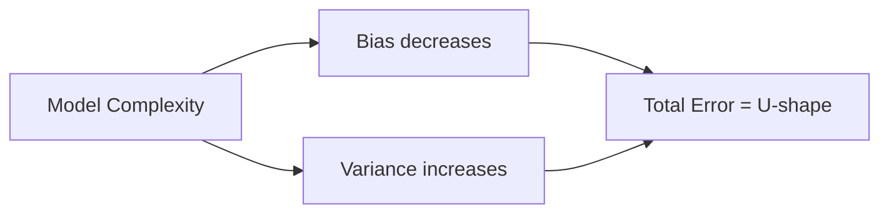
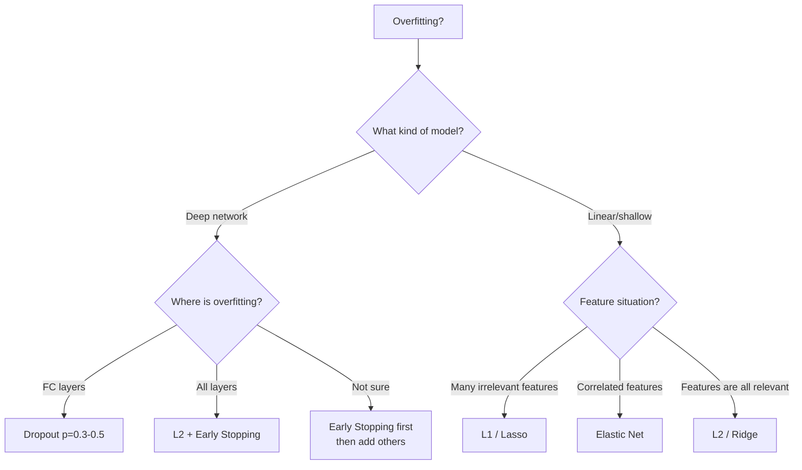

# Regularization

> Regularization = any technique that reduces overfitting by constraining the model.
> Every technique here is a different answer to the same question: *how do we stop the model from memorizing training data?*

---

## 1. Bias-Variance Tradeoff

This is the **conceptual foundation** of all regularization. Understand this and everything else makes sense.

### The Decomposition

The expected test error of any model can be decomposed as:

$$\text{Expected Error} = \text{Bias}^2 + \text{Variance} + \text{Irreducible Noise}$$

**Bias** — error from wrong assumptions in the model. A linear model fitting a cubic relationship has high bias — it's systematically wrong no matter how much data you give it.

**Variance** — error from sensitivity to fluctuations in training data. A high-degree polynomial that passes through every training point will give completely different predictions if you swap 10% of the data. It's overfit.

**Irreducible noise** — the inherent randomness in the data. Can't be reduced by any model.

### The Tradeoff

```
                    Total Error
                   /            \
        Bias²                 Variance
      (underfitting)         (overfitting)

Simple model   → High bias,    Low variance
Complex model  → Low bias,     High variance
```

There's no free lunch — decreasing bias generally increases variance and vice versa. The goal is to find the **sweet spot** where total error is minimized.



### What Regularization Does

Regularization **deliberately increases bias** to reduce variance — accepting slightly worse training performance in exchange for better generalization. It shrinks the effective model complexity.

### Diagnosing Bias vs Variance

| Symptom | Problem | Fix |
|---|---|---|
| High train error, high test error | High bias (underfitting) | More capacity, better features |
| Low train error, high test error | High variance (overfitting) | Regularization, more data |
| Both errors high and similar | High bias | Bigger model |
| Big gap between train and test error | High variance | Regularize |

---

## 2. L2 Regularization (Weight Decay)

### What It Does

Adds a penalty proportional to the **squared magnitude** of weights to the loss:

$$L_{\text{total}} = L_{\text{original}} + \frac{\lambda}{2} \sum_j w_j^2$$

`λ` controls how strongly weights are penalized. Large `λ` = stronger regularization = smaller weights.

### Effect on the Gradient

$$\frac{\partial L_{\text{total}}}{\partial w_j} = \frac{\partial L_{\text{original}}}{\partial w_j} + \lambda w_j$$

Update rule becomes:

$$w_j \leftarrow w_j - \eta\left(\frac{\partial L}{\partial w_j} + \lambda w_j\right) = w_j(1 - \eta\lambda) - \eta\frac{\partial L}{\partial w_j}$$

The factor `(1 - ηλ)` **shrinks the weight at every step**, regardless of the gradient. This is why L2 regularization is also called **weight decay** — weights decay toward zero continuously.

### Why Smaller Weights Help

Smaller weights mean the output changes less when the input changes. The model is **smoother** — less sensitive to small input perturbations. This is precisely lower variance.

Think of it geometrically: large weights mean the decision boundary can be very wiggly and complex. L2 regularization keeps the boundary smoother.

### L2 Does Not Zero Out Weights

L2 pushes weights toward zero but never reaches exactly zero (the penalty gradient `λw` goes to zero as `w` goes to zero — so the push weakens). This has an important consequence: **L2 keeps all features**, just with small coefficients. It doesn't perform feature selection.

### Bayesian Interpretation

L2 regularization = placing a **Gaussian prior** on the weights (zero mean, variance 1/λ). Maximizing the regularized loss = computing the MAP (Maximum A Posteriori) estimate under this prior. λ encodes your belief about how large weights should be — larger λ = tighter prior = stronger belief that weights are small.

### L2 in PyTorch

```python
# Option 1: Built into optimizer (correct for SGD, wrong for Adam — see AdamW notes)
optimizer = torch.optim.SGD(model.parameters(), lr=0.01, weight_decay=1e-4)

# Option 2: Manual
l2_penalty = sum(p.pow(2).sum() for p in model.parameters())
loss = criterion(output, target) + lambda_ * l2_penalty
```

---

## 3. L1 Regularization & Sparsity

### What It Does

Adds a penalty proportional to the **absolute magnitude** of weights:

$$L_{\text{total}} = L_{\text{original}} + \lambda \sum_j |w_j|$$

### Gradient

$$\frac{\partial L_{\text{total}}}{\partial w_j} = \frac{\partial L}{\partial w_j} + \lambda \cdot \text{sign}(w_j)$$

Unlike L2 (where the penalty gradient scales with `w`), the L1 penalty gradient is **constant** ±λ regardless of weight magnitude.

### Why L1 Produces Sparsity

This is the key insight — and interviewers love it.

Consider a weight near zero, say `w = 0.001`:
- **L2 penalty gradient**: `λ × 0.001` → nearly zero push. The weight barely moves.
- **L1 penalty gradient**: `λ × sign(0.001) = λ` → same full-strength push as a large weight.

L1 applies the **same constant force** toward zero regardless of how small the weight already is. Small weights get pushed to exactly zero. L2 applies a force proportional to the weight — so weights get exponentially smaller but never actually reach zero.

### Geometric Explanation

```
L2 constraint: ||w||₂ ≤ t  →  circle (in 2D) / sphere (in nD)
L1 constraint: ||w||₁ ≤ t  →  diamond (in 2D) / cross-polytope (in nD)

The constrained loss minimum sits where the loss contours first touch the constraint region.

L2 (circle):  The circle is smooth — the minimum almost never lands exactly on an axis
L1 (diamond): The diamond has corners on the axes — the minimum frequently lands on a corner

A corner on an axis means one weight = 0 and the other nonzero → SPARSITY
```

```
        w₂
        |  ◇ (L1)        ○ (L2)
        | /|\            / \
        |/ | \          /   \
   ─────┼──┼──┼────  ──┼─────┼── w₁
        |\ | /          \   /
        | \|/            \ /
        |  ◇              ○

L1 diamond corners sit on axes → optimal point often has w₁=0 or w₂=0
L2 circle has no corners → optimal point rarely has exact zeros
```

### What Sparsity Means in Practice

- **Feature selection**: Weights that go to zero mean those features are ignored. L1 automatically selects the most important features.
- **Interpretability**: A sparse model is easier to explain — most features are zeroed out.
- **Memory/computation**: Sparse weight matrices can be stored and computed efficiently.
- **Use case**: High-dimensional data where most features are irrelevant (genomics, text with large vocabulary).

### Bayesian Interpretation

L1 regularization = placing a **Laplace prior** on weights. The Laplace distribution has a sharp peak at zero and heavy tails — it strongly encourages weights to be zero but allows a few to be large. This matches the sparsity behavior exactly.

---

## 4. Elastic Net (L1 + L2)

### Formula

$$L_{\text{total}} = L_{\text{original}} + \lambda_1 \sum_j |w_j| + \lambda_2 \sum_j w_j^2$$

A weighted combination of both penalties, controlled by two hyperparameters.

### Why It Exists — L1's Problems

L1 has two practical issues:
1. **Unstable selection with correlated features**: If two features are highly correlated, L1 arbitrarily zeroes one and keeps the other. Which one survives depends on minor data fluctuations.
2. **At most n nonzero weights**: With p features and n training samples (p > n), L1 can select at most n features. Often too few.

Elastic Net fixes both: L2 **groups** correlated features (keeps them together or zeros them together), while L1 provides **sparsity** (actual zeros).

### When to Use

| Scenario | Best Choice |
|---|---|
| Features are independent, need sparsity | L1 |
| Features are correlated, need sparsity | Elastic Net |
| Just need smooth weights | L2 |
| Correlated features, keep all | L2 |

Elastic Net is the default regularizer in `sklearn`'s linear models for a reason — real data usually has correlated features.

---

## 5. Dropout

### The Idea

During training, randomly **zero out neurons** with probability `p` (the drop probability). Each forward pass, a different random subset of neurons is deactivated.

```
Normal forward pass:
Input → [n1, n2, n3, n4, n5] → Output

Dropout (p=0.5) forward pass:
Input → [n1,  0, n3,  0, n5] → Output   (pass 1)
Input → [ 0, n2,  0, n4, n5] → Output   (pass 2)
Input → [n1, n2,  0,  0, n5] → Output   (pass 3)
```

### Why It Works — Two Views

**View 1: Ensemble of networks.** With `n` neurons, dropout samples from `2ⁿ` possible sub-networks. At test time, the full network approximates averaging over all these sub-networks — a form of ensemble learning without the cost of training separate models.

**View 2: Prevents co-adaptation.** Without dropout, neurons can co-adapt — neuron A learns to correct neuron B's mistakes, making both fragile. Dropout breaks this. Every neuron must be useful on its own because it can't rely on any specific other neuron being present.

### Test Time Behavior

Dropout is **off at test time** — all neurons are active. But now the expected output of each neuron is `(1-p)` times what it was at training (since neurons were dropped with probability `p`). Without correction, test activations would be larger than training activations — mismatch.

**Fix: scale by (1-p) at test time**, OR equivalently, scale up by `1/(1-p)` during training (inverted dropout — next section).

### Where to Apply Dropout

Dropout is typically applied to **fully connected layers**, not convolutional layers (spatial structure in conv layers means dropout is less effective — use Spatial Dropout or BatchNorm instead). Commonly placed after activation functions.

```python
nn.Sequential(
    nn.Linear(512, 256),
    nn.ReLU(),
    nn.Dropout(p=0.5),   # After activation
    nn.Linear(256, 10)
)
```

Typical dropout rates:
- `p = 0.5` for large fully connected layers
- `p = 0.1–0.3` for smaller layers or input layers
- Transformers often use `p = 0.1`

---

## 6. Inverted Dropout

### The Problem With Standard Dropout

Standard dropout zeroes neurons during training, then scales by `(1-p)` at test time. This means **test-time code differs from training-time code** — easy to introduce bugs when deploying.

### Inverted Dropout — Scale During Training

Scale the surviving activations **up** by `1/(1-p)` during training. At test time, do nothing — the network is used as-is.

```python
# Training forward pass (inverted dropout)
mask = (torch.rand(x.shape) > p).float()   # 1 with prob (1-p), 0 with prob p
x = x * mask / (1 - p)                     # zero some, scale up survivors

# Test forward pass
# nothing — no scaling needed
```

### Why Expectations Match

During training with inverted dropout, the expected value of each neuron's output is:

$$E[\text{output}] = (1-p) \cdot \frac{a}{1-p} + p \cdot 0 = a$$

Same as if no dropout. At test time, the network sees full activations `a` — exactly matching the training expectation. No scaling needed.

### This Is What PyTorch Uses

`nn.Dropout` in PyTorch implements inverted dropout. You don't need to think about this in practice — just know why it's done this way.

---

## 7. Early Stopping

### The Idea

During training, monitor **validation loss**. Stop training when validation loss stops improving, even if training loss is still decreasing.

```
Loss
 |
 |   training loss
 |  ╲
 |   ╲_____
 |         ╲_________
 |                    ╲_________________→ keeps dropping
 |
 |         validation loss
 |  ╲
 |   ╲___________╱‾‾‾‾‾‾‾‾‾‾→ starts rising
 |               ↑
 |         STOP HERE
 |
 └──────────────────────────── Epochs
```

### Why It Works — Bias-Variance View

Early in training, the model is underfit (high bias). As training continues, bias decreases. But eventually the model starts memorizing training-specific patterns — variance starts increasing. Early stopping halts training at the **sweet spot** before variance dominates.

It's equivalent to training a model with reduced capacity — you're not letting it fully explore the parameter space.

### Implementation

```python
best_val_loss = float('inf')
patience = 10      # How many epochs to wait after last improvement
counter = 0

for epoch in range(max_epochs):
    train(model)
    val_loss = evaluate(model, val_loader)

    if val_loss < best_val_loss:
        best_val_loss = val_loss
        torch.save(model.state_dict(), 'best_model.pt')  # Save best checkpoint
        counter = 0
    else:
        counter += 1
        if counter >= patience:
            print(f"Early stopping at epoch {epoch}")
            break

# Restore best model
model.load_state_dict(torch.load('best_model.pt'))
```

### Key Decisions

**Patience**: How many epochs without improvement before stopping. Too small → stops before true convergence. Too large → wastes compute and may overfit anyway.

**What metric to monitor**: Validation loss is standard. For imbalanced problems, use F1 or AUC instead — validation loss can keep improving even as class-specific performance degrades.

**Restoring best weights**: Always save and restore the best checkpoint. Training doesn't stop at its best epoch — it usually degrades slightly before the patience counter runs out.

### Pros and Cons

| Pro | Con |
|---|---|
| Free — no change to model architecture | Requires a validation set (less data for training) |
| Implicitly regularizes without tuning λ | Patience is a hyperparameter to tune |
| Saves compute — stops wasted epochs | Noisy val loss can trigger premature stopping |
| Gives free model selection | Can interact poorly with lr schedulers |

### Early Stopping vs L2 Regularization

They're related — L2 regularization has a correspondence to limiting the number of gradient steps. Both constrain how far parameters move from initialization, just in different ways. In practice, use both: L2 for a principled prior on weight magnitudes, early stopping as a free safety net.

---

## 8. Which Regularization When?



### Combining Them

Regularization techniques are **not mutually exclusive** — in practice you use several together:

- **Transformers**: Dropout + L2 via AdamW weight decay + early stopping
- **CNNs**: L2 + BatchNorm (acts as implicit regularizer) + early stopping
- **Linear models**: L1 or Elastic Net
- **Small datasets**: Heavy dropout + strong L2 + aggressive early stopping

---

## 9. Interview Questions

**Q: What is the bias-variance tradeoff?**
> Expected test error = Bias² + Variance + Irreducible noise. Bias is systematic error from model assumptions; variance is sensitivity to training data fluctuations. Complex models have low bias but high variance (overfit); simple models have high bias but low variance (underfit). Regularization deliberately increases bias to reduce variance.

**Q: Why does L1 produce sparse weights but L2 doesn't?**
> L1's penalty gradient is a constant ±λ regardless of weight size — even tiny weights get the full push toward zero and can reach exactly zero. L2's penalty gradient is λw — as weights get smaller the push weakens, so they approach but never reach zero. Geometrically, the L1 constraint region is a diamond with corners on the axes; loss contours frequently intersect at these corners, giving exact zeros.

**Q: What is dropout doing exactly during training vs test time?**
> During training, neurons are randomly zeroed with probability p — the network sees a different random sub-network each forward pass, acting as an ensemble of 2ⁿ networks. At test time dropout is disabled; the full network approximates the ensemble average. Inverted dropout scales surviving activations by 1/(1-p) during training so test-time activations need no adjustment.

**Q: Why is inverted dropout preferred over standard dropout?**
> Standard dropout requires scaling activations at test time, meaning test code differs from training code — deployment bug risk. Inverted dropout scales during training so test-time inference code is identical to a non-dropout network. PyTorch's nn.Dropout uses inverted dropout.

**Q: L1 vs L2 — which would you use for a model with 10,000 features but only 500 training samples?**
> L1 (or Elastic Net). With p >> n, most features are noise. L1 performs automatic feature selection by zeroing irrelevant weights, effectively reducing dimensionality. L2 would keep all 10,000 features with small coefficients, wasting capacity and remaining hard to interpret. If features are correlated (likely in high-dimensional data), Elastic Net is safer than pure L1.

**Q: What is the relationship between early stopping and L2 regularization?**
> Both limit how far parameters can move from initialization. L2 adds a constant pull toward zero each update — parameters can't grow too large. Early stopping limits the number of gradient steps — parameters can't travel too far from initialization regardless of their direction. They're mathematically related: gradient descent on an L2-regularized loss follows a similar trajectory to early-stopped unregularized gradient descent, especially near the beginning of training.

**Q: Can you over-regularize?**
> Yes — too much regularization causes underfitting (high bias). L2 with very large λ drives all weights toward zero, making the model nearly constant. Dropout with p close to 1 kills most of the network's capacity. Early stopping too aggressively leaves the model in an underfit state. The right amount of regularization is determined by validation performance.